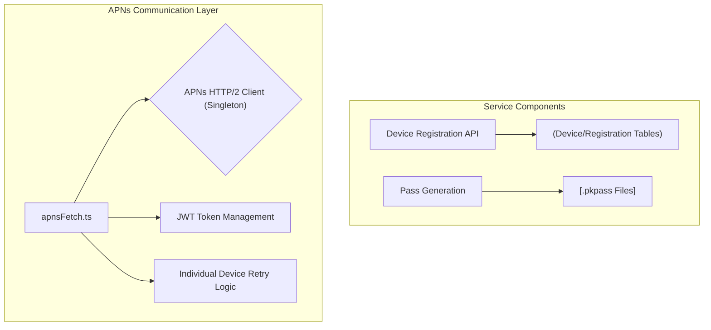
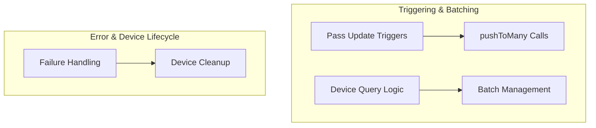
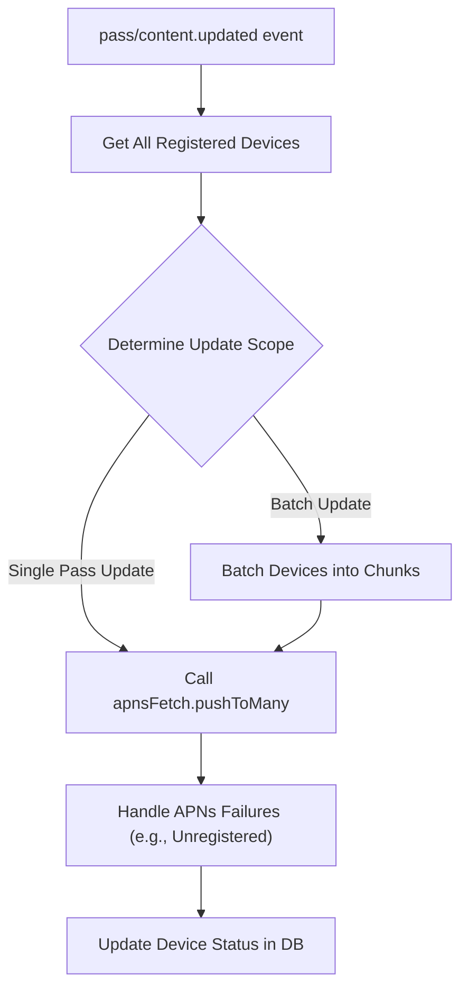

# Notes & Thoughts

Here are some notes and thoughts I have about what may still need fixed or adjusted.

- How we retrieve and where we store the actual Pass data is assumed to be a row in a database table.
  - This is joined with the passes table for the webservice to generate the Etag. We should probably update ETags during write operations (when pass content or metadata changes) rather than on read. This was just the easy way to ensure any Pass updates made it through.
- We could probably remove the PNG validation / security checks if we did that at the time of upload and _assumed_ all was good here.
- Probably need to review and cleanup package.json
- Review the details of how passes tie back to users and tickets and tenants in Neon (especially tenants).
- I need to create a usage guide that simplifies all the gory Apple / PassKit details.
- We need to create some real e2e tests that don't mock anything and run in dev
- I'm not 100% I've done PostHog right... You've got much more experience with it than I do.

## APNs Notifications

- We don't have a way to _trigger_ push notifications with APNs
- Would need to define Inngest functions for workflows that handle this
- Might need to extract the APNs code from honoken and put it in a separate library for Inngest to use
  - OR may want to have a route / RPC in honoken that actually does the APNs stuff and is called from Inngest?
- Also important to remember _devices are not passes_ and that a _pass can belong to more than one device_.

### Things We Missing

Should be Inngest workflows

- Finding registered devices for a pass
- Determining WHEN to send notifications
  - This changes based on if it's a single pass update or if it's a group / collection of passes
  - Proabably depends on how we organized groups and collections of passes
- Chunking large device lists for APNs limits
- Cross-device failure handling & retry coordination
- Device cleanup (removing invalid push tokens)
- Pass update orchestration

### Order of Ops?

1. Update pass data in database ✅
2. Invalidate ETag cache ✅
3. Find ALL registered devices for this pass
4. Batch devices into APNs-friendly chunks
5. Send push notifications with retry logic
6. Handle APNs failures (invalid tokens, etc.)
7. Update device registration status
8. Log metrics and errors

### Inngest Psuedo

```typescript
// RESPONSIBILITY: Pass update orchestration
// INPUT: Pass change events
// OUTPUT: Coordinated multi-device notifications

inngest.createFunction(
  { id: "pass-updated-notification" },
  { event: "pass/content.updated" },
  async ({ event, step }) => {
    // Get all registered devices for this pass (or group / collection of passes?)
    const devices = await step.run("get-devices", () =>
      getRegisteredDevicesForPass(
        event.data.passTypeId,
        event.data.serialNumber
      )
    );

    // Chunk for APNs rate limits (1000s of devices → multiple batches)
    const chunks = await step.run(
      "chunk-devices",
      () => chunkDevices(devices, 1000) // APNs best practice
    );

    // Send to each chunk (with step-level retry)
    for (const chunk of chunks) {
      await step.run(
        `notify-chunk-${chunk.id}`,
        () => pushToMany(env, chunk.devices, event.data.passTypeId, logger) // ← Uses your apnsFetch
      );
    }

    // Handle failures & cleanup
    await step.run("cleanup-invalid-devices", () =>
      removeInvalidDevices(event.data.passTypeId, failedDevices)
    );
  }
);
```

**Don't put in apnsFetch.ts:**

- Database queries for device registration
- Business rules about when to notify
- Cross-request coordination
- Long-running workflows

**Don't put in Inngest:**

- HTTP/2 connection details
- JWT signing logic
- APNs error code interpretation
- Single-device retry logic

#### APNs Architecture Diagrams

##### Current State ✅



##### Areas to Improve 🚧



##### Proposed Inngest Workflow 💡


