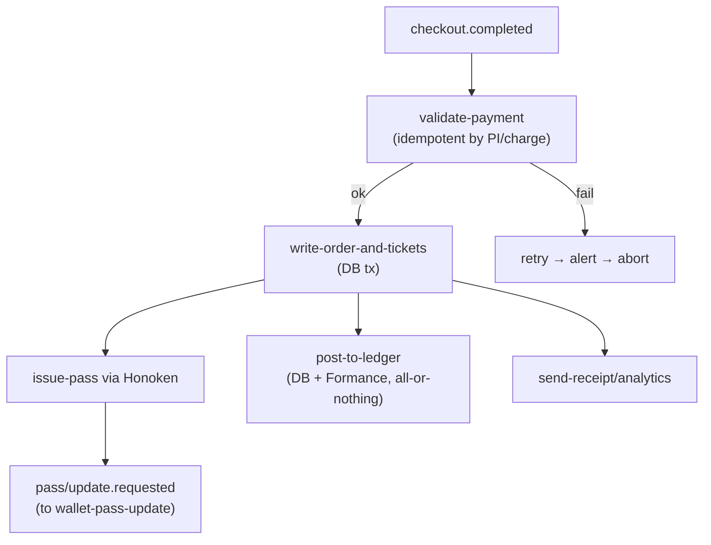
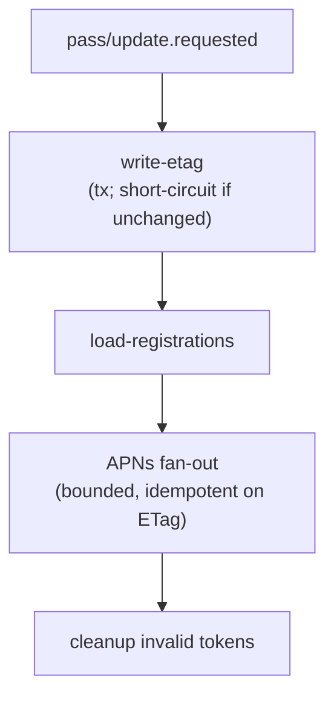
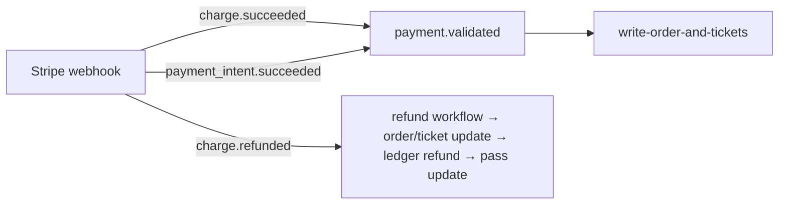

You’re asking for the backend muscle on this trail — what the Inngest workflows actually do on the hot path. Here’s the map of the orchestrators, their responsibilities, their boundaries, and how they interlock to take a cart click all the way to a scannable pass and ledgered money movement.

Where the workflows live

- Inngest client and handler glue:
  - Client: [packages/inngest/client.ts](packages/inngest/client.ts:1)
  - Hono adapter (mounted by Events app): [packages/inngest/adapters/hono.ts](packages/inngest/adapters/hono.ts:6)
  - Events service (exposes the Inngest handler): [apps/events/README.md](apps/events/README.md:1)
- Strategy and intent (EDA, DDD structure, event taxonomy): [context/dayof/dayof-tech-stack.md](context/dayof/dayof-tech-stack.md:541)

Hot-path backend workflows

## 1. Checkout Orchestrator (purchase lifecycle)

### Entry signals

- App server function emits “checkout.completed”: [context/dayof/dayof-tech-stack.md](context/dayof/dayof-tech-stack.md:617)
- OR Stripe webhooks land directly in Inngest (charges/payment_intents): [context/dayof/dayof-tech-stack.md](context/dayof/dayof-tech-stack.md:933)

### Core steps (durable; each step retriable/idempotent)

- validate-payment (idempotent on Stripe IDs)
  - If signal came from UI, confirm the PaymentIntent/Charge; if from webhook, de-duplicate on event ID and charge/payment_intent ID.
  - Concurrency: serialize by payment_intent (or charge) to prevent double-writes.
- write-order-and-tickets (DB transaction)
  - Create order + ticket instances; assign NanoIDs; attach product/variant snapshot/version.
  - Note: Ticket Instance schema + versioning are open items; keep a stub snapshot until finalized: [context/dayof/action-items-and-linear-issues.md](context/dayof/action-items-and-linear-issues.md:28), [context/dayof/action-items-and-linear-issues.md](context/dayof/action-items-and-linear-issues.md:56)
- issue-pass (delegates to Honoken)
  - Call Honoken to build the Apple Wallet pass. The Honoken service then emits an Inngest signal “pass/update.requested” so the pass update workflow can fan out device notifications: [apps/honoken/src/services/createPass.ts](apps/honoken/src/services/createPass.ts:297)
- post-to-ledger (DB + FormanceLedger “both-or-neither”)
  - Use Effect-TS inside the Inngest step to coordinate DB write + Formance posting atomically at workflow level (not DB tx): [context/dayof/dayof-business-context.md](context/dayof/dayof-business-context.md:138), [context/dayof/dayof-tech-stack.md](context/dayof/dayof-tech-stack.md:743)
  - If either system fails after retries: raise 5‑alarm, fail the step; purchase must not finalize.
- notify (email/receipt and analytics)
  - Parallel after order.created and pass issued events.

### Failure model

- Step-level retries with backoff; per-signal idempotency keys; hard failure sends alert and leaves system in a consistent state (no partial order without ledger copy, no ledger without order).

## 2. Pass Update Orchestrator (Honoken "write → then push")

### Signal source

- “pass/update.requested” emitted by pass creation/update paths in Honoken: [apps/honoken/src/services/createPass.ts](apps/honoken/src/services/createPass.ts:297)

### Workflow (race‑free, idempotent)

- write-etag (transactional)
  - Upsert JSONB payload for the pass, recompute ETag, seconds-rounded updated_at; short-circuit if no material change (returns changed=false). Details: [apps/honoken/context/plan-db-update.md](apps/honoken/context/plan-db-update.md:247), [apps/honoken/context/plan-db-new.md](apps/honoken/context/plan-db-new.md:81)
- load-registrations
  - Fetch active device registrations for this pass.
- apns-fanout (bounded concurrency)
  - Push to devices using APNs HTTP/2 with an idempotency key scoped to (pass, etag), e.g., wallet:${pt}:${sn}:${etag}, to avoid duplicate pushes for identical content: [apps/honoken/context/plan-db-update.md](apps/honoken/context/plan-db-update.md:247)
- per-pass concurrency guard
  - Serialize updates for the same pass; others run in parallel. Implemented per progress log: [apps/honoken/context/plan-db-new.md](apps/honoken/context/plan-db-new.md:243)

### Read path (no writes)

- GET returns 304 if ETag unchanged; 200 with freshly signed .pkpass if changed. No DB writes in GET: [apps/honoken/context/plan-db-new.md](apps/honoken/context/plan-db-new.md:106)

## 3. Stripe Webhook Ingestion Orchestrator (source of truth sync)

### Signal source

- Stripe → Events app Inngest handler (single endpoint). Strategy notes: [context/dayof/dayof-tech-stack.md](context/dayof/dayof-tech-stack.md:933), [context/dayof/core-questions.md](context/dayof/core-questions.md:266)

### Handlers and flows

- charge/payment_intent succeeded
  - De-dupe and normalize into a single “payment.validated” path that can converge with the UI‑initiated checkout flow before write-order-and-tickets.
- charge refunded
  - Update order/tickets (status=refunded), and post ledger refund entries; then trigger pass/content update (e.g., void or mark as refunded) via “pass/update.requested”.
- disputes/payouts/connected account updates
  - Recorded for reconciliation; ledger postings as needed.

### Security gap to close (tracked)

- Verify Stripe signature handling at ingress (Inngest) and document secret config and failure handling: [context/dayof/action-items-and-linear-issues.md](context/dayof/action-items-and-linear-issues.md:168)

## Concurrency, idempotency, and ordering patterns

- Concurrency keys
  - Checkout: key by payment_intent or charge → prevents double-creation.
  - Pass updates: key by (passTypeIdentifier, serialNumber) → prevents interleaved writes: [apps/honoken/context/plan-db-new.md](apps/honoken/context/plan-db-new.md:243)
- Idempotency
  - Use Stripe IDs (event ID + charge/payment_intent) to dedupe payment steps.
  - Use pass ETag idempotency in APNs fan-out to avoid duplicate notifications: [apps/honoken/context/plan-db-update.md](apps/honoken/context/plan-db-update.md:247)
- Ordering
  - Never notify passes or scanners before DB state is written; “write → then push” is the invariant: [apps/honoken/context/plan-db-update.md](apps/honoken/context/plan-db-update.md:247)

## How to run and observe locally

- Events service: [apps/events/README.md](apps/events/README.md:1)
- Start both the Events app and the Inngest dev server; Dev UI at 8288 shows traces/steps.
- Example function scaffold present: [packages/inngest/functions/exampleEffect.ts](packages/inngest/functions/exampleEffect.ts:1)

Mermaid: Checkout orchestrator (happy path)

Mermaid: Wallet pass update orchestrator

Mermaid: Stripe webhook normalization

## Design tenets (why Inngest here)

- Replace function-chaining with event orchestration; keep steps small, retriable, and observable: [context/dayof/dayof-tech-stack.md](context/dayof/dayof-tech-stack.md:617)
- Durable, explicit dependencies and parallelism where safe (emails/analytics) while keeping financial + entitlement writes serialized and idempotent: [context/dayof/dayof-tech-stack.md](context/dayof/dayof-tech-stack.md:617)
- Financial operations coordinated with Effect-TS inside Inngest steps to guarantee “both-or-neither”: [context/dayof/dayof-business-context.md](context/dayof/dayof-business-context.md:138)

## Open edges to close (impacting workflows)

- Define Ticket Instance schema + product/variant versioning so “write-order-and-tickets” can snapshot cleanly: [context/dayof/action-items-and-linear-issues.md](context/dayof/action-items-and-linear-issues.md:28), [context/dayof/action-items-and-linear-issues.md](context/dayof/action-items-and-linear-issues.md:56)
- Confirm Stripe signature verification at ingress and record exact env wiring: [context/dayof/action-items-and-linear-issues.md](context/dayof/action-items-and-linear-issues.md:168)
- Document the full webhook matrix and handler mapping: [context/dayof/action-items-and-linear-issues.md](context/dayof/action-items-and-linear-issues.md:192)

Signed the hunt
The backend logic’s edge is where it should be: write state first, then notify; ledger entries move in lockstep with DB or not at all; pass updates are serialized per pass and idempotent by ETag. That discipline is exactly what keeps tickets scannable within seconds and finances audit‑clean under pressure. The only things still rustling the bushes are versioning and the ticket instance contract — bag those, and this trail is paved.
