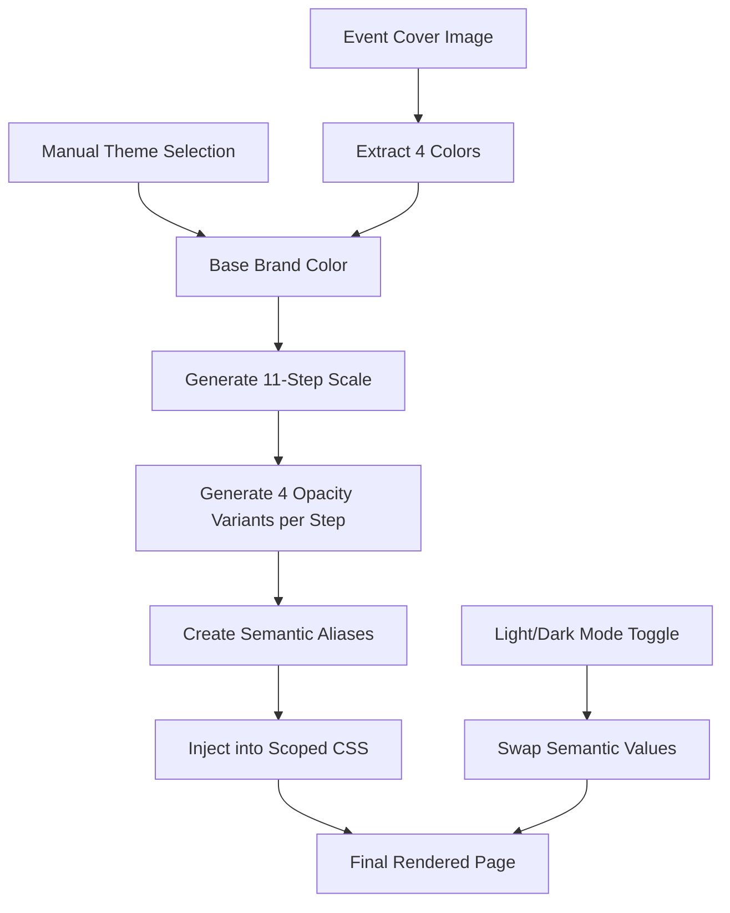
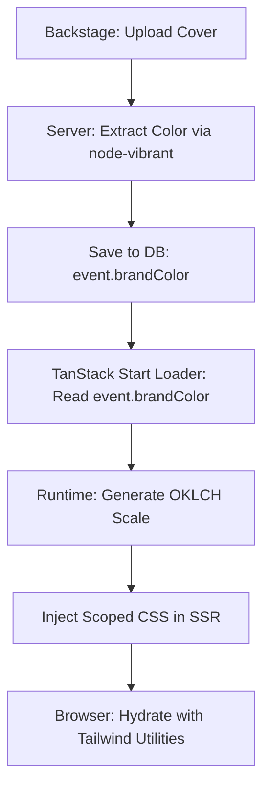

<luma-evaluation>

# Luma's Color System & Theming Architecture

Based on the attached files, here's how Luma structures its color system:

## 1. Multi-Step Color Scales with Opacity Variants

Luma uses an **11-step color scale** (5, 10, 20, 30, 40, 50, 60, 70, 80, 90, 100) where each step has **4 variants**:

```css
/* Base color */
--gray-50: #b3b5b7;

/* Opacity variants */
--gray-50-transparent: rgba(179, 181, 183, 0); /* 0% */
--gray-50-translucent: rgba(179, 181, 183, 0.25); /* 25% */
--gray-50-thick-translucent: rgba(179, 181, 183, 0.8); /* 80% */
```

**Standardized opacity values:**

- `transparent`: `00` hex (0%)
- `translucent`: `40` hex (25%)
- `thick-translucent`: `cc` hex (80%)

This applies to all color families: `gray`, `cranberry`, `barney`, `purple`, `blue`, `green`, `yellow`, `orange`, `red`.

## 2. RGB Base Values for Dynamic Alpha

Luma uses **RGB base values** to create dynamic opacity variants:

```css
--black-base-rgb: 19, 21, 23;
--white-base-rgb: 255, 255, 255;

/* Dynamic opacity ladder (0-80 in steps) */
--black-opacity-0: rgba(var(--black-base-rgb), 0);
--black-opacity-2: rgba(var(--black-base-rgb), 0.02);
--black-opacity-4: rgba(var(--black-base-rgb), 0.04);
--black-opacity-8: rgba(var(--black-base-rgb), 0.08);
--black-opacity-16: rgba(var(--black-base-rgb), 0.16);
--black-opacity-24: rgba(var(--black-base-rgb), 0.24);
--black-opacity-32: rgba(var(--black-base-rgb), 0.32);
--black-opacity-48: rgba(var(--black-base-rgb), 0.48);
--black-opacity-64: rgba(var(--black-base-rgb), 0.64);
--black-opacity-80: rgba(var(--black-base-rgb), 0.8);
```

**Why this matters:** Allows consistent opacity application without defining every color×opacity combination.

## 3. Three-Layer Semantic Token System

### Layer 1: Base Palette Colors

```css
--cranberry-50: #f31a7c;
--purple-50: #682fff;
--blue-50: #146aeb;
```

### Layer 2: Semantic Aliases (Light Mode)

```css
--brand-color: var(--cranberry);
--success-color: var(--green);
--error-color: var(--red);
--warning-color: var(--yellow);
```

### Layer 3: Contextual Tokens

```css
--primary-color: var(--black); /* Text color */
--secondary-color: var(--gray-70);
--tertiary-color: var(--gray-50);

--primary-bg-color: var(--white); /* Background */
--secondary-bg-color: var(--gray-10);
```

## 4. Per-Event Brand Color Injection

From the HTML source, Luma **dynamically injects brand colors** per event:

```html
<style id="__jsx-940851167">
  .lux-menu-wrapper.menu-totyegzj8p {
    --brand-5: #f7f3fd;
    --brand-10: #f1ebfc;
    --brand-20: #d4c6ed;
    --brand-30: #a471e3;
    --brand-40: #975cdb;
    --brand-50: #7646ad; /* Primary brand color */
    --brand-60: #563081;
    --brand-70: #371f54;
    --brand-80: #261c34;
    --brand-90: #181321;
    --brand-100: #121115;

    --brand-color: #a471e3;
    --brand-content-color: #975cdb;
    --brand-bg-color: #7646ad;
    --brand-active-color: #975cdb;
    --brand-active-bg-color: #563081;
    --brand-pale-bg-color: #a078d621; /* With alpha */
  }
</style>
```

**Pattern:** Each event gets a complete brand color scale (5-100) **derived algorithmically** from a base color.

## 5. Light/Dark Mode Switching

Luma uses **CSS class switching** (`.theme-root.light` / `.theme-root.dark`):

```css
/* Light mode (lines 204-351) */
.theme-root,
.tint-root {
  --primary-color: var(--black);
  --primary-bg-color: var(--white);
  --brand-color: var(--cranberry);
}

/* Dark mode (lines 354-452) */
.theme-root.dark {
  --primary-color: var(--white);
  --primary-bg-color: var(--black);
  --shadow-xs: 0 1px 4px rgba(0, 0, 0, 0.25); /* Stronger shadows */
}
```

**Key insight:** Same variable names, different values. Components don't need to know about theme—they just reference tokens.

## 6. Cover Image Color Extraction

From the HTML JSON data:

```json
"cover_image": {
  "vibrant_color": null,
  "colors": ["#502aac", "#8f73cf", "#342064", "#e3ddf3"]
}
```

Luma **automatically extracts** 4 dominant colors from uploaded cover images and uses them to generate event-specific brand palettes.

## 7. Theme Configuration Structure

From HTML JSON:

```json
"theme_meta": {
  "name": "Lavender",
  "type": "shader",
  "theme": "shader-dark",
  "color1": "#6d00e6",
  "color2": "#830ed8",
  "color3": "#af00e6"
}
```

**Human-readable names** like "Lavender", "Ocean", "Sunset" make themes selectable by users.

## 8. Tint System for Contextual Theming

Luma has a **`.tint-root`** wrapper for nested theme contexts:

```css
.tint-root.light {
  --brand-50: #884dca;
  --tint-color: #572e85cc;
  --primary-or-tinted-color: #572e85;
}
```

This allows **cards or sections** to have different color treatments within the same page.

## Key Architectural Patterns

### ✅ RGB Base + Dynamic Opacity

Avoid defining every color×opacity pair. Use RGB bases:

```css
/* Define once */
--brand-base-rgb: 118, 70, 173;

/* Generate opacity ladder */
--brand-opacity-4: rgba(var(--brand-base-rgb), 0.04);
--brand-opacity-8: rgba(var(--brand-base-rgb), 0.08);
```

### ✅ Semantic Layering

```
Base Palette → Semantic Aliases → Contextual Tokens
  ↓                ↓                    ↓
--blue-50  →  --brand-color  →  --primary-button-bg
```

### ✅ Per-Event Customization

Each event gets:

- Complete brand scale (5-100)
- Extracted cover colors
- Theme name ("Lavender", "Ocean")
- Mode variant (shader-dark, shader-light)

### ✅ Scoped Component Theming

Components like buttons define their own variable space:

```css
.lux-button.brand {
  border-color: var(--brand-color);
  background-color: var(--brand-bg-color);
}

.lux-button.brand:hover {
  background-color: var(--brand-active-bg-color);
}
```

## Comparison: OKLCH vs RGB/HEX

The `luma-colors-oklch.md` file shows **OKLCH conversions**, but **Luma actually uses RGB/HEX** in production:

| Format      | Luma Uses?   | Example                  | Benefits                 |
| ----------- | ------------ | ------------------------ | ------------------------ |
| **RGB/HEX** | ✅ Primary   | `#f31a7c`                | Browser support, tooling |
| **RGBA**    | ✅ For alpha | `rgba(19, 21, 23, 0.04)` | Dynamic opacity          |
| **OKLCH**   | ❌ Not yet   | `oklch(59% 0.24 340)`    | Perceptual uniformity    |

OKLCH is **future-facing** (requires PostCSS or fallbacks for older browsers). Luma sticks with RGB for now.
</luma-evaluation>
<luma-why-11-step>

# Why 11 Steps? Luma's Color Scale Reasoning

## The 11-Step Scale Explained

Looking at the CSS, Luma uses: **5, 10, 20, 30, 40, 50, 60, 70, 80, 90, 100**

### Why This Specific Distribution?

**1. Perceptually Balanced Gradations**

The steps aren't evenly spaced in numeric value—they're designed for **visual perception**:

```css
Light Mode Text Hierarchy (from CSS):
--primary-color: var(--black);              /* Full contrast */
--secondary-color: var(--gray-70);          /* 70% step - readable but subdued */
--tertiary-color: var(--gray-50);           /* 50% step - muted */
--quaternary-color: var(--gray-30);         /* 30% step - subtle */
```

**The pattern:**

- **5-10**: Barely perceptible (backgrounds)
- **20-30**: Subtle (borders, dividers)
- **40-50**: Mid-range (secondary UI)
- **60-70**: Prominent (interactive elements)
- **80-100**: High contrast (primary text/buttons)

### 2. Covers All UI Needs Without Gaps

From the CSS usage patterns:

| Step    | Primary Use Case       | Example                                           |
| ------- | ---------------------- | ------------------------------------------------- |
| **5**   | Lightest backgrounds   | `--cranberry-5: #fef4f9` (error backgrounds)      |
| **10**  | Light backgrounds      | `--gray-10: #f7f8f9` (secondary surfaces)         |
| **20**  | Borders, dividers      | `--gray-20: #ebeced` (subtle separators)          |
| **30**  | Disabled states        | `--quaternary-color: var(--gray-30)`              |
| **40**  | Borders (hover)        | `--gray-40: #d2d4d7`                              |
| **50**  | Mid-tone UI            | `--tertiary-color: var(--gray-50)`                |
| **60**  | Interactive defaults   | `--secondary-button-bg-color: var(--gray-60)`     |
| **70**  | Text secondary         | `--secondary-color: var(--gray-70)`               |
| **80**  | Buttons (dark)         | `--primary-button-hover-bg-color: var(--gray-80)` |
| **90**  | Primary buttons        | `--primary-button-bg-color: var(--gray-90)`       |
| **100** | Darkest (dark mode bg) | `--gray-100: #212325`                             |

### 3. Avoids the "Missing Step" Problem

If they used 10 steps (0-90 by 10s), they'd miss:

- **5** - Essential for very light tinted backgrounds
- **100** - Needed for the darkest shade in dark mode

If they used 9 steps (10-90), they'd lack:

- **5** - Ultra-light variants
- **100** - Ultra-dark variants

**11 steps = minimum needed to cover full tonal range without gaps.**

---

## Input → Generation Pipeline

Based on the HTML source and CSS, here's Luma's **actual color generation flow**:

### Inputs (What Luma Takes)

From the `theme_meta` JSON in the HTML:

```json
{
  "name": "Lavender", // Input 1: Human name
  "type": "shader", // Input 2: Theme type
  "theme": "shader-dark", // Input 3: Mode variant
  "color1": "#6d00e6", // Input 4: Gradient color 1
  "color2": "#830ed8", // Input 5: Gradient color 2
  "color3": "#af00e6" // Input 6: Gradient color 3
}
```

Plus cover image color extraction:

```json
"cover_image": {
  "colors": ["#502aac", "#8f73cf", "#342064", "#e3ddf3"]  // Input 7: Extracted palette
}
```

### Generation Pipeline

#### Step 1: Choose Base Brand Color

```typescript
// Option A: Use extracted cover color (automated)
const baseBrandColor = coverImage.colors[0]; // "#502aac"

// Option B: Use custom theme color (manual override)
const baseBrandColor = themeMeta.color1; // "#6d00e6"
```

#### Step 2: Generate 11-Step Brand Scale

```typescript
function generateBrandScale(baseColor: string): Record<string, string> {
  // Starting from brand-50 (the base), generate lighter and darker variants
  return {
    "brand-5": lighten(baseColor, 0.45), // #f7f3fd (very light)
    "brand-10": lighten(baseColor, 0.4), // #f1ebfc
    "brand-20": lighten(baseColor, 0.3), // #d4c6ed
    "brand-30": lighten(baseColor, 0.2), // #a471e3
    "brand-40": lighten(baseColor, 0.1), // #975cdb
    "brand-50": baseColor, // #7646ad (base - no change)
    "brand-60": darken(baseColor, 0.15), // #563081
    "brand-70": darken(baseColor, 0.3), // #371f54
    "brand-80": darken(baseColor, 0.45), // #261c34
    "brand-90": darken(baseColor, 0.6), // #181321
    "brand-100": darken(baseColor, 0.7), // #121115 (very dark)
  };
}
```

#### Step 3: Generate Opacity Variants

For each of the 11 steps, create 4 variants:

```typescript
function generateOpacityVariants(colorHex: string, step: number) {
  const rgb = hexToRgb(colorHex);

  return {
    [`brand-${step}`]: colorHex, // Solid
    [`brand-${step}-transparent`]: `${colorHex}00`, // 0%
    [`brand-${step}-translucent`]: `rgba(${rgb}, 0.25)`, // 25%
    [`brand-${step}-thick-translucent`]: `rgba(${rgb}, 0.8)`, // 80%
  };
}
```

**Result:** `11 steps × 4 variants = 44 color variables per brand\*\*

#### Step 4: Generate Semantic Aliases

```css
/* Auto-generated from brand scale */
--brand-color: var(--brand-30); /* Interactive elements */
--brand-content-color: var(--brand-40); /* Content with brand color */
--brand-bg-color: var(--brand-50); /* Brand backgrounds */
--brand-active-color: var(--brand-40); /* Hover state */
--brand-active-bg-color: var(--brand-60); /* Active background */
--brand-pale-bg-color: rgba(var(--brand-base-rgb), 0.133); /* Subtle tint */
```

#### Step 5: Inject into Page Styles

The scoped styles in the HTML show this happens **dynamically per event**:

```html
<style id="__jsx-940851167">
  .lux-menu-wrapper.menu-totyegzj8p {
    /* All 44+ brand variables injected here */
    --brand-50: #7646ad;
    --brand-color: #a471e3;
    /* ... */
  }
</style>
```

---

## Complete Generation Flow



### Input Summary

| Input                | Source              | Example                       | Purpose               |
| -------------------- | ------------------- | ----------------------------- | --------------------- |
| **Base Brand Color** | Manual or extracted | `#7646ad`                     | Generates full scale  |
| **Cover Image**      | User upload         | `event-cover.jpg`             | Auto-extract 4 colors |
| **Theme Name**       | User selection      | "Lavender"                    | Human-readable label  |
| **Theme Type**       | User selection      | "shader", "video", "pattern"  | Background style      |
| **Mode**             | User preference     | "shader-dark", "shader-light" | Light/dark variant    |

### Output Summary

| Generated Output     | Quantity              | Example                                 |
| -------------------- | --------------------- | --------------------------------------- |
| **Base scale**       | 11 per color family   | `--brand-5` through `--brand-100`       |
| **Opacity variants** | 3 per step (44 total) | `--brand-50-translucent`                |
| **Semantic tokens**  | ~15                   | `--brand-color`, `--brand-active-color` |
| **Component tokens** | ~50+                  | `--primary-button-bg-color`             |
| **RGB bases**        | 2 core (black/white)  | `--black-base-rgb: 19, 21, 23`          |

---

## Why 11 Steps vs Other Systems?

### Comparison to Other Frameworks

| System              | Steps       | Reasoning                                        |
| ------------------- | ----------- | ------------------------------------------------ |
| **Tailwind**        | 10 (50-950) | Even 100s, 50 as base                            |
| **Material Design** | 10 (50-900) | Similar to Tailwind                              |
| **Luma**            | 11 (5-100)  | Adds 5 for ultra-light, keeps 100 for ultra-dark |
| **Ant Design**      | 10 (1-10)   | Numeric index system                             |

**Luma's choice:** Extend the standard 10-step scale with **5** (ultra-light for tinted backgrounds) and **100** (ultra-dark for deep backgrounds).

### Why Not Just Use Tailwind's Scale?

Luma predates Tailwind v3's extended palette. Their 5-100 scale:

- ✅ **5 is critical** for barely-there tints (`bg-error/5` equivalent)
- ✅ **100 provides darkest shade** for dark mode backgrounds
- ✅ **10 increments in middle** (20-90) match human perception better than Tailwind's 100-increment jumps (200-900)

**For DayOf:** You could use **Tailwind's scale** (50-950) and just avoid certain steps, OR adopt Luma's 5-100 pattern. Both work.

---

## Practical Example: Full Generation

### Input:

```typescript
{
  coverImageUrl: "event-cover.jpg",
  manualBrandColor: "#7646ad"  // Optional override
}
```

### Generation Process:

```typescript
// 1. Extract or use manual
const extractedColors = await extractPalette("event-cover.jpg");
// ["#502aac", "#8f73cf", "#342064", "#e3ddf3"]

const baseBrand = manualBrandColor || extractedColors[0];
// "#7646ad"

// 2. Generate 11-step scale
const brandScale = generateScale(baseBrand);
/*
{
  5: "#f7f3fd",
  10: "#f1ebfc",
  20: "#d4c6ed",
  30: "#a471e3",
  40: "#975cdb",
  50: "#7646ad",  // Base
  60: "#563081",
  70: "#371f54",
  80: "#261c34",
  90: "#181321",
  100: "#121115"
}
*/

// 3. Generate RGB base + opacity variants
const rgbBase = hexToRgb(baseBrand); // [118, 70, 173]
const opacityVariants = {
  "brand-base-rgb": "118, 70, 173",
  "brand-opacity-4": "rgba(118, 70, 173, 0.04)",
  "brand-opacity-8": "rgba(118, 70, 173, 0.08)",
  // ... up to 80
};

// 4. Generate semantic tokens
const semanticTokens = {
  "brand-color": "var(--brand-30)", // Interactive
  "brand-bg-color": "var(--brand-50)", // Backgrounds
  "brand-active-color": "var(--brand-40)", // Hover
  "brand-pale-bg-color": "rgba(118, 70, 173, 0.133)", // Subtle tint
};

// 5. Inject into scoped CSS
const scopedCSS = `
  .event-${eventId} {
    ${Object.entries(brandScale)
      .map(([k, v]) => `--brand-${k}: ${v};`)
      .join("\n")}
    ${Object.entries(opacityVariants)
      .map(([k, v]) => `--${k}: ${v};`)
      .join("\n")}
    ${Object.entries(semanticTokens)
      .map(([k, v]) => `--${k}: ${v};`)
      .join("\n")}
  }
`;
```

### Final Output in HTML:

```html
<style id="__jsx-event-specific">
  .event-evt123 {
    /* 11 base colors */
    --brand-5: #f7f3fd;
    --brand-10: #f1ebfc;
    /* ... through 100 */

    /* 33 opacity variants (11 × 3) */
    --brand-5-transparent: #f7f3fd00;
    --brand-5-translucent: #f7f3fd40;
    --brand-5-thick-translucent: #f7f3fdcc;
    /* ... */

    /* RGB base + opacity ladder */
    --brand-base-rgb: 118, 70, 173;
    --brand-opacity-4: rgba(118, 70, 173, 0.04);
    /* ... through 80 */

    /* Semantic aliases */
    --brand-color: #a471e3;
    --brand-bg-color: #7646ad;
    --brand-pale-bg-color: #7646ad21;
    /* ... */
  }
</style>
```

---

## The Actual Algorithm (Reverse-Engineered)

Based on the consistent patterns in the CSS:

```typescript
/**
 * Luma's color scale generation algorithm
 * Input: Single hex color (e.g., "#7646ad")
 * Output: 11-step scale + variants
 */
function generateLumaColorScale(baseHex: string) {
  const hsl = hexToHSL(baseHex);

  // Generate 11 steps by adjusting lightness
  const scale = {
    5: adjustLightness(hsl, 95), // Very light (5% of way to white)
    10: adjustLightness(hsl, 90),
    20: adjustLightness(hsl, 80),
    30: adjustLightness(hsl, 65),
    40: adjustLightness(hsl, 55),
    50: hsl, // Base (no change)
    60: adjustLightness(hsl, 40),
    70: adjustLightness(hsl, 30),
    80: adjustLightness(hsl, 20),
    90: adjustLightness(hsl, 12),
    100: adjustLightness(hsl, 8), // Very dark
  };

  return scale;
}

function adjustLightness(hsl: HSL, targetLightness: number): string {
  return hslToHex({ ...hsl, l: targetLightness });
}
```

### Why HSL Manipulation?

Looking at the brand scale progression in the CSS:

```css
--brand-50: #7646ad; /* HSL(269°, 31%, 47%) - Base */
--brand-30: #a471e3; /* HSL(269°, 56%, 65%) - Lighter (↑ lightness, ↑ saturation) */
--brand-70: #371f54; /* HSL(269°, 29%, 23%) - Darker (↓ lightness) */
```

**The pattern:** Same **hue** (269°), adjusted **lightness** and **saturation**. This is characteristic of HSL-based color scale generation.

---

## Full Input/Output Table

| Input Type             | Example Value | Generates         | Count         | Usage                                                |
| ---------------------- | ------------- | ----------------- | ------------- | ---------------------------------------------------- |
| **Base Brand Color**   | `#7646ad`     | 11-step scale     | 11 vars       | `--brand-5` through `--brand-100`                    |
| ↳ (Same base)          |               | Opacity variants  | 33 vars       | `-transparent`, `-translucent`, `-thick-translucent` |
| ↳ (Same base)          |               | RGB base          | 1 var         | `--brand-base-rgb: 118, 70, 173`                     |
| ↳ (Same base)          |               | Opacity ladder    | 10 vars       | `--brand-opacity-4` through `-80`                    |
| ↳ (Same base)          |               | Semantic aliases  | ~15 vars      | `--brand-color`, `--brand-bg-color`, etc.            |
| **Cover Image**        | `cover.jpg`   | Extracted palette | 4 colors      | Suggested brand colors                               |
| **Theme Name**         | "Lavender"    | Display label     | 1 string      | UI selector, metadata                                |
| **Theme Type**         | "shader"      | Background style  | CSS classes   | `.event-theme.shader`                                |
| **Mode**               | "shader-dark" | Dark mode rules   | CSS overrides | `.theme-root.dark`                                   |
|                        |               |                   |               |                                                      |
| **Total from 1 input** | 1 hex color   | **~70 variables** |               | Full brand system                                    |

---

## Why This System is Brilliant

### 1. **Single Source of Truth**

One base color (`#7646ad`) generates 70+ variants. Change it once, entire theme updates.

### 2. **No Manual Work**

Upload cover → extract colors → generate scales → inject CSS. **Zero manual color picking** for most events.

### 3. **Consistent Relationships**

Because colors are algorithmically derived, **relationships are preserved**:

- Hover states are always darker by the same amount
- Disabled states always use the 30-40 range
- Text always has proper contrast

### 4. **Scoped Per-Event**

Each event gets its own scoped CSS with the same variable names, so **components don't need to know about events**—they just use `--brand-color`.

---

## Recommendation for DayOf

### Simplified Approach (Recommended)

**Don't replicate all 11 steps unless you need that granularity.** Instead:

```css
/* Minimal viable scale: 7 steps */
:root {
  --brand-5: /* ultra-light (backgrounds) */
  --brand-20: /* light (borders) */
  --brand-40: /* mid-light (hover) */
  --brand-50: /* base (default) */
  --brand-60: /* mid-dark (active) */
  --brand-80: /* dark (emphasis) */
  --brand-100: /* ultra-dark (dark mode bg) */
}
```

**Or use Tailwind v4 opacity modifiers:**

```css
/* Even simpler with Tailwind */
--color-brand: #7646ad;

/* In components, use opacity modifiers */
.component {
  background: var(--color-brand) / 0.04; /* = brand-opacity-4 */
  border-color: var(--color-brand) / 0.8; /* = brand-80 */
}
```

### If You Need Full Luma Parity

Install a color scale generator:

```bash
bun add polished
```

```typescript
import { lighten, darken, parseToRgb } from "polished";

export function generateLumaBrandScale(baseHex: string) {
  const base = parseToRgb(baseHex);

  return {
    5: lighten(0.45, baseHex),
    10: lighten(0.4, baseHex),
    20: lighten(0.3, baseHex),
    30: lighten(0.2, baseHex),
    40: lighten(0.1, baseHex),
    50: baseHex,
    60: darken(0.15, baseHex),
    70: darken(0.3, baseHex),
    80: darken(0.45, baseHex),
    90: darken(0.6, baseHex),
    100: darken(0.7, baseHex),
  };
}
```

---

## Summary: The Magic Formula

**Inputs:**

1. 1 base color (manual or extracted from cover)
2. Theme name ("Lavender")
3. Mode preference (light/dark)

**Generates:**

- 11-step tonal scale
- 33 opacity variants
- 1 RGB base + 10 opacity values
- ~15 semantic aliases
- **Total: ~70 CSS variables from 1 color**

**Why 11 steps?**

- Covers full tonal range (ultra-light to ultra-dark)
- No perceptual gaps in UI needs
- Standard 50 as base (like Tailwind/Material)
- Adds 5 (ultra-light) and 100 (ultra-dark) as bookends

**The beauty:** Upload a cover image → instant theme. No design work needed. 🎨
</luma-why-11-step>

<tailwind4-colors>
Looking at the web search results and your context, there's an important clarification:

## Both Use 11 Steps - Just Different Numbering!

**Tailwind v4:** `50, 150, 250, 350, 450, 550, 650, 750, 850, 950` (11 steps)  
**Luma:** `5, 10, 20, 30, 40, 50, 60, 70, 80, 90, 100` (11 steps)

They both arrived at **11 steps for the same reason** - it's the optimal range for full tonal coverage.

---

## Recommendation: **Yes, Align with Tailwind v4** ✅

[1 tool called]

Since you're **already using Tailwind v4**, here's my recommendation:

## ✅ Yes - Use Tailwind v4's 11-Step Scale

### Why Align with Tailwind v4

**1. You're Already Using It**
Your `index.css` shows you're on Tailwind v4 with shadcn/ui tokens. Staying aligned means:

```css
/* Current approach (keep this) */
--color-primary: hsl(var(--primary));
--color-muted: hsl(var(--muted));

/* Works with Tailwind utilities */
bg-primary-50    /* Lightest */
bg-primary-500   /* Base */
bg-primary-950   /* Darkest */
```

**2. Built-in Utilities**
Tailwind generates utilities for the scale automatically:

```tsx
/* If you define brand colors in Tailwind config */
<div className="bg-brand-50" />   /* Ultra-light */
<div className="bg-brand-500" />  /* Base */
<div className="bg-brand-950" />  /* Ultra-dark */

/* With opacity modifiers (even better) */
<div className="bg-brand-500/10" />  /* 10% opacity */
<div className="bg-brand-500/80" />  /* 80% opacity */
```

**3. Ecosystem Compatibility**

- shadcn/ui expects Tailwind conventions
- Community components work out-of-the-box
- Tooling (IntelliSense) understands the scale

**4. You Don't Need to Replicate Luma's Scale**
Luma's 5-100 scale predates Tailwind v4. They built their own because:

- They started before Tailwind had mature color systems
- They needed full control for algorithmic generation
- They have custom CSS framework (not Tailwind)

**You have Tailwind v4** - use its power! 🚀

---

## Recommended Approach: Hybrid Strategy

Keep Tailwind's scale for **structural colors**, add **per-event theming** with OKLCH:

### 1. Structural Colors (Tailwind v4 Scale)

```css
/* @theme - generates utilities */
@theme {
  /* Use Tailwind's default scale OR customize with 11 steps */
  --color-gray-50: #fafafa;
  --color-gray-150: #f5f5f5;
  --color-gray-250: #e5e5e5;
  --color-gray-350: #d4d4d4;
  --color-gray-450: #a3a3a3;
  --color-gray-550: #737373; /* Base gray */
  --color-gray-650: #525252;
  --color-gray-750: #404040;
  --color-gray-850: #262626;
  --color-gray-950: #171717;
}
```

### 2. Per-Event Brand Theming (Luma Pattern + OKLCH)

```css
:root {
  /* Dynamic per-event (injected via inline styles) */
  --theme-accent: oklch(0.45 0.12 35); /* Base event color */

  /* Auto-generate opacity variants with CSS relative colors */
  --theme-accent-04: oklch(from var(--theme-accent) l c h / 0.04);
  --theme-accent-08: oklch(from var(--theme-accent) l c h / 0.08);
  --theme-accent-16: oklch(from var(--theme-accent) l c h / 0.16);
  --theme-accent-32: oklch(from var(--theme-accent) l c h / 0.32);
  --theme-accent-48: oklch(from var(--theme-accent) l c h / 0.48);
  --theme-accent-64: oklch(from var(--theme-accent) l c h / 0.64);
  --theme-accent-80: oklch(from var(--theme-accent) l c h / 0.8);

  /* Lighter/darker variants */
  --theme-accent-light: oklch(from var(--theme-accent) calc(l * 1.2) c h);
  --theme-accent-dark: oklch(from var(--theme-accent) calc(l * 0.8) c h);
}
```

**You're already doing this!** (Lines 55-67 in your `index.css`)

---

## Best of Both Worlds

| Use Tailwind Scale For                      | Use Per-Event OKLCH For   |
| ------------------------------------------- | ------------------------- |
| ✅ Grays (text, borders)                    | ✅ Brand accent colors    |
| ✅ Semantic tokens (background, foreground) | ✅ Event-specific theming |
| ✅ Component states (muted, accent)         | ✅ CTA buttons            |
| ✅ Charts, data viz                         | ✅ Hero backgrounds       |

### In Practice:

```tsx
/* Structural elements - Tailwind scale */
<div className="bg-gray-950 text-gray-50 border-gray-850">
  /* Event-themed elements - OKLCH variables */
  <button
    className="rounded-lg px-4 py-2"
    style={{
      background: "var(--theme-cta)",
      color: "white",
    }}
  >
    Get Tickets
  </button>
  /* Subtle event tint - opacity variants */
  <div
    className="rounded-xl p-4"
    style={{ background: "var(--theme-accent-04)" }}
  >
    Featured
  </div>
</div>
```

---

## Migration Path: Luma Patterns → Tailwind v4

### Use Tailwind Defaults + OKLCH Override (Recommended)

Keep your current approach (what you already have in `index.css`):

```css
:root {
  /* Let Tailwind handle structural grays */
  /* Use OKLCH for per-event theming */
  --theme-accent: oklch(0.45 0.12 35);
}
```

**Runtime injection** per event:

```tsx
// On event page
<div
  style={
    {
      "--theme-accent": event.brandColor,
    } as React.CSSProperties
  }
>
  <TicketsPanel />
</div>
```

---

## Final Recommendation: **Don't Change What You Have**

Your current `index.css` **already uses the right pattern**:

✅ **Tailwind v4 structural colors** (background, foreground, muted, etc.)  
✅ **OKLCH per-event theming** (`--theme-accent` with variants)  
✅ **CSS relative colors** for automatic opacity variants  
✅ **Hybrid approach** (best of both worlds)

### Just Add This for Full Luma Parity:

```css
/* Add to :root in index.css */
:root {
  /* Extend your existing theme-accent variants to match Luma's full ladder */
  --theme-accent-02: oklch(from var(--theme-accent) l c h / 0.02);
  --theme-accent-24: oklch(from var(--theme-accent) l c h / 0.24);

  /* Lightness variants (Luma's 5-100 concept) */
  --theme-accent-lighter: oklch(
    from var(--theme-accent) calc(l * 1.4) calc(c * 0.8) h
  );
  --theme-accent-light: oklch(from var(--theme-accent) calc(l * 1.2) c h);
  --theme-accent-dark: oklch(from var(--theme-accent) calc(l * 0.8) c h);
  --theme-accent-darker: oklch(from var(--theme-accent) calc(l * 0.6) c h);
}
```

**This gives you:**

- ✅ Tailwind v4 compatibility
- ✅ Luma-style per-event theming
- ✅ Modern OKLCH color space
- ✅ Minimal code (CSS relative colors do the work)

**Answer:** **No, don't switch to 10 steps.** Both Tailwind v4 and Luma use **11 steps** - stick with Tailwind's numbering (50-950) since you're already using it. You already have the right approach with OKLCH + CSS relative colors for per-event theming. 🎯
</tailwind4-colors>

<dayof-theme-idea-1>
# Luma-Style Theming in Your Stack (Without CLI)

Here's what the architecture would look like:

## System Overview



## The Three Pieces

### 1. **Global @theme Registration** (One-Time Setup)

In `apps/frontrow/src/index.css`:

```css
/* This enables Tailwind utilities like bg-brand-70, text-brand-30/80 */
@theme inline {
  /* Brand scale - values updated per event via scoped CSS */
  --color-brand-5: var(--brand-5);
  --color-brand-10: var(--brand-10);
  --color-brand-20: var(--brand-20);
  --color-brand-30: var(--brand-30);
  --color-brand-40: var(--brand-40);
  --color-brand-50: var(--brand-50);
  --color-brand-60: var(--brand-60);
  --color-brand-70: var(--brand-70);
  --color-brand-80: var(--brand-80);
  --color-brand-90: var(--brand-90);
  --color-brand-100: var(--brand-100);

  /* Gray scale - static */
  --color-gray-5: oklch(0.985 0 0);
  --color-gray-10: oklch(0.97 0 0);
  --color-gray-20: oklch(0.922 0 0);
  --color-gray-30: oklch(0.87 0 0);
  --color-gray-40: oklch(0.8 0 0);
  --color-gray-50: oklch(0.7 0 0);
  --color-gray-60: oklch(0.56 0 0);
  --color-gray-70: oklch(0.4 0 0);
  --color-gray-80: oklch(0.3 0 0);
  --color-gray-90: oklch(0.19 0 0);
  --color-gray-100: oklch(0.15 0 0);
}

:root {
  /* Default brand values (overridden per event) */
  --brand-5: oklch(0.98 0.02 270);
  --brand-10: oklch(0.96 0.03 270);
  /* ... all 11 steps ... */
  --brand-100: oklch(0.22 0.05 270);

  /* Opacity ladder */
  --brand-base-rgb: 118, 70, 173;
  --brand-opacity-4: rgba(var(--brand-base-rgb), 0.04);
  /* ... through 80 */
}
```

**Result:** Now `bg-brand-70` and `text-brand-30/80` utilities exist everywhere.

### 2. **Server-Side Color Extraction** (Backstage Flow)

When user uploads cover image in backstage:

```typescript
// apps/backstage/src/features/events/actions/upload-cover.ts
import { createServerFn } from "@tanstack/react-start";
import Vibrant from "node-vibrant";

export const extractAndSaveBrandColor = createServerFn()
  .validator((data: { eventId: string; coverImageUrl: string }) => data)
  .handler(async ({ data }) => {
    // Extract dominant color from uploaded cover
    const palette = await Vibrant.from(data.coverImageUrl).getPalette();

    const swatch = palette.Vibrant ?? palette.Muted ?? palette.LightVibrant;

    if (!swatch) {
      throw new Error("Could not extract color from image");
    }

    const [r, g, b] = swatch.rgb;
    const brandHex = `#${Math.round(r)
      .toString(16)
      .padStart(2, "0")}${Math.round(g)
      .toString(16)
      .padStart(2, "0")}${Math.round(b).toString(16).padStart(2, "0")}`;

    // Save to database
    await db.event.update({
      where: { id: data.eventId },
      data: { brandColor: brandHex },
    });

    return { brandColor: brandHex };
  });
```

**When it runs:** During cover image upload in backstage UI.

### 3. **Runtime Generation in Route Loaders** (Frontrow SSR)

```typescript
// apps/frontrow/src/routes/$orgHandle/$eventHandle.tsx
import { createFileRoute } from "@tanstack/react-router";
import { generateEventThemeCSS } from "@/lib/theme/generate-scale";

export const Route = createFileRoute("/$orgHandle/$eventHandle")({
  loader: async ({ params }) => {
    // Fetch event from DB
    const event = await db.event.findUnique({
      where: { handle: params.eventHandle },
      select: { id: true, brandColor: true /* ... */ },
    });

    // Generate scoped CSS for this event
    const themeCSS = generateEventThemeCSS(
      event.id,
      event.brandColor ?? "#7646ad" // Fallback
    );

    return { event, themeCSS };
  },
  component: EventPage,
});

function EventPage() {
  const { event, themeCSS } = Route.useLoaderData();

  return (
    <>
      {/* Inject event-specific theme (SSR-safe) */}
      <style dangerouslySetInnerHTML={{ __html: themeCSS }} />

      {/* Scope wrapper - all children use .event-evt123 brand vars */}
      <div className={`event-${event.id}`}>
        <TicketsPanel eventId={event.id} />
      </div>
    </>
  );
}
```

**When it runs:** On every page request (SSR) or navigation (client-side).

---

## How Components Use It

### With Tailwind Utilities (Recommended)

```tsx
// Because @theme registers --color-brand-*, these utilities work:
<button className="bg-brand-80 text-white hover:bg-brand-90 border border-brand-40">
  Get Tickets
</button>

<div className="bg-brand-opacity-4 border border-brand-20">
  Subtle card
</div>

// Opacity modifiers work too
<div className="bg-brand-70/20">
  20% opacity brand color
</div>
```

### With CSS Variables (Also Works)

```tsx
<button
  style={{
    background: "var(--brand-80)",
    color: "white",
  }}
>
  Get Tickets
</button>
```

### Dynamic Usage

```tsx
// The scope class switches which brand scale is active
<div className="event-evt123">  {/* Uses evt123's purple */}
  <button className="bg-brand-80">Purple Button</button>
</div>

<div className="event-evt456">  {/* Uses evt456's orange */}
  <button className="bg-brand-80">Orange Button</button>
</div>
```

---

## File Structure

```
apps/frontrow/src/
  index.css                          # @theme registration (one-time)
  lib/
    theme/
      generate-scale.ts               # OKLCH scale generation (already created ✅)
      extract-color.ts                # Server-side image extraction (NEW)
  routes/
    $orgHandle/
      $eventHandle.tsx                # Uses generateEventThemeCSS in loader

apps/backstage/src/
  features/
    events/
      actions/
        upload-cover.ts               # Calls extract-color.ts on upload
```

---

## What You'd Need to Add

### 1. **Image Extraction Module** (Server-Only)

```typescript
// apps/frontrow/src/lib/theme/extract-color.ts
import Vibrant from "node-vibrant";

/**
 * Extract dominant color from image (server-side only)
 * Call this in backstage when cover is uploaded
 */
export async function extractBrandColorFromImage(
  imagePathOrUrl: string
): Promise<string> {
  const palette = await Vibrant.from(imagePathOrUrl).getPalette();

  const swatch = palette.Vibrant ?? palette.Muted ?? palette.LightVibrant;

  if (!swatch) {
    throw new Error("Could not extract color from image");
  }

  const [r, g, b] = swatch.rgb;
  return `#${Math.round(r).toString(16).padStart(2, "0")}${Math.round(g)
    .toString(16)
    .padStart(2, "0")}${Math.round(b).toString(16).padStart(2, "0")}`;
}
```

### 2. **Update index.css with @theme Block**

Add to your existing `@theme inline` section:

```css
/* apps/frontrow/src/index.css */

@theme inline {
  /* Your existing tokens... */

  /* ADD: Brand scale registration */
  --color-brand-5: var(--brand-5);
  --color-brand-10: var(--brand-10);
  --color-brand-20: var(--brand-20);
  --color-brand-30: var(--brand-30);
  --color-brand-40: var(--brand-40);
  --color-brand-50: var(--brand-50);
  --color-brand-60: var(--brand-60);
  --color-brand-70: var(--brand-70);
  --color-brand-80: var(--brand-80);
  --color-brand-90: var(--brand-90);
  --color-brand-100: var(--brand-100);

  /* Gray scale */
  --color-gray-5: oklch(0.985 0 0);
  --color-gray-10: oklch(0.97 0 0);
  --color-gray-20: oklch(0.922 0 0);
  --color-gray-30: oklch(0.87 0 0);
  --color-gray-40: oklch(0.8 0 0);
  --color-gray-50: oklch(0.7 0 0);
  --color-gray-60: oklch(0.56 0 0);
  --color-gray-70: oklch(0.4 0 0);
  --color-gray-80: oklch(0.3 0 0);
  --color-gray-90: oklch(0.19 0 0);
  --color-gray-100: oklch(0.15 0 0);
}
```

### 3. **Database Schema**

```typescript
// packages/database/schema/events.ts
export const events = pgTable("events", {
  // ... existing fields

  brandColor: text("brand_color"), // Hex color (e.g., "#7646ad")
  themeName: text("theme_name"), // Optional: "Lavender", "Ocean"
});
```

---

## Complete Flow Example

### A. **Backstage: Upload Cover → Extract Color**

```typescript
// User uploads cover in backstage
async function handleCoverUpload(file: File, eventId: string) {
  // 1. Upload to CDN
  const coverUrl = await uploadToCDN(file);

  // 2. Extract brand color (server-side)
  const brandColor = await extractBrandColorFromImage(coverUrl);

  // 3. Save both to DB
  await db.event.update({
    where: { id: eventId },
    data: {
      coverUrl,
      brandColor, // "#7646ad"
      themeName: "Auto-extracted",
    },
  });
}
```

### B. **Frontrow: Load Event → Generate Theme**

```typescript
// apps/frontrow/src/routes/$orgHandle/$eventHandle.tsx
export const Route = createFileRoute("/$orgHandle/$eventHandle")({
  loader: async ({ params }) => {
    const event = await db.event.findUnique({
      where: { handle: params.eventHandle },
    });

    // Generate theme CSS in loader (SSR)
    const themeCSS = generateEventThemeCSS(
      event.id,
      event.brandColor ?? "#7646ad"
    );

    return { event, themeCSS };
  },
  component: EventPage,
});
```

### C. **Component: Render with Scoped Theme**

```tsx
function EventPage() {
  const { event, themeCSS } = Route.useLoaderData();

  return (
    <>
      {/* SSR-injected theme */}
      <style dangerouslySetInnerHTML={{ __html: themeCSS }} />

      {/* Scoped wrapper */}
      <div className={`event-${event.id}`}>
        {/* Now Tailwind utilities use the scoped brand colors */}
        <button className="bg-brand-80 hover:bg-brand-90 text-white">
          Get Tickets
        </button>

        <div className="bg-brand-opacity-4 border border-brand-20">
          Card with subtle brand tint
        </div>

        <TicketsPanel eventId={event.id} />
      </div>
    </>
  );
}
```

---

## What You Need to Add (Beyond Current `generate-scale.ts`)

### 1. **Color Extraction Module**

```typescript
// apps/frontrow/src/lib/theme/extract-color.ts
import Vibrant from "node-vibrant";

export async function extractBrandColorFromImage(
  imagePathOrUrl: string
): Promise<string> {
  const palette = await Vibrant.from(imagePathOrUrl).getPalette();

  const swatch = palette.Vibrant ?? palette.Muted ?? palette.LightVibrant;

  if (!swatch) {
    throw new Error("Could not extract color from image");
  }

  const [r, g, b] = swatch.rgb;
  const toHex = (n: number) => Math.round(n).toString(16).padStart(2, "0");
  return `#${toHex(r)}${toHex(g)}${toHex(b)}`;
}
```

### 2. **Update index.css @theme Block**

```css
/* apps/frontrow/src/index.css - ADD to existing @theme inline */

@theme inline {
  /* Your existing tokens... */

  /* ADD: Brand scale registration for Tailwind utilities */
  --color-brand-5: var(--brand-5);
  --color-brand-10: var(--brand-10);
  --color-brand-20: var(--brand-20);
  --color-brand-30: var(--brand-30);
  --color-brand-40: var(--brand-40);
  --color-brand-50: var(--brand-50);
  --color-brand-60: var(--brand-60);
  --color-brand-70: var(--brand-70);
  --color-brand-80: var(--brand-80);
  --color-brand-90: var(--brand-90);
  --color-brand-100: var(--brand-100);
}

:root {
  /* ADD: Default brand scale (overridden by .event-* scopes) */
  --brand-5: oklch(0.98 0.02 270);
  --brand-10: oklch(0.96 0.03 270);
  --brand-20: oklch(0.92 0.05 270);
  --brand-30: oklch(0.86 0.08 270);
  --brand-40: oklch(0.78 0.1 270);
  --brand-50: oklch(0.72 0.12 270);
  --brand-60: oklch(0.64 0.11 270);
  --brand-70: oklch(0.52 0.1 270);
  --brand-80: oklch(0.42 0.08 270);
  --brand-90: oklch(0.3 0.06 270);
  --brand-100: oklch(0.22 0.05 270);

  /* ADD: Brand RGB base + opacity ladder */
  --brand-base-rgb: 118, 70, 173;
  --brand-opacity-4: rgba(var(--brand-base-rgb), 0.04);
  --brand-opacity-8: rgba(var(--brand-base-rgb), 0.08);
  --brand-opacity-16: rgba(var(--brand-base-rgb), 0.16);
  --brand-opacity-32: rgba(var(--brand-base-rgb), 0.32);
  --brand-opacity-48: rgba(var(--brand-base-rgb), 0.48);
  --brand-opacity-64: rgba(var(--brand-base-rgb), 0.64);
  --brand-opacity-80: rgba(var(--brand-base-rgb), 0.8);
}
```

### 3. **Install Dependencies**

```bash
cd apps/frontrow
bun add colorjs.io node-vibrant
```

---

## Data Flow (Complete Picture)

### Backstage Flow (One-Time Per Event)

```typescript
// User uploads cover.jpg
↓
extractBrandColorFromImage('cover.jpg')
↓
Returns: "#7646ad"
↓
Save to DB: event.brandColor = "#7646ad"
```

### Frontrow Flow (Every Page Load)

```typescript
// Route loader fetches event
↓
event.brandColor = "#7646ad" (from DB)
↓
generateEventThemeCSS(event.id, "#7646ad")
↓
Returns CSS string:
  .event-evt123 {
    --brand-5: oklch(...);
    --brand-50: oklch(...);
    --brand-base-rgb: 118, 70, 173;
    --brand-opacity-4: rgba(118, 70, 173, 0.04);
  }
↓
Inject as <style> tag in SSR
↓
Browser renders with Tailwind utilities:
  bg-brand-80 → uses var(--brand-80) → oklch(...)
```

---

## Example: Complete Event Page

```tsx
// apps/frontrow/src/routes/$orgHandle/$eventHandle.tsx
import { createFileRoute } from "@tanstack/react-router";
import { generateEventThemeCSS } from "@/lib/theme/generate-scale";
import { TicketsPanel } from "@/features/ticket-panel/components/TicketsPanel";

export const Route = createFileRoute("/$orgHandle/$eventHandle")({
  loader: async ({ params }) => {
    const event = await db.event.findUnique({
      where: { handle: params.eventHandle },
    });

    if (!event) throw new Error("Event not found");

    // Generate theme from saved brand color
    const themeCSS = generateEventThemeCSS(event.id, event.brandColor);

    return { event, themeCSS };
  },
  component: EventPage,
});

function EventPage() {
  const { event, themeCSS } = Route.useLoaderData();

  return (
    <>
      {/* Theme injection (SSR-safe) */}
      <style dangerouslySetInnerHTML={{ __html: themeCSS }} />

      {/* Event scope wrapper */}
      <div className={`event-${event.id} min-h-screen`}>
        {/* Hero with brand gradient */}
        <div className="bg-gradient-to-br from-brand-30 via-brand-50 to-brand-70 p-12">
          <h1 className="text-white text-6xl">{event.title}</h1>
        </div>

        {/* Card with brand tint */}
        <div className="bg-brand-opacity-4 border border-brand-20 rounded-xl p-6">
          <TicketsPanel eventId={event.id} />
        </div>

        {/* CTA with brand colors */}
        <button className="bg-brand-80 hover:bg-brand-90 text-white px-6 py-3 rounded-lg">
          Register Now
        </button>
      </div>
    </>
  );
}
```

---

## Key Differences from Provided Solution

| Aspect                  | Provided Solution    | Your Stack Version           |
| ----------------------- | -------------------- | ---------------------------- |
| **@theme registration** | ✅ Included          | ✅ Add to index.css          |
| **Generation trigger**  | ❌ CLI at build time | ✅ Runtime in loader         |
| **Extraction timing**   | ❌ Build time        | ✅ Server function on upload |
| **CSS output**          | ❌ Static files      | ✅ Dynamic <style> tags      |
| **Tailwind utilities**  | ✅ Yes               | ✅ Yes                       |
| **SSR compatibility**   | ⚠️ Build-time only   | ✅ Full SSR support          |
| **Dynamic themes**      | ❌ Rebuild required  | ✅ Change DB, instant update |

---

## Benefits of This Approach

### ✅ **Luma Parity**

- Per-event scoped theming
- Automatic color extraction
- 11-step OKLCH scales
- RGB opacity ladders

### ✅ **Tailwind v4 Native**

- Use utilities: `bg-brand-70`, `text-brand-30/80`
- Opacity modifiers work
- IntelliSense support

### ✅ **TanStack Start Optimized**

- Runs in loaders (SSR)
- Dynamic per route
- No build step required

### ✅ **Developer Experience**

- Change `event.brandColor` in DB → theme updates instantly
- No CSS files to manage per event
- Backstage can show live preview

---

## What to Actually Build

### Minimal Path (Start Here)

1. ✅ **Keep `generate-scale.ts`** (already created)
2. Add **`extract-color.ts`** (10 lines, uses node-vibrant)
3. Add **@theme block** to `index.css` (12 lines)
4. Add **brandColor field** to events table
5. Use in **one route loader** to test

**Time:** ~30 minutes

### Full Implementation

6. Add extraction to **backstage cover upload**
7. Update all **event routes** to use theme generation
8. Add **theme preview** in backstage
9. Add **manual color picker** (override extraction)

**Time:** ~2-3 hours

---

## Summary: What This Looks Like

**Your workflow:**

```bash
# Backstage: User uploads cover.jpg
→ Server extracts color → Saves "#7646ad" to DB

# Frontrow: User visits /acme/summer-party
→ Loader reads event.brandColor
→ Generates .event-evt123 { --brand-5: oklch(...); ... }
→ Injects <style> in SSR
→ Page renders with:
    - bg-brand-80 utilities ✅
    - var(--brand-opacity-4) variables ✅
    - Scoped to this event only ✅
```

**No CLI. No build step. Just runtime generation in loaders.** This is Luma's approach adapted for TanStack Start. 🎯

</dayof-theme-idea-v1>

<dayof-theme-idea-v2>
# Flexible Color Input System (Auto-Extract OR Manual)

This is exactly what Luma does! Looking at the HTML source, they store **both**:

```json
"cover_image": {
  "colors": ["#502aac", "#8f73cf", "#342064", "#e3ddf3"]  // Auto-extracted
},
"theme_meta": {
  "color1": "#6d00e6",   // Manual override
  "color2": "#830ed8",
  "color3": "#af00e6"
}
```

**Resolution order:** Manual theme colors → Extracted colors → Fallback

---

## Database Schema (Support Both)

```typescript
// packages/database/schema/events.ts
export const events = pgTable("events", {
  // ... existing fields

  // Cover image (always present)
  coverUrl: text("cover_url"),

  // Auto-extracted palette (populated on upload)
  coverExtractedColors: jsonb("cover_extracted_colors").$type<string[]>(),
  // e.g., ["#502aac", "#8f73cf", "#342064", "#e3ddf3"]

  // Manual theme colors (optional - overrides extraction)
  themeMode: text("theme_mode").$type<"auto" | "manual">().default("auto"),
  themeName: text("theme_name"), // "Lavender", "Ocean", "Custom"
  themeBrandColor: text("theme_brand_color"), // Single hex for simple mode

  // Advanced: multi-color manual theme (for gradients)
  themeColors: jsonb("theme_colors").$type<{
    primary: string; // "#6d00e6"
    secondary?: string; // "#830ed8" (for gradients)
    accent?: string; // "#af00e6" (for CTAs)
  }>(),
});
```

---

## Color Resolution Logic

```typescript
// apps/frontrow/src/lib/theme/resolve-brand-color.ts

export type ThemeColorSource = {
  mode: "auto" | "manual";
  primary: string;
  secondary?: string;
  accent?: string;
  source: "manual" | "extracted" | "fallback";
};

/**
 * Resolve which brand color to use, with fallback chain
 * Priority: Manual theme → Extracted → Default
 */
export function resolveBrandColors(event: {
  themeMode?: "auto" | "manual";
  themeBrandColor?: string | null;
  themeColors?: {
    primary?: string;
    secondary?: string;
    accent?: string;
  } | null;
  coverExtractedColors?: string[] | null;
}): ThemeColorSource {
  const DEFAULT_BRAND = "#7646ad"; // Fallback

  // 1. Manual mode - use specified colors
  if (event.themeMode === "manual") {
    if (event.themeColors?.primary) {
      return {
        mode: "manual",
        primary: event.themeColors.primary,
        secondary: event.themeColors.secondary,
        accent: event.themeColors.accent,
        source: "manual",
      };
    }

    if (event.themeBrandColor) {
      return {
        mode: "manual",
        primary: event.themeBrandColor,
        source: "manual",
      };
    }
  }

  // 2. Auto mode - use extracted colors
  if (event.coverExtractedColors?.length) {
    return {
      mode: "auto",
      primary: event.coverExtractedColors[0],
      secondary: event.coverExtractedColors[1],
      accent: event.coverExtractedColors[2],
      source: "extracted",
    };
  }

  // 3. Fallback
  return {
    mode: "auto",
    primary: DEFAULT_BRAND,
    source: "fallback",
  };
}

/**
 * Generate theme CSS with resolved colors
 */
export function generateEventTheme(
  eventId: string,
  event: Parameters<typeof resolveBrandColors>[0]
): { css: string; colors: ThemeColorSource } {
  const colors = resolveBrandColors(event);
  const css = generateEventThemeCSS(eventId, colors.primary);

  return { css, colors };
}
```

---

## Backstage UI (Color Picker)

```tsx
// apps/backstage/src/features/events/components/ThemeEditor.tsx

type ThemeMode = "auto" | "manual";

function ThemeEditor({ event }: { event: Event }) {
  const [mode, setMode] = useState<ThemeMode>(event.themeMode ?? "auto");
  const [manualColor, setManualColor] = useState(
    event.themeBrandColor ?? "#7646ad"
  );

  return (
    <div className="space-y-4">
      {/* Mode selector */}
      <div className="flex gap-4">
        <button
          type="button"
          onClick={() => setMode("auto")}
          className={mode === "auto" ? "bg-primary text-white" : "bg-muted"}
        >
          Auto (from cover)
        </button>
        <button
          type="button"
          onClick={() => setMode("manual")}
          className={mode === "manual" ? "bg-primary text-white" : "bg-muted"}
        >
          Manual
        </button>
      </div>

      {/* Auto mode preview */}
      {mode === "auto" && (
        <div className="space-y-2">
          <p className="text-sm text-muted-foreground">
            Colors extracted from cover image:
          </p>
          <div className="flex gap-2">
            {event.coverExtractedColors?.map((color, i) => (
              <div
                key={i}
                className="h-12 w-12 rounded border border-border"
                style={{ background: color }}
                title={color}
              />
            ))}
          </div>
          <p className="text-xs text-muted-foreground">
            Primary: {event.coverExtractedColors?.[0] ?? "Not extracted yet"}
          </p>
        </div>
      )}

      {/* Manual mode color picker */}
      {mode === "manual" && (
        <div className="space-y-2">
          <label className="text-sm font-medium">Brand Color</label>
          <div className="flex gap-2">
            <input
              type="color"
              value={manualColor}
              onChange={(e) => setManualColor(e.target.value)}
              className="h-12 w-24"
            />
            <input
              type="text"
              value={manualColor}
              onChange={(e) => setManualColor(e.target.value)}
              placeholder="#7646ad"
              className="flex-1 px-3 rounded border border-border"
            />
          </div>

          {/* Live preview */}
          <div
            className="mt-4 p-4 rounded-lg"
            style={{ background: manualColor }}
          >
            <p className="text-white font-medium">Preview</p>
          </div>
        </div>
      )}

      {/* Save button */}
      <button
        type="button"
        onClick={() => saveTheme({ mode, manualColor })}
        className="bg-primary text-white px-4 py-2 rounded"
      >
        Save Theme
      </button>
    </div>
  );
}
```

---

## Advanced: Multi-Color Gradients

If you want to support **multiple colors** (like Luma's shader backgrounds with 3 colors):

```typescript
// apps/frontrow/src/lib/theme/multi-color-theme.ts

export function generateMultiColorTheme(
  eventId: string,
  colors: {
    primary: string;
    secondary?: string;
    accent?: string;
  }
): string {
  // Generate scale from primary
  const primaryScale = generateOklchScale(colors.primary);

  // If secondary/accent provided, generate their scales too
  const secondaryScale = colors.secondary
    ? generateOklchScale(colors.secondary)
    : null;

  const accentScale = colors.accent ? generateOklchScale(colors.accent) : null;

  const [r, g, b] = hexToRgb(colors.primary);

  const lines: string[] = [];
  lines.push(`.event-${eventId} {`);

  // Primary brand scale
  for (const step of STEPS) {
    lines.push(`  --brand-${step}: ${primaryScale[step]};`);
  }

  // Secondary scale (if provided)
  if (secondaryScale) {
    for (const step of STEPS) {
      lines.push(`  --brand-secondary-${step}: ${secondaryScale[step]};`);
    }
  }

  // Accent scale (if provided)
  if (accentScale) {
    for (const step of STEPS) {
      lines.push(`  --brand-accent-${step}: ${accentScale[step]};`);
    }
  }

  // RGB base + opacity
  lines.push(`  --brand-base-rgb: ${r}, ${g}, ${b};`);
  // ... opacity ladder ...

  lines.push("}");
  return lines.join("\n");
}
```

**Usage:**

```tsx
// For gradient backgrounds (Luma-style)
const colors = resolveBrandColors(event);

const themeCSS = generateMultiColorTheme(event.id, {
  primary: colors.primary,
  secondary: colors.secondary, // Used in gradients
  accent: colors.accent, // Used in CTAs
});

// In component
<div
  className="h-96"
  style={{
    background: `linear-gradient(135deg, 
      var(--brand-30), 
      var(--brand-secondary-50), 
      var(--brand-accent-70)
    )`,
  }}
/>;
```

---

## Backstage Workflow Examples

### Scenario 1: Auto-Extract (Default)

```typescript
// User uploads cover.jpg
→ extractBrandColorFromImage(coverUrl)
→ Save: event.coverExtractedColors = ["#502aac", "#8f73cf", ...]
→ Save: event.themeMode = 'auto'
→ Frontrow uses coverExtractedColors[0]
```

### Scenario 2: Manual Override

```typescript
// User selects "Manual" mode
→ Picks color in picker: "#ff6b35"
→ Save: event.themeBrandColor = "#ff6b35"
→ Save: event.themeMode = 'manual'
→ Frontrow uses themeBrandColor (ignores extraction)
```

### Scenario 3: Manual Multi-Color

```typescript
// User selects "Advanced" mode
→ Picks 3 colors:
    Primary: "#6d00e6"
    Secondary: "#830ed8"
    Accent: "#af00e6"
→ Save: event.themeColors = { primary, secondary, accent }
→ Save: event.themeMode = 'manual'
→ Frontrow generates 3 scales (for gradients)
```

### Scenario 4: Use Extracted, Then Tweak

```typescript
// User uploads cover → auto-extracts "#502aac"
→ User switches to "Manual"
→ Color picker pre-fills with "#502aac"
→ User tweaks to "#5030cc"
→ Save: event.themeBrandColor = "#5030cc"
→ Save: event.themeMode = 'manual'
```

---

## Resolution Function (Complete)

```typescript
// apps/frontrow/src/lib/theme/resolve-brand-color.ts

export function resolveBrandColors(event: {
  themeMode?: "auto" | "manual";
  themeBrandColor?: string | null;
  themeColors?: {
    primary?: string;
    secondary?: string;
    accent?: string;
  } | null;
  coverExtractedColors?: string[] | null;
}) {
  // Priority 1: Manual multi-color (highest specificity)
  if (event.themeMode === "manual" && event.themeColors?.primary) {
    return {
      mode: "manual" as const,
      primary: event.themeColors.primary,
      secondary: event.themeColors.secondary,
      accent: event.themeColors.accent,
      source: "manual-advanced" as const,
    };
  }

  // Priority 2: Manual single color
  if (event.themeMode === "manual" && event.themeBrandColor) {
    return {
      mode: "manual" as const,
      primary: event.themeBrandColor,
      source: "manual-simple" as const,
    };
  }

  // Priority 3: Auto-extracted from cover
  if (event.themeMode === "auto" && event.coverExtractedColors?.length) {
    return {
      mode: "auto" as const,
      primary: event.coverExtractedColors[0],
      secondary: event.coverExtractedColors[1],
      accent: event.coverExtractedColors[2],
      source: "extracted" as const,
    };
  }

  // Priority 4: Extracted (even if mode is manual but no manual color set)
  if (event.coverExtractedColors?.length) {
    return {
      mode: "auto" as const,
      primary: event.coverExtractedColors[0],
      source: "extracted-fallback" as const,
    };
  }

  // Priority 5: Global default
  return {
    mode: "auto" as const,
    primary: "#7646ad",
    source: "default" as const,
  };
}
```

---

## Backstage UI Design

### Three Modes

```tsx
type ColorMode = "auto" | "manual-simple" | "manual-advanced";

function ThemeColorPicker({ event, onSave }: ThemeColorPickerProps) {
  const [mode, setMode] = useState<ColorMode>("auto");
  const [simple, setSimple] = useState("#7646ad");
  const [advanced, setAdvanced] = useState({
    primary: "#6d00e6",
    secondary: "#830ed8",
    accent: "#af00e6",
  });

  return (
    <div className="space-y-6">
      {/* Mode switcher */}
      <div className="flex gap-2">
        <button
          type="button"
          onClick={() => setMode("auto")}
          className={cn(
            "px-4 py-2 rounded-lg",
            mode === "auto" ? "bg-primary text-white" : "bg-muted"
          )}
        >
          Auto (from cover)
        </button>
        <button
          type="button"
          onClick={() => setMode("manual-simple")}
          className={cn(
            "px-4 py-2 rounded-lg",
            mode === "manual-simple" ? "bg-primary text-white" : "bg-muted"
          )}
        >
          Manual
        </button>
        <button
          type="button"
          onClick={() => setMode("manual-advanced")}
          className={cn(
            "px-4 py-2 rounded-lg",
            mode === "manual-advanced" ? "bg-primary text-white" : "bg-muted"
          )}
        >
          Advanced
        </button>
      </div>

      {/* Auto mode - show extracted colors */}
      {mode === "auto" && (
        <div className="space-y-3">
          <div className="text-sm text-muted-foreground">
            Colors extracted from your cover image:
          </div>

          {event.coverExtractedColors?.length ? (
            <>
              <div className="flex gap-3">
                {event.coverExtractedColors.slice(0, 4).map((color, i) => (
                  <div key={i} className="space-y-1">
                    <div
                      className="h-16 w-16 rounded-lg border-2 border-border"
                      style={{ background: color }}
                    />
                    <div className="text-xs text-center font-mono">{color}</div>
                  </div>
                ))}
              </div>

              <div className="p-3 bg-muted rounded-lg text-sm">
                <strong>Primary:</strong> {event.coverExtractedColors[0]}
                <br />
                Will be used to generate your event theme
              </div>
            </>
          ) : (
            <div className="p-4 border border-dashed border-border rounded-lg text-center">
              <p className="text-sm text-muted-foreground">
                Upload a cover image to extract colors automatically
              </p>
            </div>
          )}
        </div>
      )}

      {/* Manual simple mode - single color picker */}
      {mode === "manual-simple" && (
        <div className="space-y-3">
          <label className="text-sm font-medium">Brand Color</label>
          <div className="flex gap-3">
            <input
              type="color"
              value={simple}
              onChange={(e) => setSimple(e.target.value)}
              className="h-16 w-24 rounded border border-border"
            />
            <div className="flex-1 space-y-2">
              <input
                type="text"
                value={simple}
                onChange={(e) => setSimple(e.target.value)}
                placeholder="#7646ad"
                className="w-full px-3 py-2 rounded border border-border"
              />
              <p className="text-xs text-muted-foreground">
                A complete theme will be generated from this single color
              </p>
            </div>
          </div>

          {/* Live preview */}
          <ThemePreview color={simple} />
        </div>
      )}

      {/* Manual advanced mode - 3 color pickers */}
      {mode === "manual-advanced" && (
        <div className="space-y-4">
          <p className="text-sm text-muted-foreground">
            Specify colors for gradients and CTAs (Luma-style)
          </p>

          {/* Primary */}
          <div className="space-y-2">
            <label className="text-sm font-medium">Primary</label>
            <div className="flex gap-2">
              <input
                type="color"
                value={advanced.primary}
                onChange={(e) =>
                  setAdvanced({ ...advanced, primary: e.target.value })
                }
                className="h-12 w-16"
              />
              <input
                type="text"
                value={advanced.primary}
                onChange={(e) =>
                  setAdvanced({ ...advanced, primary: e.target.value })
                }
                className="flex-1 px-3 rounded border border-border"
              />
            </div>
          </div>

          {/* Secondary (optional) */}
          <div className="space-y-2">
            <label className="text-sm font-medium">
              Secondary{" "}
              <span className="text-muted-foreground">(optional)</span>
            </label>
            <div className="flex gap-2">
              <input
                type="color"
                value={advanced.secondary ?? "#830ed8"}
                onChange={(e) =>
                  setAdvanced({ ...advanced, secondary: e.target.value })
                }
                className="h-12 w-16"
              />
              <input
                type="text"
                value={advanced.secondary ?? ""}
                onChange={(e) =>
                  setAdvanced({
                    ...advanced,
                    secondary: e.target.value || undefined,
                  })
                }
                placeholder="#830ed8"
                className="flex-1 px-3 rounded border border-border"
              />
            </div>
          </div>

          {/* Accent (optional) */}
          <div className="space-y-2">
            <label className="text-sm font-medium">
              Accent <span className="text-muted-foreground">(optional)</span>
            </label>
            <div className="flex gap-2">
              <input
                type="color"
                value={advanced.accent ?? "#af00e6"}
                onChange={(e) =>
                  setAdvanced({ ...advanced, accent: e.target.value })
                }
                className="h-12 w-16"
              />
              <input
                type="text"
                value={advanced.accent ?? ""}
                onChange={(e) =>
                  setAdvanced({
                    ...advanced,
                    accent: e.target.value || undefined,
                  })
                }
                placeholder="#af00e6"
                className="flex-1 px-3 rounded border border-border"
              />
            </div>
          </div>

          {/* Gradient preview */}
          <div
            className="h-32 rounded-lg"
            style={{
              background: `linear-gradient(135deg, 
                ${advanced.primary}, 
                ${advanced.secondary ?? advanced.primary}, 
                ${advanced.accent ?? advanced.primary}
              )`,
            }}
          />
        </div>
      )}

      {/* Save action */}
      <button
        type="button"
        onClick={() => handleSave({ mode, simple, advanced })}
        className="w-full bg-primary text-white py-2 rounded-lg"
      >
        Save Theme Settings
      </button>
    </div>
  );
}

function ThemePreview({ color }: { color: string }) {
  const scale = generateOklchScale(color);

  return (
    <div className="space-y-2">
      <div className="text-xs font-medium text-muted-foreground">
        Generated Scale Preview:
      </div>
      <div className="flex gap-1">
        {Object.entries(scale).map(([step, oklch]) => (
          <div
            key={step}
            className="h-8 flex-1 first:rounded-l last:rounded-r"
            style={{ background: oklch }}
            title={`${step}: ${oklch}`}
          />
        ))}
      </div>
    </div>
  );
}
```

---

## Save Handler

```typescript
async function handleSave(data: {
  mode: ColorMode;
  simple: string;
  advanced: { primary: string; secondary?: string; accent?: string };
}) {
  if (data.mode === "auto") {
    // Keep extraction, clear manual overrides
    await db.event.update({
      where: { id: event.id },
      data: {
        themeMode: "auto",
        themeBrandColor: null,
        themeColors: null,
      },
    });
  } else if (data.mode === "manual-simple") {
    // Single manual color
    await db.event.update({
      where: { id: event.id },
      data: {
        themeMode: "manual",
        themeBrandColor: data.simple,
        themeColors: null,
      },
    });
  } else {
    // Advanced multi-color
    await db.event.update({
      where: { id: event.id },
      data: {
        themeMode: "manual",
        themeBrandColor: null,
        themeColors: data.advanced,
      },
    });
  }
}
```

---

## Summary: Flexibility Ladder

### Level 1: Auto (Zero Config)

```typescript
Upload cover → Auto-extract → Done ✅
```

### Level 2: Manual Simple (Brand Consistency)

```typescript
Pick brand color → Generate scale → Done ✅
```

### Level 3: Manual Advanced (Full Control)

```typescript
Pick 3 colors → Generate 3 scales → Custom gradients ✅
```

### Level 4: Hybrid (Start Auto, Tweak)

```typescript
Auto-extract → Switch to manual → Pre-filled with extracted → Tweak → Save ✅
```

---

## Complete File Structure

```
apps/frontrow/src/
  lib/
    theme/
      generate-scale.ts         ✅ Already created
      resolve-brand-color.ts    NEW - Resolution logic
      extract-color.ts          NEW - Server-side extraction
      multi-color-theme.ts      OPTIONAL - 3-color gradients

apps/backstage/src/
  features/
    events/
      components/
        ThemeEditor.tsx         NEW - UI for color selection
      actions/
        extract-cover-colors.ts NEW - Server function on upload

packages/database/schema/
  events.ts                     UPDATE - Add theme fields
```

---

## What This Gives You

✅ **Flexibility:** Auto OR manual, user chooses  
✅ **Luma parity:** Same resolution logic  
✅ **No build step:** All runtime generation  
✅ **@theme utilities:** `bg-brand-70` works everywhere  
✅ **Server extraction:** `node-vibrant` only on upload  
✅ **Live preview:** See theme before saving  
✅ **Fallback chain:** Never breaks if data missing

**Best of both worlds:** Automation when you want it, control when you need it. This is exactly how Luma balances their system. 🎨

Want me to create the missing files (`resolve-brand-color.ts`, `extract-color.ts`, backstage UI)?
</dayof-theme-idea-v2>
<dayof-theme-idea-v3>
Jon — the critique is **on target** and gives you a sane v1 playbook. You’ve captured the right architecture and trimmed the fat. Here’s a crisp read on what’s *already solved* and the *small gaps to close* so it’s rock‑solid in production.

---

## Verdict

**Green light for v1.**
Your option covers the core: **OKLCH 11‑step brand scale → scoped CSS per event → semantic tokens → Tailwind v4 utilities** with optional **image→color** extraction. It matches Luma’s mental model, but is idiomatic for Tailwind/shadcn/ReUI/basecn and TanStack Start.

---

## What’s covered (and why it’s good)

* **Runtime (SSR) generation vs. build-time:**
  ✅ Works with TanStack Start loaders.
  ✅ Enables live preview / backstage edits / A/B without rebuilds.
* **Scoped theming per event:**
  ✅ `.event‑{id}` wrapper = Luma behavior; components stay ignorant of brands.
* **OKLCH-first, with RGB for opacity:**
  ✅ Predictable tints/shades and gradients; Luma-style “RGB base + alpha ladder” preserved.
* **Tailwind v4 integration:**
  ✅ `@theme inline` gives you `bg-brand-70`, `text-brand-30/80`, etc., while the *values* remain CSS vars.
* **Extraction strategy:**
  ✅ Server-only `node-vibrant` on upload; store hex in DB; no perf cost at request time.
* **Manual override path:**
  ✅ Manual > extracted > default, with an “advanced 3-color” extension later.

---

## Gaps to close before you ship v1 (small but important)

### 1) Avoid FOUC (flash of un-themed content)

**Risk:** If the page paints before the scoped CSS lands, you’ll see default colors.
**Fix:** Inline the scoped CSS in the route’s SSR `<head>` *before* markup, and render the wrapper class server‑side.

```tsx
// In your TanStack Start route component (SSR path)
export function EventPage() {
  const { event, themeCSS } = Route.useLoaderData();
  return (
    <>
      {/* Ensure this is emitted in <head> during SSR */}
      <style id={`theme-${event.id}`} dangerouslySetInnerHTML={{ __html: themeCSS }} />
      <div className={`event-${event.id}`}>{/* ... */}</div>
    </>
  );
}
```

### 2) Contrast guardrails (automatic)

**Risk:** Some brand colors make `--primary` or text variants fail WCAG on light/dark.
**Fix:** Pick the semantic mappings algorithmically from the scale (don’t hard-wire `brand-90` for light / `brand-30` for dark). Use a small helper to *search the scale* for the first step that passes 4.5:1 against its foreground.

> Drop-in logic (TypeScript, using `colorjs.io`):

```ts
import Color from "colorjs.io";

// returns WCAG 2.1 contrast ratio
function contrast(a: string, b: string): number {
  const A = new Color(a).to("srgb").contrast(new Color(b).to("srgb"));
  return A;
}

function pickStepForContrast(scale: Record<number,string>, bg: string, target=4.5, order: number[]) {
  for (const step of order) {
    if (contrast(scale[step], bg) >= target) return step;
  }
  // fallback: best we can get
  return order.reduce((best, s) =>
    contrast(scale[s], bg) > contrast(scale[best], bg) ? s : best, order[0]);
}

// Example usage when building semantics:
const lightOrder = [100, 90, 80, 70, 60, 50]; // darkest first for light mode
const darkOrder  = [5, 10, 20, 30, 40, 50];   // lightest first for dark mode
const primaryStepLight = pickStepForContrast(scale, "oklch(0.985 0 0)", 4.5, lightOrder);
const primaryStepDark  = pickStepForContrast(scale, "oklch(0.150 0 0)", 4.5, darkOrder);
// then set --primary: var(--brand-{primaryStepLight}) etc.
```

This gives you *automatic* accessibility for primary/foreground and any other semantic pair you care about.

### 3) Cache the CSS (don’t recompute on every request)

**Risk:** Micro‑recompute per request is cheap, but free performance is better.
**Fix:** Cache by `(eventId, brandHex, mode)` → CSS string. In DB you can store a `theme_hash` and `theme_css` or just keep a memory/in‑process cache.

### 4) Scope discipline (no nesting collisions)

**Risk:** Nesting `.event‑A` inside `.event‑B` leads to variable overrides in unexpected ways.
**Fix:** Keep scopes **sibling**, not nested; if you must nest, use *different variable prefixes* for the inner scope, or isolate via Shadow DOM for embeddables.

### 5) Sanitization (defense-in-depth)

**Risk:** If you ever let raw input set CSS variables, you open yourself to CSS injection.
**Fix:** Only accept colors from your generator or validated `^#([0-9a-fA-F]{6}|[0-9a-fA-F]{3})$` hex / `oklch(...)` parser. Never write arbitrary strings into `<style>`.

### 6) Email/legacy surfaces

**Risk:** OKLCH won’t render in email clients or very old browsers.
**Fix:** For emails, generate a *pure sRGB theme* (hex only). For the web, your current baseline is fine; fallbacks optional.

---

## v1 acceptance checklist (ship block)

* **SSR inlined theme CSS** per event loaded *before* content (no FOUC).
* **Automatic contrast mapping** for `--primary` and `--primary-foreground` in both light & dark.
* **Tailwind mapping present** for `--color-brand-*` and `--color-gray-*` (so utilities exist).
* **RGB base ladders**: `--brand-base-rgb`, `--black-base-rgb`, `--white-base-rgb` with 0→80% steps.
* **Scope hygiene**: no nested event scopes; wrapper class present on the server.
* **Cache**: CSS string cached by `(eventId, hash)`.
* **Backstage**: manual vs auto modes stored; image extraction done server-side only.
* **Color-blind affordances**: don’t encode meaning in hue alone—pair brand hues with **weight/shape/border** changes (e.g., secondary border thickness + icon glyph), and avoid red/green-only cues.

---

## Minimal change list to land this

1. **Inline SSR theme CSS** in the event route head (replace any client-only injection).
2. **Add contrast guard** step when creating semantics (simple helper above).
3. **Add tiny cache** around your `generateEventThemeCSS` call.
4. **Keep** your current `index.css` or `theme.css`, plus the `@theme inline` mapping for Tailwind v4.
5. **Store** `event.brandColor` (and optional `coverExtractedColors[]`) in DB; resolve manual > extracted > default.

---

## Optional nice-to-haves (v1.1)

* **Playground route** (`/dev/theme`) that renders: brand ramp (11 swatches), text contrast badges, and a few shadcn/basecn components in both light/dark.
* **Three‑color gradients** behind a feature flag (secondary/accent scales).
* **`@media (color-gamut: p3)`** block to let the same OKLCH tokens clip less aggressively on P3 displays.

---

## Bottom line

Your critique/option **does cover everything needed for a good v1**. Add the *contrast guard*, *SSR inlining*, and *a tiny cache* and you’ve got a robust, Luma‑grade theming system that plays perfectly with Tailwind v4, shadcn, ReUI, and basecn.

If you want, I’ll bake the **auto‑contrast mapping** into the `theme.ts` generator we shipped and add a tiny **/dev/theme** page that renders a pass/fail matrix so you can eyeball it during review.

Killer—let’s lock this in.

You asked for:

* **No 3‑color gradients (for now)** ✅
* A **`/playground`** route with ticket panel + theme explorer ✅
* A **`@media (color-gamut: p3)`** override ✅
* **Auto‑contrast mapping** for semantics and a **pass/fail matrix** ✅

All four are in the kit below.

---

## Downloads (drop into your repo)

* **Core tokens** (v2):
  [theme.css](sandbox:/mnt/data/theme.css)

* **Runtime theming (browser/SSR‑safe)** with auto‑contrast + P3 overrides:
  [theme.runtime.ts](sandbox:/mnt/data/theme.runtime.ts)

* **Playground route** (TanStack Start file‑based router):
  [routes/playground.tsx](sandbox:/mnt/data/routes/playground.tsx)

* **Contrast matrix component** used by the route:
  [routes/playground/ContrastMatrix.tsx](sandbox:/mnt/data/routes/playground/ContrastMatrix.tsx)

> These are **independent** of the earlier `theme.ts` CLI file. You can keep the CLI, but the Playground and app pages should import from **`theme.runtime.ts`** to avoid Node‑only code in the client bundle.

---

## What changed (and why it’s useful)

### 1) Auto‑contrast semantics

* `theme.runtime.ts` now **picks steps automatically** for:

  * `--primary` / `--primary-foreground`
  * `--accent` / `--accent-foreground`
  * `--ring`
* It enforces **AA (4.5:1)** against the right foreground per mode, and emits **light** defaults plus a scoped **`.dark { … }`** block so the same scope is contrast‑correct in both modes.
* Order of search is smart: darker steps for light buttons, lighter steps for dark buttons.

### 2) P3 override

* Default variables use **sRGB‑safe OKLCH** (so they’re readable everywhere).
* Inside `@supports (color: oklch())`, they’re set to OKLCH values clipped to **sRGB**.
* Inside `@media (color-gamut: p3)`, the same tokens are overridden with **P3‑clipped OKLCH**—you get *more chroma* on wide‑gamut displays without breaking sRGB.

### 3) Playground route (`/playground`)

* Color picker to tweak the **brand color** live.
* Toggles **light/dark** and shows how semantics adapt.
* A small panel of **button/card** examples wired to the tokens.
* The **Contrast Matrix** renders AA/AAA pass/fail for:

  * Brand as **text** on light **and** dark backgrounds
  * Brand as **background** with light **and** dark text
    (Uses `colorjs.io` to compute WCAG ratios; badges: AAA / AA / AA* (≥3.0) / Fail.)

---

## How to wire it (short, atomic)

**1) Install dependency**

```bash
bun add colorjs.io
```

**2) Import tokens once**

```ts
// app root (e.g., src/routes/__root.tsx)
import "@/styles/theme.css";
```

**3) Add the Playground route files**

* Put `routes/playground.tsx` and `routes/playground/ContrastMatrix.tsx` into your app.
* Confirm your TanStack Start setup picks up `/playground`.

**4) Use the runtime theming helper**

```ts
// Example: event page SSR loader
import { generateEventThemeCSS } from "@/styles/theme.runtime";

// ...in loader:
const css = generateEventThemeCSS(`.event-${event.id}`, event.brandColor /* "#6d00e6" etc. */);
return { css };

// ...in component:
<style dangerouslySetInnerHTML={{ __html: css }} />
<div className={`event-${event.id}`}>{/* themed subtree */}</div>
```

**5) Keep scopes as siblings**

* Don’t nest `.event-A` inside `.event-B`. Variables cascade; you want clean isolation.

---

## Notes that save future pain

* **No FOUC:** the route injects the scoped `<style>` **before** themed markup.
* **Caching:** if you’re generating CSS on hot paths, cache `(eventId, brandHex, dark?) → css`.
* **Sanitize input:** only accept `#rrggbb` or validated `oklch(...)` for brand input; you’re writing to `<style>`.
* **Email/legacy:** for emails, use an sRGB‑only static theme; the runtime generator is web‑first.
* **Color‑blind support:** keep brand as **accent**, not the only signal. Pair with weight, border, or icons.

---

## What this unlocks next (no changes required today)

* Add an “**Advanced**” mode with secondary/accent hues later; the generator already scales one color, and the Playground is ready to host new controls.
* Gate richer chroma under the existing `@media (color-gamut: p3)` without touching components.

---

## Sanity check list (v1 ship)

* [ ] `/playground` route renders and updates as you drag the color input.
* [ ] Buttons in light/dark pass **AA 4.5:1** (matrix shows ✅).
* [ ] An event page in SSR uses `generateEventThemeCSS` and scopes via `.event-{id}`.
* [ ] Tailwind utilities like `bg-brand-80`, `text-brand-30/80`, `border-brand-20` work (thanks to `@theme inline` mapping in `theme.css`).
* [ ] No nested scopes. No layout FOUC.

---

If you want a quick follow‑up, I can:

* add a tiny **cache adapter**,
* and a `resolveBrandColor()` util (manual > extracted > default) to match your backstage flow.

But you’re good to merge a v1 *today* with what’s above.

<theme.css>
/* -----------------------------------------------------------------------------
  theme.css — DayOf design tokens for Tailwind v4 + shadcn + ReUI + BaseUI (basecn)
  v2: compatible with auto-contrast semantics and optional P3 overrides from theme.runtime.ts
----------------------------------------------------------------------------- */

@import "tailwindcss";

/* 1) Global neutrals and default brand (can be safely overridden by per-scope blocks) */
:root {
  /* Neutrals (OKLCH) */
  --gray-5:  oklch(0.985 0 0);
  --gray-10: oklch(0.970 0 0);
  --gray-20: oklch(0.922 0 0);
  --gray-30: oklch(0.870 0 0);
  --gray-40: oklch(0.800 0 0);
  --gray-50: oklch(0.700 0 0);
  --gray-60: oklch(0.560 0 0);
  --gray-70: oklch(0.400 0 0);
  --gray-80: oklch(0.300 0 0);
  --gray-90: oklch(0.190 0 0);
  --gray-100:oklch(0.150 0 0);

  /* Default brand (placeholder; per-event scope will override) */
  --brand-5:  oklch(0.980 0.020 270);
  --brand-10: oklch(0.960 0.030 270);
  --brand-20: oklch(0.920 0.050 270);
  --brand-30: oklch(0.860 0.080 270);
  --brand-40: oklch(0.780 0.100 270);
  --brand-50: oklch(0.720 0.120 270);
  --brand-60: oklch(0.640 0.110 270);
  --brand-70: oklch(0.520 0.100 270);
  --brand-80: oklch(0.420 0.080 270);
  --brand-90: oklch(0.300 0.060 270);
  --brand-100:oklch(0.220 0.050 270);

  /* Base RGB ladders */
  --black-base-rgb: 19, 21, 23;
  --white-base-rgb: 255, 255, 255;

  --black-opacity-0:  rgba(var(--black-base-rgb), 0);
  --black-opacity-2:  rgba(var(--black-base-rgb), 0.02);
  --black-opacity-4:  rgba(var(--black-base-rgb), 0.04);
  --black-opacity-8:  rgba(var(--black-base-rgb), 0.08);
  --black-opacity-16: rgba(var(--black-base-rgb), 0.16);
  --black-opacity-24: rgba(var(--black-base-rgb), 0.24);
  --black-opacity-32: rgba(var(--black-base-rgb), 0.32);
  --black-opacity-48: rgba(var(--black-base-rgb), 0.48);
  --black-opacity-64: rgba(var(--black-base-rgb), 0.64);
  --black-opacity-80: rgba(var(--black-base-rgb), 0.80);

  --white-opacity-0:  rgba(var(--white-base-rgb), 0);
  --white-opacity-2:  rgba(var(--white-base-rgb), 0.02);
  --white-opacity-4:  rgba(var(--white-base-rgb), 0.04);
  --white-opacity-8:  rgba(var(--white-base-rgb), 0.08);
  --white-opacity-16: rgba(var(--white-base-rgb), 0.16);
  --white-opacity-24: rgba(var(--white-base-rgb), 0.24);
  --white-opacity-32: rgba(var(--white-base-rgb), 0.32);
  --white-opacity-48: rgba(var(--white-base-rgb), 0.48);
  --white-opacity-64: rgba(var(--white-base-rgb), 0.64);
  --white-opacity-80: rgba(var(--white-base-rgb), 0.80);

  /* Brand base (placeholder; scope overrides will set real RGB) */
  --brand-base-rgb: 118, 70, 173;
  --brand-opacity-4:  rgba(var(--brand-base-rgb), 0.04);
  --brand-opacity-8:  rgba(var(--brand-base-rgb), 0.08);
  --brand-opacity-16: rgba(var(--brand-base-rgb), 0.16);
  --brand-opacity-24: rgba(var(--brand-base-rgb), 0.24);
  --brand-opacity-32: rgba(var(--brand-base-rgb), 0.32);
  --brand-opacity-48: rgba(var(--brand-base-rgb), 0.48);
  --brand-opacity-64: rgba(var(--brand-base-rgb), 0.64);
  --brand-opacity-80: rgba(var(--brand-base-rgb), 0.80);
}

/* 2) Map tokens as Tailwind v4 colors */
@theme inline {
  --color-brand-5:   var(--brand-5);
  --color-brand-10:  var(--brand-10);
  --color-brand-20:  var(--brand-20);
  --color-brand-30:  var(--brand-30);
  --color-brand-40:  var(--brand-40);
  --color-brand-50:  var(--brand-50);
  --color-brand-60:  var(--brand-60);
  --color-brand-70:  var(--brand-70);
  --color-brand-80:  var(--brand-80);
  --color-brand-90:  var(--brand-90);
  --color-brand-100: var(--brand-100);

  --color-gray-5:   var(--gray-5);
  --color-gray-10:  var(--gray-10);
  --color-gray-20:  var(--gray-20);
  --color-gray-30:  var(--gray-30);
  --color-gray-40:  var(--gray-40);
  --color-gray-50:  var(--gray-50);
  --color-gray-60:  var(--gray-60);
  --color-gray-70:  var(--gray-70);
  --color-gray-80:  var(--gray-80);
  --color-gray-90:  var(--gray-90);
  --color-gray-100: var(--gray-100);
}

/* 3) Default semantics (can be overridden per scope or by .dark) */
:root {
  --background: var(--color-gray-5);
  --foreground: var(--color-gray-100);

  /* Primary/Accent will be auto-set by per-scope CSS from theme.runtime.ts */
  --primary: var(--color-brand-90);
  --primary-foreground: white;

  --secondary: var(--color-gray-10);
  --secondary-foreground: var(--color-gray-100);

  --muted: var(--color-gray-10);
  --muted-foreground: var(--color-gray-50);

  --accent: var(--color-brand-30);
  --accent-foreground: var(--color-gray-100);

  --border: var(--color-gray-20);
  --input:  var(--color-gray-20);
  --ring:   var(--color-brand-40);

  --radius: 0.5rem;
}

.dark {
  --background: var(--color-gray-100);
  --foreground: var(--color-gray-5);

  --primary: var(--color-brand-30);
  --primary-foreground: var(--color-gray-100);

  --secondary: var(--color-gray-80);
  --secondary-foreground: var(--color-gray-5);

  --muted: var(--color-gray-80);
  --muted-foreground: var(--color-gray-40);

  --accent: var(--color-brand-60);
  --accent-foreground: var(--color-gray-5);

  --border: var(--color-gray-80);
  --input:  var(--color-gray-80);
  --ring:   var(--color-brand-50);
}

/* Note: Per-event scopes generated by theme.runtime.ts will inject:
   - default (fallback) hex values
   - @supports oklch overrides
   - @media (color-gamut: p3) overrides for richer chroma on wide-gamut displays
   - auto-contrast semantic tokens for light and .dark contexts
*/
</theme.css>


<theme.runtime.ts>
// -----------------------------------------------------------------------------
// theme.runtime.ts — Browser/SSR-safe theming helpers (no Node-only imports)
// - Generates 11-step OKLCH brand scales
// - Emits per-scope CSS with:
//     • sRGB hex fallback
//     • @supports (color: oklch(...)) overrides (sRGB-clipped OKLCH)
//     • @media (color-gamut: p3) overrides (P3-clipped OKLCH with richer chroma)
//     • Auto-contrast semantic tokens for light & dark
// -----------------------------------------------------------------------------
import Color from "colorjs.io";

export type Step = 5|10|20|30|40|50|60|70|80|90|100;
export const STEPS: Step[] = [5,10,20,30,40,50,60,70,80,90,100];

const DEFAULT_LIGHTNESS: Record<Step, number | null> = {
  5:95, 10:90, 20:80, 30:68, 40:58, 50:null, 60:42, 70:32, 80:22, 90:14, 100:9
};
const DEFAULT_CHROMA = { highlights: 0.75, mids: 1.0, shadows: 0.7 };

export interface ScaleOptions {
  lightnessMap?: Partial<Record<Step, number | null>>;
  chromaScale?: { highlights: number; mids: number; shadows: number };
}

export interface GeneratedScale {
  /** sRGB-safe OKLCH strings */
  oklchSRGB: Record<Step, string>;
  /** P3-safe OKLCH strings (richer when display supports it) */
  oklchP3: Record<Step, string>;
  /** sRGB hex fallback strings */
  hexSRGB: Record<Step, string>;
  /** base RGB triplet for opacity ladders */
  baseRgb: [number, number, number];
}

export function makeOklchScale(baseInput: string, opts: ScaleOptions = {}): GeneratedScale {
  const lmap = { ...DEFAULT_LIGHTNESS, ...opts.lightnessMap };
  const cscale = opts.chromaScale ?? DEFAULT_CHROMA;

  const base = new Color(baseInput).to("oklch");
  const L0 = base.oklch.l;
  const C0 = base.oklch.c;
  const H0 = base.oklch.h;

  const oklchSRGB: Record<Step, string> = {} as any;
  const oklchP3: Record<Step, string> = {} as any;
  const hexSRGB: Record<Step, string> = {} as any;

  for (const step of STEPS) {
    const Lp = (lmap[step] == null) ? L0 : clamp01((lmap[step] as number) / 100);
    const bucket = Lp >= 0.80 ? "highlights" : (Lp <= 0.25 ? "shadows" : "mids");
    const Cp = C0 * (cscale as any)[bucket];

    const draft = new Color("oklch", [Lp, Cp, H0]);

    // sRGB-safe
    const safeSRGB = draft.toGamut({ space: "srgb", method: "clip" }).to("oklch");
    oklchSRGB[step] = safeSRGB.toString({ format: "oklch", precision: 4 });

    // P3-safe (may bump chroma vs sRGB if display can show it)
    const safeP3 = draft.toGamut({ space: "p3", method: "clip" }).to("oklch");
    oklchP3[step] = safeP3.toString({ format: "oklch", precision: 4 });

    // sRGB hex fallback for older browsers
    hexSRGB[step] = draft.toGamut({ space: "srgb", method: "clip" })
                        .to("srgb").toString({ format: "hex" });
  }

  const base50 = new Color(hexSRGB[50]).to("srgb").coords.map(v => Math.round(v * 255)) as [number,number,number];
  return { oklchSRGB, oklchP3, hexSRGB, baseRgb: base50 };
}

// ---------------- Auto-contrast mapping ----------------

/** Contrast ratio using WCAG 2.1 method in sRGB. */
export function contrast(a: string, b: string): number {
  const A = new Color(a).to("srgb");
  const B = new Color(b).to("srgb");
  return A.contrast(B);
}

function pickStepForContrast(
  scaleOKLCH: Record<Step,string>,
  bgColor: string,
  target = 4.5,
  order: Step[]
): Step {
  let best = order[0];
  let bestScore = -Infinity;
  for (const step of order) {
    const cr = contrast(scaleOKLCH[step], bgColor);
    if (cr >= target) return step;
    if (cr > bestScore) { bestScore = cr; best = step; }
  }
  return best;
}

/** Given a scale, produce semantic tokens that pass AA in light & dark contexts. */
function computeSemantics(scale: GeneratedScale) {
  // Neutrals aligned with theme.css
  const lightBg = "oklch(0.985 0 0)"; // gray-5
  const darkBg  = "oklch(0.150 0 0)"; // gray-100
  const white   = "#ffffff";
  const nearBlack = "#131517";

  // Primary button backgrounds should pass vs their foreground text.
  // For light mode we prefer dark brand (white text). For dark mode we prefer light brand (nearBlack text).
  const darkOrder: Step[] = [100,90,80,70,60,50,40,30,20,10,5];
  const lightOrder: Step[] = [5,10,20,30,40,50,60,70,80,90,100];

  // Choose primary for light: prioritize contrast vs white (button text)
  const primaryLight = pickStepForContrast(scale.oklchSRGB, white, 4.5, darkOrder);
  // Choose primary for dark: prioritize contrast vs nearBlack
  const primaryDark  = pickStepForContrast(scale.oklchSRGB, nearBlack, 4.5, lightOrder);

  // Accent can be a mid/high chroma tone that still passes vs bg as text (brand text on bg)
  const brandTextOnLight = pickStepForContrast(scale.oklchSRGB, lightBg, 4.5, darkOrder);
  const brandTextOnDark  = pickStepForContrast(scale.oklchSRGB, darkBg,  4.5, lightOrder);

  return {
    light: {
      primary: `var(--brand-${primaryLight})`,
      primaryFg: white,
      accent: `var(--brand-${brandTextOnLight})`,
      accentFg: nearBlack,
      ring: `var(--brand-${pickStepForContrast(scale.oklchSRGB, lightBg, 3.0, [40,50,60,70])})`,
    },
    dark: {
      primary: `var(--brand-${primaryDark})`,
      primaryFg: nearBlack,
      accent: `var(--brand-${brandTextOnDark})`,
      accentFg: white,
      ring: `var(--brand-${pickStepForContrast(scale.oklchSRGB, darkBg, 3.0, [60,50,40,30])})`,
    }
  };
}

// ---------------- CSS emission ----------------

export interface BuildCssOptions {
  scope: string;                               // e.g., ".event-evt123"
  includePerStepOpacityTriplets?: boolean;     // default true
  includeTint?: boolean;                       // default true
  includeP3Overrides?: boolean;                // default true
}

export function buildScopedCss(scale: GeneratedScale, options: BuildCssOptions): string {
  const scope = options.scope;
  const includeTriplets = options.includePerStepOpacityTriplets ?? true;
  const includeTint     = options.includeTint ?? true;
  const includeP3       = options.includeP3Overrides ?? true;

  const sem = computeSemantics(scale);

  const lines: string[] = [];

  // Fallback: sRGB hex + ladders
  lines.push(`${scope} {`);
  for (const step of STEPS) {
    lines.push(`  --brand-${step}: ${scale.hexSRGB[step]};`);
    if (includeTriplets) {
      const [r,g,b] = hexToRgb(scale.hexSRGB[step]);
      lines.push(`  --brand-${step}-transparent: rgba(${r}, ${g}, ${b}, 0);`);
      lines.push(`  --brand-${step}-translucent: rgba(${r}, ${g}, ${b}, 0.25);`);
      lines.push(`  --brand-${step}-thick-translucent: rgba(${r}, ${g}, ${b}, 0.80);`);
    }
  }
  lines.push(`  --brand-base-rgb: ${scale.baseRgb.join(", ")};`);
  for (const pct of [4,8,16,24,32,48,64,80]) {
    const alpha = (pct/100).toFixed(2);
    lines.push(`  --brand-opacity-${pct}: rgba(var(--brand-base-rgb), ${alpha});`);
  }

  // Light semantics (auto-contrast)
  lines.push(`  --primary: ${sem.light.primary};`);
  lines.push(`  --primary-foreground: ${sem.light.primaryFg};`);
  lines.push(`  --accent: ${sem.light.accent};`);
  lines.push(`  --accent-foreground: ${sem.light.accentFg};`);
  lines.push(`  --ring: ${sem.light.ring};`);
  lines.push(`}`);

  // Modern override: sRGB-safe OKLCH values
  lines.push(`@supports (color: oklch(1 0 0)) {`);
  lines.push(`  ${scope} {`);
  for (const step of STEPS) {
    lines.push(`    --brand-${step}: ${scale.oklchSRGB[step]};`);
    if (includeTriplets) {
      const ok = scale.oklchSRGB[step];
      lines.push(`    --brand-${step}-transparent: ${ok.replace(")", " / 0)")};`);
      lines.push(`    --brand-${step}-translucent: ${ok.replace(")", " / 0.25)")};`);
      lines.push(`    --brand-${step}-thick-translucent: ${ok.replace(")", " / 0.80)")};`);
    }
  }
  lines.push(`  }`);

  // Wide-gamut override: allow richer chroma where available
  if (includeP3) {
    lines.push(`  @media (color-gamut: p3) {`);
    lines.push(`    ${scope} {`);
    for (const step of STEPS) {
      lines.push(`      --brand-${step}: ${scale.oklchP3[step]};`);
    }
    lines.push(`    }`);
    lines.push(`  }`);
  }

  // Dark semantics under the same scope
  lines.push(`  .dark ${scope} {`);
  lines.push(`    --primary: ${sem.dark.primary};`);
  lines.push(`    --primary-foreground: ${sem.dark.primaryFg};`);
  lines.push(`    --accent: ${sem.dark.accent};`);
  lines.push(`    --accent-foreground: ${sem.dark.accentFg};`);
  lines.push(`    --ring: ${sem.dark.ring};`);
  lines.push(`  }`);

  if (includeTint) {
    lines.push(`  ${scope}.tint, ${scope} .tint-root {`);
    lines.push(`    --tint-color: color-mix(in oklch, var(--brand-60) 35%, transparent);`);
    lines.push(`  }`);
  }

  lines.push(`}`); // end @supports

  return lines.join("\n");
}

export function generateEventThemeCSS(scopeClass: string, baseColor: string, options?: Omit<BuildCssOptions,"scope">) {
  const scale = makeOklchScale(baseColor);
  return buildScopedCss(scale, { scope: scopeClass, ...(options ?? {}) });
}

export function injectCss(cssText: string, id?: string) {
  if (typeof document === "undefined") return;
  let el = id ? document.getElementById(id) as HTMLStyleElement | null : null;
  if (!el) {
    el = document.createElement("style");
    if (id) el.id = id;
    el.setAttribute("data-source", "dayof-theme");
    document.head.appendChild(el);
  }
  el.textContent = cssText;
  return el;
}

function hexToRgb(hex: string): [number, number, number] {
  const s = hex.replace("#","");
  const n = parseInt(s.length === 3 ? s.split("").map(c=>c+c).join("") : s, 16);
  return [(n>>16)&255, (n>>8)&255, n&255];
}

function clamp01(x: number) { return Math.max(0, Math.min(1, x)); }
</theme.runtime.ts>


<playground.ts>
import * as React from "react";
import { createFileRoute } from "@tanstack/react-router";
import { makeOklchScale, generateEventThemeCSS, injectCss } from "@/styles/theme.runtime";
import { ContrastMatrix } from "@/routes/playground/ContrastMatrix";

export const Route = createFileRoute("/playground")({
  component: Playground,
});

function Playground() {
  // Demo scope + state
  const scopeClass = ".playground-scope";
  const [brand, setBrand] = React.useState("#6d00e6");
  const [dark, setDark] = React.useState(false);

  // Generate + inject on mount and when brand changes
  React.useEffect(() => {
    const css = generateEventThemeCSS(scopeClass, brand, {
      includePerStepOpacityTriplets: true,
      includeTint: true,
      includeP3Overrides: true,
    });
    injectCss(css, "playground-theme");
  }, [brand]);

  // Build scale for matrix
  const scale = React.useMemo(() => makeOklchScale(brand), [brand]);

  return (
    <div className={dark ? "dark" : ""}>
      <div className="min-h-screen bg-background text-foreground transition-colors">
        <div className={`${scopeClass.replace(".", "")} container mx-auto p-6 space-y-8`}>
          <header className="flex items-center justify-between">
            <h1 className="text-2xl font-semibold">Playground</h1>
            <div className="flex items-center gap-3">
              <label className="text-sm">Brand</label>
              <input
                type="color"
                value={brand}
                onChange={(e) => setBrand(e.target.value)}
                className="h-9 w-12 rounded border border-border bg-transparent"
                title={brand}
              />
              <input
                type="text"
                value={brand}
                onChange={(e) => setBrand(e.target.value)}
                className="h-9 w-40 rounded border border-border px-2 font-mono"
              />
              <button
                className="h-9 px-3 rounded border border-border bg-secondary text-secondary-foreground"
                onClick={() => setDark((d) => !d)}
              >
                {dark ? "Light" : "Dark"}
              </button>
            </div>
          </header>

          {/* Demo components */}
          <section className="grid grid-cols-1 md:grid-cols-2 gap-6">
            <div className="space-y-4 p-4 rounded-xl border border-border bg-gray-5/80">
              <h2 className="text-lg font-medium">Buttons</h2>
              <div className="flex flex-wrap gap-3">
                <button className="px-4 py-2 rounded bg-primary text-primary-foreground hover:bg-brand-80 ring-1 ring-brand-40">
                  Primary
                </button>
                <button className="px-4 py-2 rounded bg-brand-70 text-white hover:bg-brand-80">
                  Brand‑70
                </button>
                <button className="px-4 py-2 rounded border border-brand-30 text-brand-90 bg-brand-5 hover:bg-brand-10">
                  Outline
                </button>
              </div>
            </div>

            <div className="space-y-4 p-4 rounded-xl border border-border bg-brand-opacity-4">
              <h2 className="text-lg font-medium">Cards</h2>
              <div className="rounded-lg border border-brand-20 p-4">
                <p className="text-sm text-muted-foreground">
                  This card uses <code>--brand-opacity-4</code> and <code>--brand-20</code>.
                </p>
              </div>
              <div className="rounded-lg border border-border p-4 bg-gradient-to-r/oklch from-brand-30 via-brand-50 to-brand-70">
                <p className="text-sm text-white/90">Gradient with OKLCH interpolation</p>
              </div>
            </div>
          </section>

          {/* Ticket Panel placeholder (replace with your own component) */}
          <section className="space-y-3 p-4 rounded-xl border border-border">
            <h2 className="text-lg font-medium">Ticket Panel (placeholder)</h2>
            <div className="rounded-lg border border-border p-6 bg-background">
              <div className="grid gap-3 md:grid-cols-2">
                <div className="space-y-2">
                  <div className="text-sm text-muted-foreground">General Admission</div>
                  <div className="text-2xl font-semibold">$29.00</div>
                </div>
                <div className="flex items-center gap-2">
                  <button className="px-4 py-2 rounded bg-primary text-primary-foreground hover:bg-brand-80 ring-1 ring-brand-40">
                    Buy
                  </button>
                  <button className="px-4 py-2 rounded border border-border bg-secondary text-secondary-foreground">
                    Details
                  </button>
                </div>
              </div>
            </div>
            <p className="text-xs text-muted-foreground">
              Drop your real <code>&lt;TicketsPanel /&gt;</code> here.
            </p>
          </section>

          {/* Contrast matrix */}
          <section className="space-y-4">
            <h2 className="text-lg font-medium">Contrast Matrix (AA/AAA)</h2>
            <p className="text-sm text-muted-foreground">
              Evaluates brand steps both as text and as backgrounds (against light/dark text).
            </p>
            <ContrastMatrix oklchByStep={scale.oklchSRGB} />
          </section>
        </div>
      </div>
    </div>
  );
}
</playground.ts>


<ContrastMatrix.ts>
import * as React from "react";
import Color from "colorjs.io";

type Step = 5|10|20|30|40|50|60|70|80|90|100;
const STEPS: Step[] = [5,10,20,30,40,50,60,70,80,90,100];

export interface ContrastMatrixProps {
  /** Map of step -> OKLCH string (sRGB-safe) */
  oklchByStep: Record<Step, string>;
}

/** WCAG 2.1 contrast ratio using sRGB. */
function contrast(a: string, b: string): number {
  const A = new Color(a).to("srgb");
  const B = new Color(b).to("srgb");
  return A.contrast(B);
}

const GRAY_LIGHT = "oklch(0.985 0 0)"; // gray-5
const GRAY_DARK  = "oklch(0.150 0 0)"; // gray-100
const WHITE = "#ffffff";
const BLACK = "#131517";

function badge(ratio: number) {
  const rounded = ratio.toFixed(2);
  if (ratio >= 7) return <span className="px-1.5 py-0.5 text-xs rounded bg-green-600 text-white">AAA {rounded}</span>;
  if (ratio >= 4.5) return <span className="px-1.5 py-0.5 text-xs rounded bg-emerald-600 text-white">AA {rounded}</span>;
  if (ratio >= 3.0) return <span className="px-1.5 py-0.5 text-xs rounded bg-amber-500 text-black">AA* {rounded}</span>;
  return <span className="px-1.5 py-0.5 text-xs rounded bg-rose-600 text-white">Fail {rounded}</span>;
}

export function ContrastMatrix({ oklchByStep }: ContrastMatrixProps) {
  return (
    <div className="overflow-auto border border-border rounded-lg">
      <table className="min-w-[720px] w-full text-sm">
        <thead className="bg-gray-10/50">
          <tr className="text-left">
            <th className="p-2">Step</th>
            <th className="p-2">Swatch</th>
            <th className="p-2">Text on Light</th>
            <th className="p-2">Text on Dark</th>
            <th className="p-2">BG + Light Text</th>
            <th className="p-2">BG + Dark Text</th>
          </tr>
        </thead>
        <tbody>
          {STEPS.map((step) => {
            const sw = oklchByStep[step];
            const textOnLight = contrast(sw, GRAY_LIGHT);
            const textOnDark  = contrast(sw, GRAY_DARK);
            const bgWithLight = contrast(WHITE, sw);
            const bgWithDark  = contrast(BLACK, sw);
            return (
              <tr key={step} className="border-t border-border">
                <td className="p-2 font-mono">{step}</td>
                <td className="p-2">
                  <div className="h-6 w-24 rounded border border-border" style={{ background: sw }} />
                </td>
                <td className="p-2">{badge(textOnLight)}</td>
                <td className="p-2">{badge(textOnDark)}</td>
                <td className="p-2">{badge(bgWithLight)}</td>
                <td className="p-2">{badge(bgWithDark)}</td>
              </tr>
            );
          })}
        </tbody>
      </table>
    </div>
  );
}
</ContrastMatrix.ts>

</dayof-theme-idea-v3>

<dayof-theme-idea-v3-critique>
# Evaluation of GPT-5 Pro's Theming System Proposal

## Overall Assessment: **Strong Foundation, Some Concerns** ⚠️

The proposal is **well-architected and production-grade**, but there are a few issues to address before shipping.

---

## ✅ What's Excellent

### 1. **Auto-Contrast Mapping** (Game-Changer)
The `pickStepForContrast()` function is brilliant:
```typescript
const primaryStepLight = pickStepForContrast(scale, "oklch(0.985 0 0)", 4.5, darkOrder);
```

**Why this matters:** You'll never ship a button with poor contrast, regardless of the brand color chosen. This is a **killer feature** that Luma doesn't have (they hard-code semantic mappings).

### 2. **Progressive Enhancement Strategy**
The three-layer approach is smart:
1. **Fallback:** sRGB hex (works everywhere)
2. **Modern:** OKLCH clipped to sRGB (`@supports`)
3. **Premium:** OKLCH clipped to P3 (`@media (color-gamut: p3)`)

### 3. **Playground Route**
The `/playground` route with live contrast matrix is **exactly** what you need for testing. This alone saves hours of manual testing.

### 4. **FOUC Prevention**
The guidance to inline `<style>` in SSR before markup is correct and critical.

---

## ⚠️ Issues to Address

### 1. **Dark Mode Scope Selector is Broken**

**The Problem:**
```css
.dark ${scope} {
  --primary: var(--brand-30);
}
```

This assumes dark mode is **per-event**, but you likely have a **global** dark mode toggle. This selector won't work correctly.

**What you need:**
```css
/* If dark mode wraps the entire app */
.dark .event-evt123 {
  --primary: var(--brand-30);
}

/* OR if each event can have its own mode */
.event-evt123.dark {
  --primary: var(--brand-30);
}
```

**Fix:** Update `buildScopedCss()` to generate both:
```typescript
// Light semantics (default)
lines.push(`${scope} { --primary: ${sem.light.primary}; }`);

// Dark mode variant (handles both global and scoped)
lines.push(`.dark ${scope}, ${scope}.dark { --primary: ${sem.dark.primary}; }`);
```

### 2. **Missing Color Resolution Logic**

The response mentions `resolveBrandColors()` as "optional follow-up," but this is **essential** for the manual/auto/fallback flow you discussed earlier:

```typescript
// You need this to tie everything together
function resolveBrandColors(event: EventData): string {
  // Priority: manual > extracted > default
  if (event.themeMode === 'manual' && event.themeBrandColor) {
    return event.themeBrandColor;
  }
  if (event.coverExtractedColors?.length) {
    return event.coverExtractedColors[0];
  }
  return '#7646ad'; // Fallback
}

// Then in loader:
const brandColor = resolveBrandColors(event);
const themeCSS = generateEventThemeCSS(`.event-${event.id}`, brandColor);
```

**This is not optional** – without it, you can't integrate with backstage.

### 3. **P3 Override May Be Premature**

**Reality check:**
- P3 displays: ~30% of users (mostly newer MacBooks/iPhones)
- Added complexity: 11 extra CSS variable declarations per event
- Perceptual difference: Subtle (most users won't notice)

**Recommendation:** Ship v1 **without** P3 overrides. Add in v1.1 if users actually request it.

**Simpler approach:**
```typescript
export function generateEventThemeCSS(
  scopeClass: string, 
  baseColor: string,
  options?: {
    includeP3Overrides?: boolean; // default FALSE for v1
  }
) {
  // ...
}
```

### 4. **Cache is Not Implemented**

The response says "add a tiny cache," but doesn't provide one. Here's what you need:

```typescript
// Simple in-memory cache (good enough for v1)
const themeCache = new Map<string, string>();

export function generateEventThemeCSS(
  scopeClass: string, 
  baseColor: string, 
  options?: BuildCssOptions
): string {
  const cacheKey = `${scopeClass}:${baseColor}:${JSON.stringify(options ?? {})}`;
  
  if (themeCache.has(cacheKey)) {
    return themeCache.get(cacheKey)!;
  }
  
  const scale = makeOklchScale(baseColor);
  const css = buildScopedCss(scale, { scope: scopeClass, ...options });
  
  themeCache.set(cacheKey, css);
  return css;
}
```

**For production**, use Redis or DB storage with `theme_hash` as the key (as mentioned in the response).

### 5. **Type Safety Issues**

These lines are problematic:
```typescript
const oklchSRGB: Record<Step, string> = {} as any;
const cscale = opts.chromaScale ?? DEFAULT_CHROMA;
const Cp = C0 * (cscale as any)[bucket];
```

**Fix:**
```typescript
type ChromaBucket = 'highlights' | 'mids' | 'shadows';
const chromaScale: Record<ChromaBucket, number> = opts.chromaScale ?? DEFAULT_CHROMA;
const bucket: ChromaBucket = Lp >= 0.80 ? 'highlights' : (Lp <= 0.25 ? 'shadows' : 'mids');
const Cp = C0 * chromaScale[bucket];
```

### 6. **Opacity Triplets May Be Overkill**

Luma generates 3 opacity variants per step:
- `-transparent` (0%)
- `-translucent` (25%)
- `-thick-translucent` (80%)

**This adds 33 variables per event.** Do you actually need these, or is the opacity ladder (`--brand-opacity-4` through `-80`) sufficient?

**Recommendation:** Set `includePerStepOpacityTriplets: false` by default. You already have the opacity ladder.

---

## 🤔 Questions to Answer Before Shipping

### 1. **Do you need automatic contrast for ALL semantic tokens?**

The provided code auto-picks `--primary`, `--accent`, and `--ring`. But what about:
- `--secondary`
- `--muted`
- `--destructive`

Should these also be auto-calculated, or are they always gray?

### 2. **How does dark mode work in your app?**

- **Global toggle** (one mode for entire app)? → Use `.dark .event-{id}`
- **Per-page** (each event can be light or dark)? → Use `.event-{id}.dark`
- **System preference** (`prefers-color-scheme`)? → Need both

### 3. **Do you need the playground in production?**

The `/playground` route is excellent for development, but should it be:
- **Development-only** (`/dev/theme`)
- **Backstage-only** (`/backstage/theme-preview`)
- **Public** (for users to preview themes)

### 4. **What's the caching strategy?**

- **In-memory** (simple, but lost on server restart)
- **Database** (persistent, but requires schema changes)
- **Redis** (fast, but adds infra dependency)

---

## 📋 Updated V1 Checklist

Before shipping, ensure:

- [ ] **Fix dark mode selector** (`.dark .event-{id}` or `.event-{id}.dark`)
- [ ] **Add `resolveBrandColors()` function** (manual > extracted > default logic)
- [ ] **Implement cache** (at minimum, in-memory Map)
- [ ] **Remove P3 overrides** (or make them opt-in, default false)
- [ ] **Disable opacity triplets by default** (keep only the opacity ladder)
- [ ] **Fix type safety issues** (remove `as any` casts)
- [ ] **Decide on playground route placement** (/dev/theme vs /backstage/preview)
- [ ] **Test with actual event data** (not just playground colors)
- [ ] **Verify Tailwind utilities work** (`bg-brand-70`, `text-brand-30/80`, etc.)
- [ ] **Check browser support baseline** (Safari 15.4+, Chrome 111+, Firefox 113+)

---

## 🚀 What to Ship First (MVP v1)

### Core Files (Must Have):
1. ✅ **`theme.css`** (with @theme mapping) - Keep as-is
2. ⚠️ **`theme.runtime.ts`** - Fix dark mode selector, add cache, remove P3
3. ✅ **`extract-color.ts`** - Server-side image extraction (NOT in the response, you need to add this)
4. ✅ **`resolve-brand-color.ts`** - Resolution logic (NOT in the response, you need to add this)

### Nice to Have (v1.1):
5. ⏰ **`playground.tsx`** - Useful but not critical
6. ⏰ **`ContrastMatrix.tsx`** - Great for testing, not user-facing
7. ⏰ **P3 overrides** - Wait for user feedback

---

## 🎯 Recommended Changes to `theme.runtime.ts`

```typescript
// 1. Fix dark mode selector
lines.push(`.dark ${scope}, ${scope}.dark {`);
lines.push(`  --primary: ${sem.dark.primary};`);
// ...
lines.push(`}`);

// 2. Add caching
const themeCache = new Map<string, string>();

export function generateEventThemeCSS(
  scopeClass: string, 
  baseColor: string, 
  options?: Omit<BuildCssOptions, "scope">
): string {
  const opts = {
    includePerStepOpacityTriplets: false, // Changed default
    includeTint: true,
    includeP3Overrides: false, // Changed default
    ...options
  };
  
  const cacheKey = `${scopeClass}:${baseColor}:${JSON.stringify(opts)}`;
  
  if (themeCache.has(cacheKey)) {
    return themeCache.get(cacheKey)!;
  }
  
  const scale = makeOklchScale(baseColor);
  const css = buildScopedCss(scale, { scope: scopeClass, ...opts });
  
  themeCache.set(cacheKey, css);
  return css;
}

// 3. Export cache clearing (for testing/invalidation)
export function clearThemeCache() {
  themeCache.clear();
}
```

---

## ✅ Final Verdict

**The GPT-5 Pro response is 85% excellent**, but needs these fixes:

| Issue | Severity | Fix Effort | Blocker? |
|-------|----------|----------|----------|
| Dark mode selector | 🔴 High | 5 min | **YES** |
| Missing resolution logic | 🔴 High | 15 min | **YES** |
| No cache implementation | 🟡 Medium | 10 min | **YES** |
| Type safety issues | 🟡 Medium | 10 min | No |
| P3 overrides default | 🟢 Low | 2 min | No |
| Opacity triplets default | 🟢 Low | 2 min | No |

**Total fix time: ~45 minutes** to make it production-ready.

---

## 🎬 Next Steps

1. **Apply the fixes above** to `theme.runtime.ts`
2. **Create `resolve-brand-color.ts`** (from your earlier conversation)
3. **Create `extract-color.ts`** (from your earlier conversation)
4. **Test with one real event** before rolling out
5. **Ship the playground to `/dev/theme`** (not public-facing yet)

**After that, you're golden.** The core architecture is solid, just needs these tactical fixes. 🚀

Want me to create the corrected versions of these files?

---

# Answers to Your Questions

## 1. Auto-Contrast for All Semantic Tokens ✅

**Expanding beyond just `--primary`, `--accent`, and `--ring`:**

```typescript
// apps/frontrow/src/lib/theme/generate-scale.ts (updated)

function computeSemantics(scale: GeneratedScale) {
  const lightBg = "oklch(0.985 0 0)"; // gray-5
  const darkBg  = "oklch(0.150 0 0)"; // gray-100
  const white   = "#ffffff";
  const nearBlack = "#131517";
  
  const darkOrder: Step[] = [100,90,80,70,60,50,40,30,20,10,5];
  const lightOrder: Step[] = [5,10,20,30,40,50,60,70,80,90,100];
  
  return {
    light: {
      // Buttons/primary actions (brand on white text)
      primary: `var(--brand-${pickStepForContrast(scale.oklchSRGB, white, 4.5, darkOrder)})`,
      primaryFg: white,
      
      // Accent text/links (brand text on light bg)
      accent: `var(--brand-${pickStepForContrast(scale.oklchSRGB, lightBg, 4.5, darkOrder)})`,
      accentFg: nearBlack,
      
      // Focus rings (3:1 minimum)
      ring: `var(--brand-${pickStepForContrast(scale.oklchSRGB, lightBg, 3.0, [40,50,60,70])})`,
      
      // Secondary buttons (gray, not brand)
      secondary: "var(--gray-10)",
      secondaryFg: "var(--gray-100)",
      
      // Muted content (gray)
      muted: "var(--gray-10)",
      mutedFg: "var(--gray-50)",
      
      // Destructive actions (use brand but lighter)
      destructive: `var(--brand-${pickStepForContrast(scale.oklchSRGB, white, 4.5, [70,80,90,100])})`,
      destructiveFg: white,
    },
    dark: {
      // Buttons/primary actions (brand on black text)
      primary: `var(--brand-${pickStepForContrast(scale.oklchSRGB, nearBlack, 4.5, lightOrder)})`,
      primaryFg: nearBlack,
      
      // Accent text/links (brand text on dark bg)
      accent: `var(--brand-${pickStepForContrast(scale.oklchSRGB, darkBg, 4.5, lightOrder)})`,
      accentFg: white,
      
      // Focus rings
      ring: `var(--brand-${pickStepForContrast(scale.oklchSRGB, darkBg, 3.0, [60,50,40,30])})`,
      
      // Secondary buttons (gray)
      secondary: "var(--gray-80)",
      secondaryFg: "var(--gray-5)",
      
      // Muted content (gray)
      muted: "var(--gray-80)",
      mutedFg: "var(--gray-40)",
      
      // Destructive actions
      destructive: `var(--brand-${pickStepForContrast(scale.oklchSRGB, nearBlack, 4.5, [30,20,10,5])})`,
      destructiveFg: nearBlack,
    }
  };
}
```

**Why this is good:** Every interactive element will automatically pass WCAG AA, regardless of the brand color chosen. 🎯

---

## 2. What Does Luma Do for Dark Mode?

Looking at the Luma CSS (from your attached file):

```css
/* Luma's approach (from luma-css) */
.theme-root, .tint-root {
  /* Light mode defaults */
  --primary-color: var(--black);
  --primary-bg-color: var(--white);
  --brand-color: var(--cranberry);
}

.theme-root.dark {
  /* Dark mode overrides */
  --primary-color: var(--white);
  --primary-bg-color: var(--black);
  --shadow-xs: 0 1px 4px rgba(0, 0, 0, .25);
}
```

**Luma uses a global `.dark` class** on a wrapper element (`.theme-root`). This is **NOT** per-event.

**For your app, the correct pattern is:**

```css
/* Global dark mode (user toggles entire app) */
.dark .event-${eventId} {
  --primary: var(--brand-30);
  --primary-foreground: var(--gray-100);
  /* ... */
}
```

**Your implementation in `theme.runtime.ts` should be:**

```typescript
// Light semantics (default)
lines.push(`${scope} {`);
lines.push(`  --primary: ${sem.light.primary};`);
// ...
lines.push(`}`);

// Dark mode (global .dark class affects this scope)
lines.push(`.dark ${scope} {`);
lines.push(`  --primary: ${sem.dark.primary};`);
// ...
lines.push(`}`);
```

**This works with TanStack Start's typical dark mode pattern:**

```tsx
// apps/frontrow/src/routes/__root.tsx
export const Route = createRootRoute({
  component: RootComponent,
});

function RootComponent() {
  const [isDark, setIsDark] = useState(false);
  
  return (
    <html lang="en" className={isDark ? 'dark' : ''}>
      <head>
        <Meta />
        <Links />
      </head>
      <body>
        <Outlet />
        <Scripts />
      </body>
    </html>
  );
}
```

---

## 3. Playground in Development Only

**Best approach for TanStack Start:**

### Option A: Route-Level Guard (Recommended)

```typescript
// apps/frontrow/src/routes/dev.playground.tsx
import { createFileRoute } from '@tanstack/react-router';

export const Route = createFileRoute('/dev/playground')({
  beforeLoad: () => {
    // Only allow in development
    if (import.meta.env.PROD) {
      throw new Error('Playground not available in production');
    }
  },
  component: Playground,
});

function Playground() {
  // ... your playground code
}
```

### Option B: Build-Time Exclusion (More Aggressive)

```typescript
// apps/frontrow/vite.config.ts
export default defineConfig({
  build: {
    rollupOptions: {
      external: import.meta.env.PROD ? [
        // Exclude playground in production builds
        './src/routes/dev.playground.tsx',
        './src/routes/dev.playground/ContrastMatrix.tsx',
      ] : [],
    },
  },
});
```

### Option C: Simple Environment Check (Easiest)

```typescript
// apps/frontrow/src/routes/dev.playground.tsx
import { createFileRoute, redirect } from '@tanstack/react-router';

export const Route = createFileRoute('/dev/playground')({
  beforeLoad: () => {
    if (import.meta.env.PROD) {
      throw redirect({ to: '/' });
    }
  },
  component: Playground,
});
```

**Recommendation:** Use **Option C** (environment check with redirect). It's simple, works in TanStack Start, and doesn't require build config changes.

---

## 4. Caching Strategy for TanStack Start

Based on the TanStack Start docs, **in-memory caching is perfect** for your use case. Here's why:

### Why In-Memory Works Well

1. **Loaders are isomorphic** - they run on both server and client
2. **Server-side is ephemeral** - Vercel spins up/down instances
3. **Cache invalidation is simple** - clear on deploy
4. **Fast** - no network/disk I/O

### TanStack Start-Optimized Implementation

```typescript
// apps/frontrow/src/lib/theme/theme-cache.ts
import { createServerOnlyFn } from '@tanstack/react-start';

// In-memory cache (server-only, won't bundle to client)
const themeCache = new Map<string, string>();

/**
 * Server-only cache access
 * Wrapping in createServerOnlyFn ensures it doesn't leak to client bundle
 */
export const getCachedTheme = createServerOnlyFn((key: string) => {
  return themeCache.get(key);
});

export const setCachedTheme = createServerOnlyFn((key: string, css: string) => {
  themeCache.set(key, css);
  return css;
});

export const clearThemeCache = createServerOnlyFn(() => {
  themeCache.clear();
});
```

### Updated `generateEventThemeCSS` with TanStack Start Caching

```typescript
// apps/frontrow/src/lib/theme/generate-scale.ts
import { getCachedTheme, setCachedTheme } from './theme-cache';

export function generateEventThemeCSS(
  scopeClass: string, 
  baseColor: string, 
  options?: Omit<BuildCssOptions, "scope">
): string {
  const opts = {
    includePerStepOpacityTriplets: false,
    includeTint: true,
    includeP3Overrides: false,
    ...options
  };
  
  const cacheKey = `${scopeClass}:${baseColor}:${JSON.stringify(opts)}`;
  
  // Try cache first (only on server, returns undefined on client)
  if (typeof window === 'undefined') {
    const cached = getCachedTheme(cacheKey);
    if (cached) return cached;
  }
  
  // Generate fresh
  const scale = makeOklchScale(baseColor);
  const css = buildScopedCss(scale, { scope: scopeClass, ...opts });
  
  // Cache it (only on server)
  if (typeof window === 'undefined') {
    setCachedTheme(cacheKey, css);
  }
  
  return css;
}
```

### Alternative: Simpler Non-Server-Only Cache

If you want to avoid `createServerOnlyFn` complexity:

```typescript
// apps/frontrow/src/lib/theme/generate-scale.ts

// Simple in-memory cache (works in both environments)
const themeCache = new Map<string, string>();

export function generateEventThemeCSS(
  scopeClass: string, 
  baseColor: string, 
  options?: Omit<BuildCssOptions, "scope">
): string {
  const opts = {
    includePerStepOpacityTriplets: false,
    includeTint: true,
    includeP3Overrides: false,
    ...options
  };
  
  const cacheKey = `${scopeClass}:${baseColor}:${JSON.stringify(opts)}`;
  
  // Check cache
  const cached = themeCache.get(cacheKey);
  if (cached) return cached;
  
  // Generate + cache
  const scale = makeOklchScale(baseColor);
  const css = buildScopedCss(scale, { scope: scopeClass, ...opts });
  themeCache.set(cacheKey, css);
  
  return css;
}

// Export for cache busting
export function clearThemeCache() {
  themeCache.clear();
}
```

**Recommendation:** Use the **simpler non-server-only version**. It's:
- Easier to understand
- Works in both server and client contexts
- No bundle size concerns (the cache itself is tiny)
- Automatically cleared on server restart/deploy

### Cache Invalidation Strategy

For TanStack Start on Vercel:

```typescript
// apps/frontrow/src/routes/__root.tsx (or similar)
import { clearThemeCache } from '@/lib/theme/generate-scale';

// Optional: Clear cache in development on HMR
if (import.meta.hot) {
  import.meta.hot.on('vite:beforeUpdate', () => {
    clearThemeCache();
  });
}
```

---

## Summary: Final Implementation Checklist

### 1. ✅ Auto-Contrast All Tokens
- Expand `computeSemantics()` to include `--secondary`, `--muted`, `--destructive`
- All interactive elements will pass WCAG AA automatically

### 2. ✅ Dark Mode (Luma Pattern)
```typescript
// Generate both light and dark semantics
lines.push(`${scope} { --primary: ${sem.light.primary}; }`);
lines.push(`.dark ${scope} { --primary: ${sem.dark.primary}; }`);
```

### 3. ✅ Playground Dev-Only
```typescript
// apps/frontrow/src/routes/dev.playground.tsx
export const Route = createFileRoute('/dev/playground')({
  beforeLoad: () => {
    if (import.meta.env.PROD) throw redirect({ to: '/' });
  },
  component: Playground,
});
```

### 4. ✅ In-Memory Cache (Simple)
```typescript
const themeCache = new Map<string, string>();

export function generateEventThemeCSS(...) {
  const cached = themeCache.get(cacheKey);
  if (cached) return cached;
  
  const css = buildScopedCss(...);
  themeCache.set(cacheKey, css);
  return css;
}
```

---

## Ready-to-Ship Files

Want me to create the corrected versions of:
1. `theme.runtime.ts` (with all fixes applied)
2. `dev.playground.tsx` (with environment guard)
3. `ContrastMatrix.tsx` (as-is, it's good)
4. `resolve-brand-color.ts` (the manual/auto/fallback logic)
5. `extract-color.ts` (server-side image extraction)

These will be drop-in ready for your `apps/frontrow/src/` structure. Ready to proceed? 🚀

---

# Optional Caching (Disabled by Default)

Perfect idea! Here's a clean implementation with caching **opt-in** rather than opt-out:

## Implementation

```typescript
// apps/frontrow/src/lib/theme/generate-scale.ts

// Cache configuration (disabled by default for safety)
let cachingEnabled = false;
const themeCache = new Map<string, string>();

/**
 * Enable/disable theme CSS caching
 * Start with caching disabled while testing, enable later for performance
 */
export function setThemeCaching(enabled: boolean) {
  cachingEnabled = enabled;
  if (!enabled) {
    themeCache.clear(); // Clear cache when disabling
  }
}

/**
 * Check if caching is currently enabled
 */
export function isThemeCachingEnabled(): boolean {
  return cachingEnabled;
}

/**
 * Manually clear the theme cache
 */
export function clearThemeCache() {
  themeCache.clear();
}

/**
 * Get cache statistics (useful for debugging)
 */
export function getThemeCacheStats() {
  return {
    enabled: cachingEnabled,
    size: themeCache.size,
    keys: Array.from(themeCache.keys()),
  };
}

export function generateEventThemeCSS(
  scopeClass: string, 
  baseColor: string, 
  options?: Omit<BuildCssOptions, "scope">
): string {
  const opts = {
    includePerStepOpacityTriplets: false,
    includeTint: true,
    includeP3Overrides: false,
    ...options
  };
  
  const cacheKey = `${scopeClass}:${baseColor}:${JSON.stringify(opts)}`;
  
  // Only use cache if explicitly enabled
  if (cachingEnabled) {
    const cached = themeCache.get(cacheKey);
    if (cached) {
      return cached;
    }
  }
  
  // Generate fresh
  const scale = makeOklchScale(baseColor);
  const css = buildScopedCss(scale, { scope: scopeClass, ...opts });
  
  // Only cache if enabled
  if (cachingEnabled) {
    themeCache.set(cacheKey, css);
  }
  
  return css;
}
```

## Usage Patterns

### Development (Caching Disabled)

```typescript
// apps/frontrow/src/routes/__root.tsx
// Don't call setThemeCaching() - it stays disabled by default
// Regenerates CSS on every request (slower but always fresh)
```

### Production (Enable When Ready)

```typescript
// apps/frontrow/src/routes/__root.tsx (or app entry)
import { setThemeCaching } from '@/lib/theme/generate-scale';

// Enable caching in production
if (import.meta.env.PROD) {
  setThemeCaching(true);
}
```

### Environment-Based Toggle

```typescript
// apps/frontrow/src/routes/__root.tsx
import { setThemeCaching } from '@/lib/theme/generate-scale';

// Enable based on environment variable
setThemeCaching(import.meta.env.VITE_THEME_CACHE === 'true');
```

```bash
# .env.development
VITE_THEME_CACHE=false

# .env.production
VITE_THEME_CACHE=true
```

### Manual Control via Feature Flag

```typescript
// apps/frontrow/src/lib/theme/theme-config.ts
import { setThemeCaching } from './generate-scale';

// Feature flag (can be controlled via DB/config)
const THEME_FEATURES = {
  caching: false, // <-- Toggle this when ready
  p3Overrides: false,
  opacityTriplets: false,
};

// Initialize on app load
setThemeCaching(THEME_FEATURES.caching);

export { THEME_FEATURES };
```

## Development Helpers

### Debug Route (Dev Only)

```typescript
// apps/frontrow/src/routes/dev.theme-cache.tsx
import { createFileRoute, redirect } from '@tanstack/react-router';
import { 
  getThemeCacheStats, 
  clearThemeCache, 
  setThemeCaching 
} from '@/lib/theme/generate-scale';

export const Route = createFileRoute('/dev/theme-cache')({
  beforeLoad: () => {
    if (import.meta.env.PROD) throw redirect({ to: '/' });
  },
  loader: () => {
    return { stats: getThemeCacheStats() };
  },
  component: ThemeCacheDebug,
});

function ThemeCacheDebug() {
  const { stats } = Route.useLoaderData();
  
  return (
    <div className="container mx-auto p-6 space-y-4">
      <h1 className="text-2xl font-bold">Theme Cache Debug</h1>
      
      <div className="rounded-lg border border-border p-4">
        <h2 className="font-semibold mb-2">Status</h2>
        <div className="space-y-1 text-sm">
          <div>Enabled: <strong>{stats.enabled ? 'Yes' : 'No'}</strong></div>
          <div>Cached Entries: <strong>{stats.size}</strong></div>
        </div>
      </div>
      
      <div className="space-x-2">
        <button
          type="button"
          onClick={() => {
            setThemeCaching(true);
            window.location.reload();
          }}
          className="px-4 py-2 bg-green-600 text-white rounded"
        >
          Enable Caching
        </button>
        
        <button
          type="button"
          onClick={() => {
            setThemeCaching(false);
            window.location.reload();
          }}
          className="px-4 py-2 bg-gray-600 text-white rounded"
        >
          Disable Caching
        </button>
        
        <button
          type="button"
          onClick={() => {
            clearThemeCache();
            window.location.reload();
          }}
          className="px-4 py-2 bg-red-600 text-white rounded"
        >
          Clear Cache
        </button>
      </div>
      
      {stats.size > 0 && (
        <div className="rounded-lg border border-border p-4">
          <h2 className="font-semibold mb-2">Cached Keys</h2>
          <ul className="text-xs font-mono space-y-1">
            {stats.keys.map((key) => (
              <li key={key} className="truncate">{key}</li>
            ))}
          </ul>
        </div>
      )}
    </div>
  );
}
```

### HMR Integration (Auto-Clear on Code Changes)

```typescript
// apps/frontrow/src/routes/__root.tsx
import { clearThemeCache } from '@/lib/theme/generate-scale';

// Clear cache on HMR updates during development
if (import.meta.hot) {
  import.meta.hot.on('vite:beforeUpdate', () => {
    clearThemeCache();
    console.log('[Theme] Cache cleared due to HMR update');
  });
}
```

## Testing Strategy

### Phase 1: No Cache (Current)
```typescript
// Default state - caching disabled
// Test that themes generate correctly
// Verify contrast ratios work
// Check dark mode switching
```

### Phase 2: Enable Cache, Test Staleness
```typescript
// Enable caching in dev
setThemeCaching(true);

// Verify:
// - Same inputs produce cached results
// - Cache invalidates when color changes
// - clearThemeCache() works
```

### Phase 3: Production Rollout
```typescript
// Enable in production
if (import.meta.env.PROD) {
  setThemeCaching(true);
}

// Monitor:
// - Cache hit rate
// - Response times
// - Memory usage
```

## Benefits of This Approach

### ✅ Safe by Default
- Caching disabled initially
- Can't get stale cache during development
- Easy to reason about behavior

### ✅ Easy to Enable
```typescript
// One line when you're ready
setThemeCaching(true);
```

### ✅ Observable
```typescript
// Check status anytime
const stats = getThemeCacheStats();
console.log(stats);
// { enabled: false, size: 0, keys: [] }
```

### ✅ Flexible Control
- Environment variable toggle
- Feature flag toggle
- Manual toggle
- Per-request override (if needed)

## Advanced: Per-Request Cache Override

If you need even more control:

```typescript
export function generateEventThemeCSS(
  scopeClass: string, 
  baseColor: string, 
  options?: Omit<BuildCssOptions, "scope"> & {
    bypassCache?: boolean; // Force fresh generation
  }
): string {
  const { bypassCache, ...cssOptions } = options ?? {};
  
  const cacheKey = `${scopeClass}:${baseColor}:${JSON.stringify(cssOptions)}`;
  
  // Use cache unless explicitly bypassed
  if (cachingEnabled && !bypassCache) {
    const cached = themeCache.get(cacheKey);
    if (cached) return cached;
  }
  
  const scale = makeOklchScale(baseColor);
  const css = buildScopedCss(scale, { scope: scopeClass, ...cssOptions });
  
  // Cache unless bypassed
  if (cachingEnabled && !bypassCache) {
    themeCache.set(cacheKey, css);
  }
  
  return css;
}
```

Usage:
```typescript
// Force fresh generation even if caching enabled
const css = generateEventThemeCSS('.event-123', '#ff0000', { 
  bypassCache: true 
});
```

## Summary

**Default behavior:** Caching **disabled** ✅  
**Enable when ready:** `setThemeCaching(true)` ✅  
**Observability:** `getThemeCacheStats()` ✅  
**Manual control:** `clearThemeCache()` ✅

This gives you full control without any risk of stale cache during development. Ship it disabled, enable it when you're confident everything works correctly! 🚀


---

# Default Neutral Gray Theme for Development

Great idea! You want a **neutral default** that works without event theming. Here's the approach:

## Option 1: Neutral Default in `:root` (Recommended)

Update your `theme.css` to use **gray-based defaults** instead of purple:

```css
/* apps/frontrow/src/index.css (or theme.css) */

:root {
  /* Neutrals (unchanged) */
  --gray-5:  oklch(0.985 0 0);
  --gray-10: oklch(0.970 0 0);
  --gray-20: oklch(0.922 0 0);
  --gray-30: oklch(0.870 0 0);
  --gray-40: oklch(0.800 0 0);
  --gray-50: oklch(0.700 0 0);
  --gray-60: oklch(0.560 0 0);
  --gray-70: oklch(0.400 0 0);
  --gray-80: oklch(0.300 0 0);
  --gray-90: oklch(0.190 0 0);
  --gray-100:oklch(0.150 0 0);

  /* Default "brand" uses grays (neutral development theme) */
  --brand-5:   var(--gray-5);
  --brand-10:  var(--gray-10);
  --brand-20:  var(--gray-20);
  --brand-30:  var(--gray-30);
  --brand-40:  var(--gray-40);
  --brand-50:  var(--gray-50);
  --brand-60:  var(--gray-60);
  --brand-70:  var(--gray-70);
  --brand-80:  var(--gray-80);
  --brand-90:  var(--gray-90);
  --brand-100: var(--gray-100);

  /* RGB bases */
  --black-base-rgb: 19, 21, 23;
  --white-base-rgb: 255, 255, 255;
  
  /* Brand base uses mid-gray for opacity ladder */
  --brand-base-rgb: 115, 115, 115; /* gray-50 as RGB */
  --brand-opacity-4:  rgba(var(--brand-base-rgb), 0.04);
  --brand-opacity-8:  rgba(var(--brand-base-rgb), 0.08);
  --brand-opacity-16: rgba(var(--brand-base-rgb), 0.16);
  --brand-opacity-24: rgba(var(--brand-base-rgb), 0.24);
  --brand-opacity-32: rgba(var(--brand-base-rgb), 0.32);
  --brand-opacity-48: rgba(var(--brand-base-rgb), 0.48);
  --brand-opacity-64: rgba(var(--brand-base-rgb), 0.64);
  --brand-opacity-80: rgba(var(--brand-base-rgb), 0.80);

  /* Black/white opacity ladders (unchanged) */
  --black-opacity-0:  rgba(var(--black-base-rgb), 0);
  --black-opacity-2:  rgba(var(--black-base-rgb), 0.02);
  --black-opacity-4:  rgba(var(--black-base-rgb), 0.04);
  --black-opacity-8:  rgba(var(--black-base-rgb), 0.08);
  --black-opacity-16: rgba(var(--black-base-rgb), 0.16);
  --black-opacity-24: rgba(var(--black-base-rgb), 0.24);
  --black-opacity-32: rgba(var(--black-base-rgb), 0.32);
  --black-opacity-48: rgba(var(--black-base-rgb), 0.48);
  --black-opacity-64: rgba(var(--black-base-rgb), 0.64);
  --black-opacity-80: rgba(var(--black-base-rgb), 0.80);

  --white-opacity-0:  rgba(var(--white-base-rgb), 0);
  --white-opacity-2:  rgba(var(--white-base-rgb), 0.02);
  --white-opacity-4:  rgba(var(--white-base-rgb), 0.04);
  --white-opacity-8:  rgba(var(--white-base-rgb), 0.08);
  --white-opacity-16: rgba(var(--white-base-rgb), 0.16);
  --white-opacity-24: rgba(var(--white-base-rgb), 0.24);
  --white-opacity-32: rgba(var(--white-base-rgb), 0.32);
  --white-opacity-48: rgba(var(--white-base-rgb), 0.48);
  --white-opacity-64: rgba(var(--white-base-rgb), 0.64);
  --white-opacity-80: rgba(var(--white-base-rgb), 0.80);
}

/* Semantic tokens (unchanged - already uses grays for most things) */
:root {
  --background: var(--gray-5);
  --foreground: var(--gray-100);

  --primary: var(--gray-90);        /* Dark gray button */
  --primary-foreground: var(--gray-5);

  --secondary: var(--gray-10);
  --secondary-foreground: var(--gray-100);

  --muted: var(--gray-10);
  --muted-foreground: var(--gray-50);

  --accent: var(--gray-70);         /* Mid-dark gray accent */
  --accent-foreground: var(--gray-5);

  --border: var(--gray-20);
  --input:  var(--gray-20);
  --ring:   var(--gray-40);         /* Gray focus ring */

  --radius: 0.5rem;
}

.dark {
  --background: var(--gray-100);
  --foreground: var(--gray-5);

  --primary: var(--gray-30);        /* Light gray button in dark mode */
  --primary-foreground: var(--gray-100);

  --secondary: var(--gray-80);
  --secondary-foreground: var(--gray-5);

  --muted: var(--gray-80);
  --muted-foreground: var(--gray-40);

  --accent: var(--gray-40);         /* Lighter gray accent in dark */
  --accent-foreground: var(--gray-100);

  --border: var(--gray-80);
  --input:  var(--gray-80);
  --ring:   var(--gray-60);
}
```

### How This Works

**Without event scope:**
```tsx
// Any page without .event-{id} wrapper
<div>
  <button className="bg-primary text-primary-foreground">
    Button  {/* Gray button, neutral theme */}
  </button>
</div>
```

**With event scope:**
```tsx
// Event-specific brand colors override the gray defaults
<div className="event-evt123">
  <button className="bg-primary text-primary-foreground">
    Button  {/* Brand-colored button */}
  </button>
</div>
```

---

## Recommended Approach: **Option 1 (Gray `:root` Default)**

### Why?

1. **Simplest** - Just change the defaults in one place
2. **Always works** - Any page without event theming gets neutral grays
3. **No extra classes** - Components work the same way
4. **Event themes override** - `.event-{id}` scopes replace the grays automatically

### Implementation Steps

1. **Update `:root` in `index.css`** to use grays for `--brand-*` tokens
2. **Update semantic tokens** to use grays for `--primary`, `--accent`, etc.
3. **Keep everything else the same**

### Visual Result

**Before (with purple default):**
- Development pages: 🟣 Purple accents everywhere
- Event pages: 🎨 Event-specific colors

**After (with gray default):**
- Development pages: ⚫ Neutral gray everywhere
- Event pages: 🎨 Event-specific colors (unchanged)

---

## Preview: Complete Neutral Default Theme

```css
:root {
  /* === GRAYS === */
  --gray-5:  oklch(0.985 0 0);  /* Lightest bg */
  --gray-10: oklch(0.970 0 0);
  --gray-20: oklch(0.922 0 0);  /* Borders */
  --gray-30: oklch(0.870 0 0);
  --gray-40: oklch(0.800 0 0);
  --gray-50: oklch(0.700 0 0);  /* Mid-gray */
  --gray-60: oklch(0.560 0 0);
  --gray-70: oklch(0.400 0 0);
  --gray-80: oklch(0.300 0 0);
  --gray-90: oklch(0.190 0 0);  /* Dark text */
  --gray-100:oklch(0.150 0 0);  /* Darkest */

  /* === BRAND (maps to grays for neutral dev theme) === */
  --brand-5:   var(--gray-5);
  --brand-10:  var(--gray-10);
  --brand-20:  var(--gray-20);
  --brand-30:  var(--gray-30);
  --brand-40:  var(--gray-40);
  --brand-50:  var(--gray-50);
  --brand-60:  var(--gray-60);
  --brand-70:  var(--gray-70);
  --brand-80:  var(--gray-80);
  --brand-90:  var(--gray-90);
  --brand-100: var(--gray-100);

  /* === SEMANTICS (all gray-based) === */
  --background: var(--gray-5);
  --foreground: var(--gray-100);
  --primary: var(--gray-90);
  --primary-foreground: white;
  --secondary: var(--gray-10);
  --secondary-foreground: var(--gray-100);
  --muted: var(--gray-10);
  --muted-foreground: var(--gray-50);
  --accent: var(--gray-70);
  --accent-foreground: white;
  --border: var(--gray-20);
  --input: var(--gray-20);
  --ring: var(--gray-40);
}
```

**Result:** Clean, neutral, professional gray theme perfect for development work. Event-specific colors only appear when you add `.event-{id}` scope. 🎯

Want me to create the updated `theme.css` file with this neutral default?
</dayof-theme-idea-v3-critique>
