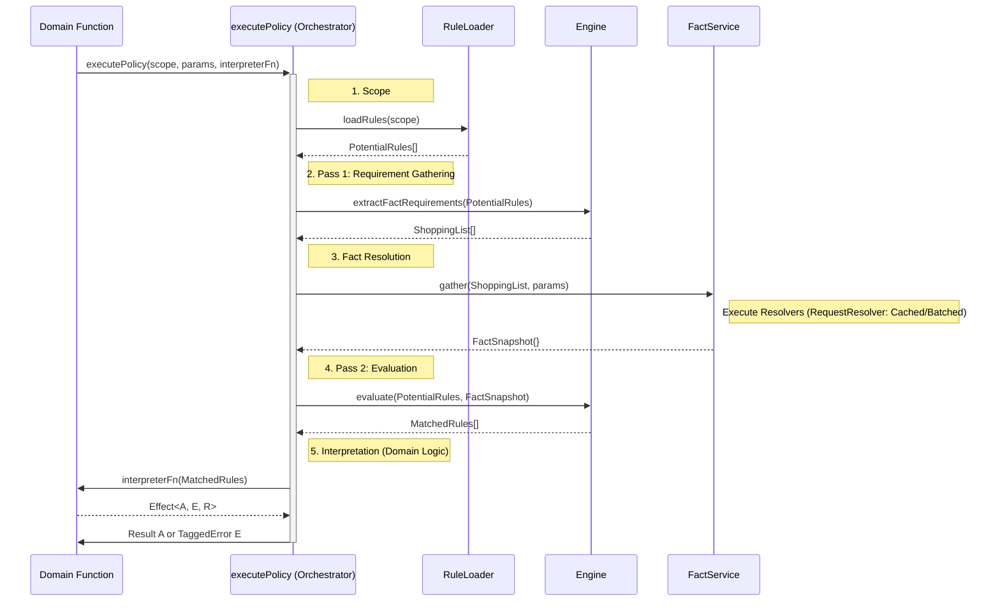

# Brian Jon Overview

## Development Environment

- **Turborepo** - Monorepo management
- **Bun** - Package manager
- **Node.js** - Runtime
- **Vitest** - Testing framework
- **Fast-check** - Property-based testing

## Core Technologies

- **TypeScript** - Type-safe JavaScript
- **Effect-TS** - Functional programming framework
- **Drizzle** - Type-safe SQL ORM
- **Dinero.js v2** - Money handling library
- **Formance Ledger** - Financial infrastructure

## Backend

- **Honoken** - Hono-based Apple PassKit web service
- **Inngest** - Orchestration and workflows
- **Better-Auth** - Authentication service
  - Possibly deployed as its own package with Hono
  - Facebook, Google, phone, and magic link authentication
- **Novu.co** - Notification infrastructure

## Frontend

- **TanStack Start** - Full-stack React framework
- **shadcn/ui** - UI component library

## Observability

### Data Flow

- **PostHog SDK** → PostHog Cloud (CDP, analytics, feature flags, session replay)
- **@effect/opentelemetry** → Axiom (logs, traces)
- **@effect/opentelemetry** → SentrySpanProcessor → Sentry.io

### Services

- **Axiom.co** - Log and trace management
- **PostHog** - Product analytics and feature management
- **OpenTelemetry Collector** _(maybe)_ - Telemetry data collection

## Deployment

- **Neon Postgres** - Serverless PostgreSQL database (single database for everything)
- **Vercel** - Node.js hosting with Fluid Compute (easy deployment with good performance)

---

## Business Rules Engine Concepts

### Policy

The abstract business objective. It is the **"why."**

**Example:** _"Ensure only valid ticket holders can enter an event."_

### Domain

A service module that orchestrates policy evaluation for a specific business area. It exposes public functions (Domain Functions), manages the Two-Pass evaluation flow, and interprets raw engine matches into business decisions.

**Example:** The `access` Domain module provides `canEnterEvent()`, orchestrates fact gathering and rule evaluation, then interprets the matches using "first deny wins" logic.

### Domain Function

The specific, public function a Domain exposes to the application to execute a business process. It is the **"entry point"** for a domain's capabilities.

**Example:** The `canEnterEvent()` function is a Domain Function the application calls to enforce the event entry policy.

### Rule

The specific, declarative data structure that defines the conditions for a policy. It is the concrete **"what"** the engine must check to determine if a policy applies.

**Example:** A JSON object with the condition:

```json
{
  "fact": "ticket.eventId",
  "operator": "eq",
  "value": "event.id"
}
```

### Fact

A single, objective piece of data about the world, made available to the engine. It is an **observation**, not a decision.

**Examples:**

- ✅ `user.loginCount` is a good Fact
- ❌ `user.isAwesomeCustomer` is a bad Fact (that's a Policy decision)

---

## Core Axioms

### 1. Policy as Data

Business rules are not imperative code; they are declarative data stored in the database. They describe **what** should happen, not **how**. The policy system's job is to process this data in real-time. This is the most fundamental principle, enabling business agility without code deployments.

### 2. Two-Pass Model

To ensure efficiency and support dynamic, user-defined conditions, the system follows a strict two-pass evaluation model. This is the core algorithm of the engine.

- **Pass 1: Requirement Gathering (The "Shopping List")**
  First, the engine scans all potentially relevant rules to discover every piece of data (`Fact`) required for the evaluation. This is done _without_ evaluating the rule's logic.

- **Pass 2: Evaluation (The "Execution")**
  Second, the `FactService` fetches _only_ the data on the shopping list. This just-in-time `context` is then provided to the engine to perform the final, efficient evaluation.

This model is the key to performance and scalability, eliminating over-fetching and N+1 query patterns.

### 3. Domain Boundary

A strict architectural boundary separates the generic, business-agnostic `engine` from the business-specific `domains`.

- **The Engine:** A pure, fast, and "dumb" **Matcher**. It knows how to compare data against conditions but has zero knowledge of what "events," "tickets," or "users" are. It never touches the database.
- **The Domains:** Smart **Orchestrators**. A domain knows how to answer a specific business question (e.g., `canEnterEvent()`). It orchestrates the Two-Pass flow and translates the engine's raw matches into a meaningful business answer.

### 4. Controlled Vocabulary

All data available to the engine is explicitly defined and provided by composable services. This provides security, discoverability, and maintainability.

- **Fact Service:** A composable service that defines and resolves every available `Fact`.
- **Operator Service:** A composable service that defines and implements all available comparison operators.

### 5. Real-time State Evaluation

The engine must evaluate policies against the most current, real-time state of the world. Decisions cannot be based on stale or cached data beyond the scope of a single request. This ensures that business logic is always reacting to ground truth.

---

## Speculative Effect-TS Implementation

- **Services & Context:** Core capabilities (`Engine`, `FactService`, `OperatorService`, `RuleLoader`) are defined as `Context.Tags` and accessed via the `R` channel.
- **Layers & Composition:** The architecture uses **Composition over Registration**. Domains (e.g., `@repo/domain-pricing`) are self-contained units that contribute their specific vocabulary (Facts/Operators) by providing `Layers`.
- **Dependency Management:** Fact resolvers are `Effect` programs; their dependencies (e.g., Repositories) must be satisfied within the domain layer using `Layer.provide()`.
- **Fact Resolution:** The `FactService` is designed to leverage `Effect.RequestResolver` for automatic caching and batching of data fetching during policy evaluation.
- **Error Handling:** Domain Functions use `Data.TaggedError` in the `E` channel for structured, type-safe error management.

### Diagrams


