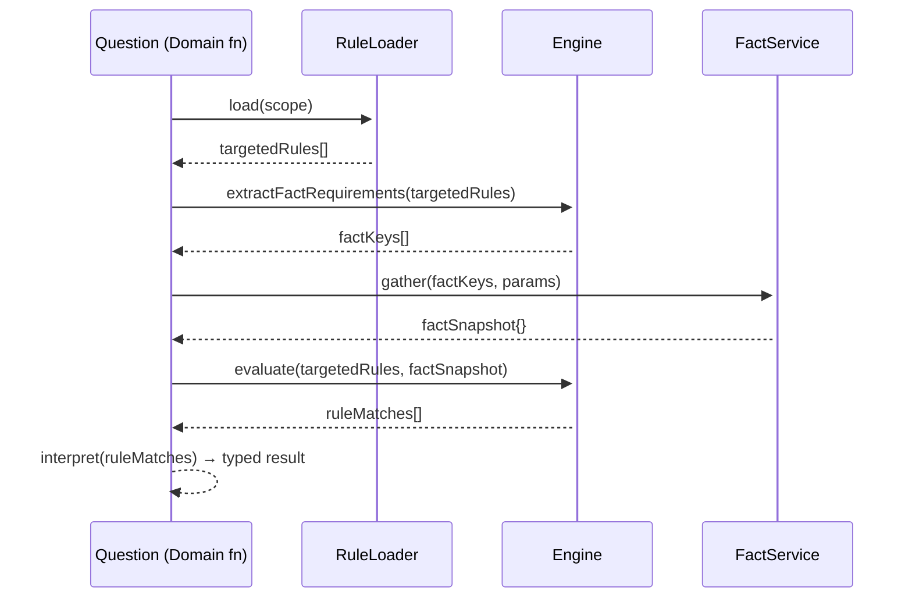
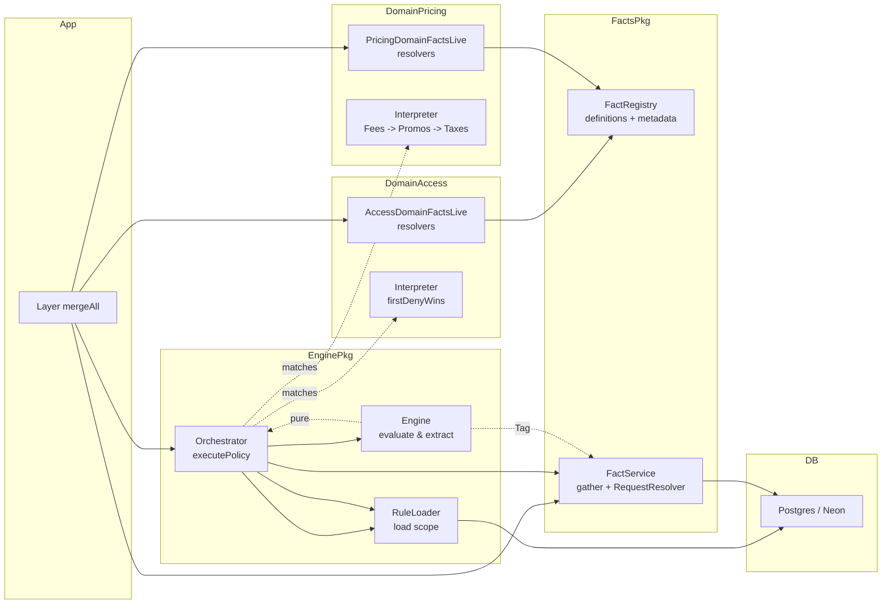
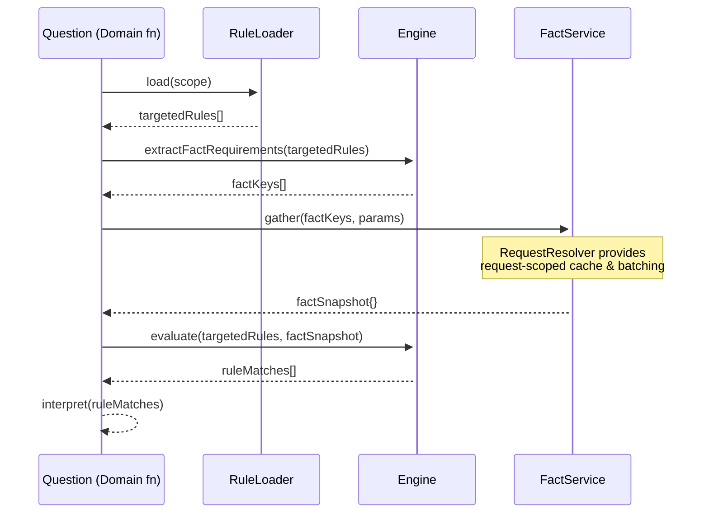
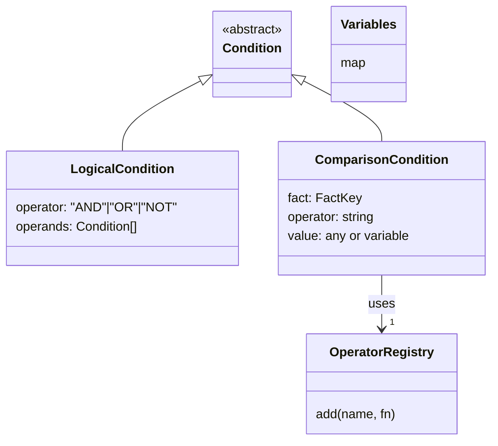
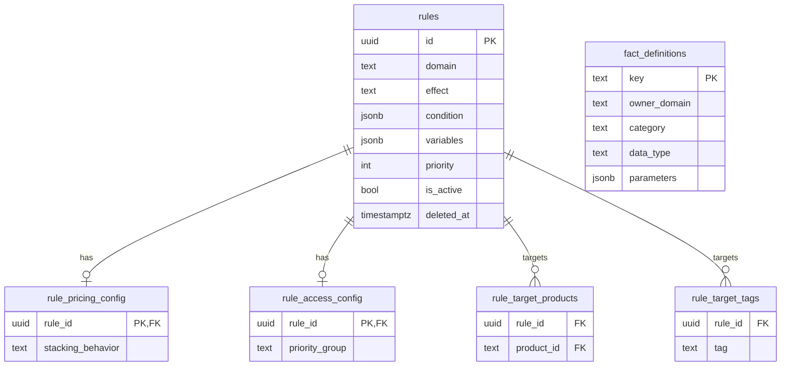
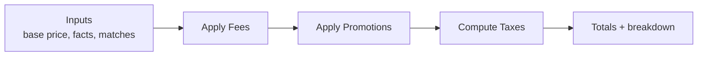
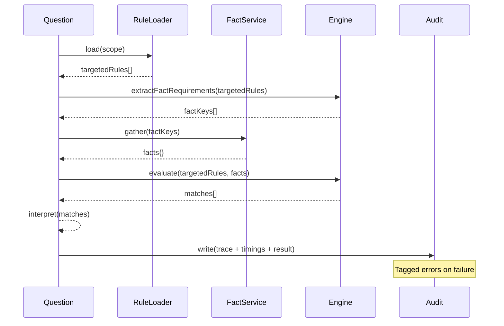
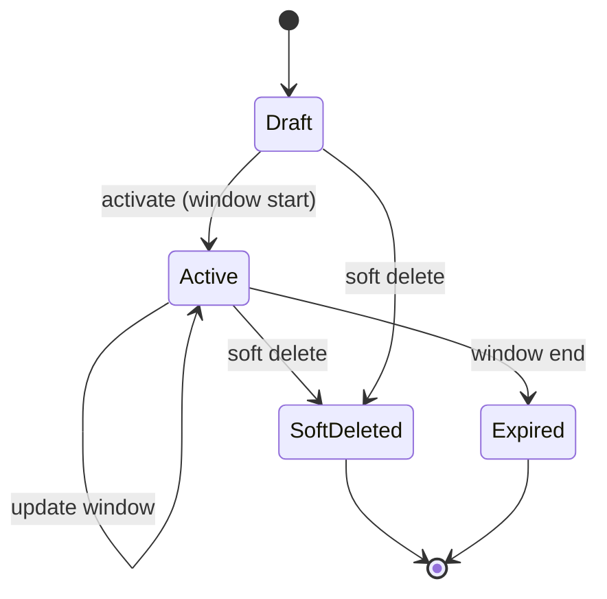
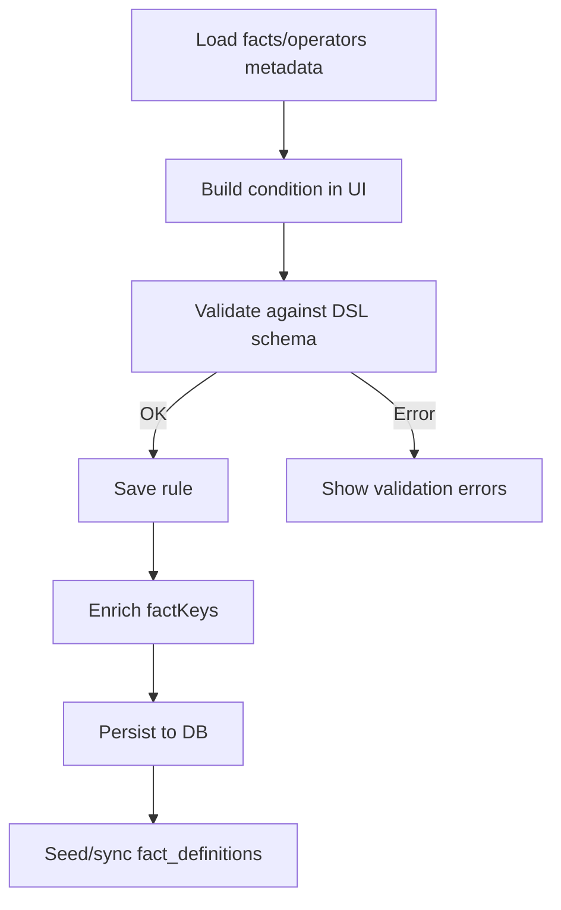
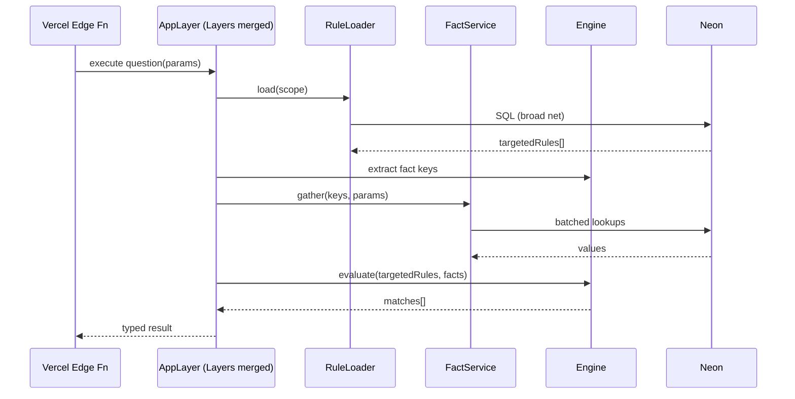

# Evaluation Strategy (Draft – evolving; synced to targeting/domains)

## Purpose

Defines the universal, domain‑agnostic strategy for evaluating policies. This is the contract all domains follow to remain consistent, testable, fast, and edge‑ready.

## Scope

- Applies to every domain function (question) that evaluates rules
- Specifies the orchestrator responsibilities, data flow, error/audit requirements, and performance principles

## Axioms

- Policy as Data: Rules are declarative data (DSL), not imperative code
- Domain Boundary: Engine is pure/matcher; domains orchestrate and interpret; business logic stays in the domains
- Two‑Pass Model: Pass 1 discovers facts; Pass 2 evaluates
- Controlled Vocabulary: Facts and Operators are explicitly registered
- Real‑time State Evaluation: Evaluate against the most current state; only request‑scoped caching; no cross‑request caches

## Guidelines

- Domain Functions: Accept only immediate inputs; fetch related context via facts inferred from rules. Construct environment context (user, org, etc.) from a typed helper.
- Compose small domain functions into larger ones (e.g., pricing pipelines) while reusing the same orchestrator flow.

## Universal Flow (All Questions → Domain Functions)

1. Domain Function defines scope and inputs
2. RuleLoader selects targetedRules (the broad net)
3. Extract fact requirements from the typed rule AST (Pass 1)
4. FactService resolves required facts (request‑scoped cache/batching)
5. Engine evaluates rules against the fact snapshot (Pass 2)
6. Domain interpretation converts `RuleMatch[]` into the typed answer



> Targeting semantics for scope are defined in `new/requirements/targeting.md` (UNIVERSAL / DOMAIN / ENTITY_TYPE / ENTITIES + tags ANY/ALL).

## Orchestrator (executePolicy)

- Inputs: scope (domain, actor scopes, entity/tag context), params (IDs), interpreter(matches) → Effect
- Responsibilities: execute the Universal Flow (load → extract → gather → evaluate), then call the interpreter
- Dependencies: Engine, RuleLoader, FactService (via Effect Context/Layer)
- Output: Typed result or domain Data.TaggedError

## RuleLoader (Broad Net)

- Filters: domain, actor scope (org + system), targeting per `new/requirements/targeting.md`:
  - UNIVERSAL/DOMAIN → include directly
  - ENTITY_TYPE → `targetEntityType IN (:typesRequiredByQuestion)`
  - ENTITIES → EXISTS on explicit junctions for inputs
  - Tags: ANY/ALL modes
- Indexes: `rules(domain, org_id, targetScope, is_active)` btree; deletedAt; optional GIN on factKeys
- Query Builder: compose SQL fragments functionally; only include joins/exists needed by scope

## Two‑Pass Details

- Pass 1: Extractor walks the typed DSL AST to collect unique fact keys; fail fast if DSL invalid
- Variables: Substitute {{var}} from rule.variables into the AST before evaluation (not fetched by FactService)
- Pass 2: Engine compares rule conditions to the fact snapshot and returns RuleMatch[]

## Facts & Operators

- FactRegistry: defines fact keys, types, parameters, and GUI metadata; owned by core or domains
- FactService: resolves facts concurrently with Effect RequestResolver (request‑scoped cache/batching only)
- OperatorRegistry: core generic operators + domain‑provided operators (e.g., money); Engine remains agnostic
- Type Compatibility: The rule builder must only offer operators valid for the selected fact’s type

## Variables vs Facts

- Variables are static rule configuration (stored on rules.variables); used for substitution
- Facts represent runtime observations; resolved only by FactService

## Rule Effects (Discriminator)

- Effect is a discriminator stored on `rules.effect` with values `boolean` | `linked`.
- **boolean**: condition is a yes/no signal; interpretation uses the match plus domain metadata to decide the outcome (e.g., access `priorityGroup`: deny | require | override).
- **linked**: condition selects which linked payload rows apply; interpretation loads payload from junctions (e.g., `rule_fees`, `rule_promotions`, `rule_tax_rates`) and combines per domain stacking/priorities.
- Authoring constraints (enforced at write-time):
  - If `effect = 'boolean'`: forbid rows in effect junction tables.
  - If `effect = 'linked'`: require ≥ 1 row in at least one relevant effect junction.

## Interpretation (Per‑Domain Strategy)

- Access: first‑deny‑wins (short‑circuit allowed)
- Visibility: highest‑priority‑wins
- Purchasability: limit/constraint checks
- Pricing: stable pipeline (Fees → Promotions → Taxes) using rule metadata (stackingBehavior, priority)

- Effect handling:
  - If `rules.effect = 'boolean'`: treat matches as truthy signals and apply domain metadata (e.g., access `priorityGroup`).
  - If `rules.effect = 'linked'`: fetch and apply linked payload rows in domain order (e.g., Fees → Promotions → Taxes).

## Error Discipline & Audit Trail

- Errors: Use Data.TaggedError (e.g., RuleDenied, FactNotFound, RuleParseError, SystemError)
- Audit: Persist or emit a trace containing at minimum:
  - question ID + params, scope
  - rule IDs loaded (and why, if available)
  - extracted fact keys
  - resolved facts snapshot (or masked summary for PII)
  - engine matches (per rule: matched, evaluated condition, selected operators)
  - interpretation decision (final result)
  - timings (fact gathering, evaluation, total) and a correlation/request ID

## Performance & Edge Constraints

- Stateless: compatible with Vercel/Neon; no cross‑request caches
- Caching: request‑scoped only (Effect RequestResolver); optional global TTL cache only for safe, non‑tenant facts (opt‑in)
- Short‑circuit: if RuleLoader returns 0 rules, skip FactService and Engine
- Concurrency: bound extraction/gather concurrency to prevent resource spikes
- Optional fast‑paths: usesFact(...) to narrow candidate rules when justified

## Versioning & Activation

- Activation: isActive = true and within temporal window; deletedAt = NULL
- Latest: loader helper for latest version semantics (domain‑specific)
- Soft deletes only; never hard delete rules

## Authoring/GUI Requirements

- Use the typed DSL schema to validate on save
- Enforce operator compatibility by fact type
- Expose registries via API for rule builder discoverability (facts, operators, types, parameters)

## Compliance Checklist (must)

- Engine performs no IO and is unaware of domains
- All domains use the orchestrator or replicate its exact flow
- All rules validated against the DSL schema before storage/use
- All fact resolution goes through FactService; no ad‑hoc fetching
- Every evaluation emits an audit trace and uses tagged errors

## Open Questions (to resolve)

- Exact persistence model for audit traces (table vs. log sink), retention policy
- Concrete versioning strategy (template vs. instance, branching/rollback support)
- Registry → DB metadata sync (source of truth, seeding strategy, drift detection)
- Global TTL cache eligibility criteria for facts, if adopted later

---

## Orchestrator Shape (Signature & Pseudocode)

```ts
// Minimal, domain-agnostic shape for the shared orchestrator
export function executePolicy<A, E, R>(
  scope: RuleScope,
  params: Record<string, unknown>,
  interpreter: (matches: RuleMatch[]) => Effect.Effect<A, E, R>
): Effect.Effect<A, E | SystemError, Engine | FactService | RuleLoader | R>;
```

Pseudocode (always the same steps):

```ts
return Effect.gen(function* (_) {
  const ruleLoader = yield* _(RuleLoader)
  const engine = yield* _(Engine)
  const facts = yield* _(FactService)

  // 1) Broad net: DB does the heavy filtering
  const rules = yield* _(ruleLoader.load(scope))
  if (rules.length === 0) {
    // Optional short-circuit: skip facts/eval when there are no candidates
    return yield* _(interpreter([]))
  }

  // 2) Pass 1: Discover required fact keys from the typed DSL
  const requirements = engine.extractFactRequirements(rules)

  // 3) Resolve facts once, with request-scoped caching/batching
  const context = yield* _(facts.gather(requirements, params))

  // 4) Pass 2: Evaluate candidates against the just-in-time snapshot
  const matches = engine.evaluate(rules, context)

  // 5) Domain-specific interpretation returns a typed answer
  return yield* _(interpreter(matches))
})
```

---

## Suggested Directory / File Structure

```text
packages/
  policy-engine/
    src/
      engine/
        engine.ts               # evaluate(), substituteVariables(), RuleMatch model
        orchestrator.ts         # executePolicy() shared flow (this spec)
        rule-loader.ts          # load(scope): Rule[] with composable query fragments
      dsl/
        schema.ts               # @effect/schema for RuleCondition DSL (parse/validate)
        extractor.ts            # extractFactRequirements(rules)
      operators/
        registry.ts             # OperatorRegistry (core + domain-composed)
      types/
        index.ts                # Rule, RuleMatch, RuleScope, DomainResult, Tagged Errors

  facts/
    src/
      registry.ts               # FactRegistry (definitions + GUI metadata)
      service.ts                # FactService (gather with RequestResolver caching)
      core/
        global-facts.ts         # currentTime, env flags, etc.
        caching.ts              # request-scoped resolver cache policy
        metadata-sync.ts        # optional DB sync helpers for fact_definitions
      types.ts                  # FactKey, FactDefinition, FactParams
      layer.ts                  # FactsCoreLive: registry + service + core resolvers

  domain-access/
    src/
      index.ts                  # canEnterEvent(params) using executePolicy + interpreter
      facts.ts                  # access facts (e.g., 'event.status')
      interpreter.ts            # firstDenyWins(matches)
      layer.ts                  # AccessDomainLive (Facts + Operators + deps)

  domain-pricing/
    src/
      index.ts                  # calculateCart(params) using executePolicy
      facts.ts                  # pricing facts (e.g., 'cart.subtotal')
      operators.ts              # money operators (moneyGreaterThan)
      interpreter.ts            # pipeline: Fees -> Promotions -> Taxes
      layer.ts                  # PricingDomainLive
```

---

## Example Implementation (Comment-Heavy)

```ts
// packages/policy-engine/src/engine/orchestrator.ts
import { Effect } from "effect"
import { Engine } from "../types" // Context.Tag for Engine service
import { FactService } from "@repo/facts/service" // Context.Tag for FactService
import { RuleLoader } from "./rule-loader" // Context.Tag for RuleLoader
import type { RuleMatch, RuleScope } from "../types"

/**
 * executePolicy
 * Centralized, universal orchestration for ALL domain questions.
 * - Prevents domain-specific drift
 * - Enforces the Two-Pass model
 * - Guarantees facts are fetched once with request-scoped caching
 */
export const executePolicy = <A, E, R>(
  scope: RuleScope,
  params: Record<string, unknown>,
  interpreter: (matches: RuleMatch[]) => Effect.Effect<A, E, R>
): Effect.Effect<A, E | "SystemError", Engine | FactService | RuleLoader | R> =>
  Effect.gen(function* (_) {
    // 1. Get required services from Effect Context
    const engine = yield* _(Engine)
    const facts = yield* _(FactService)
    const loader = yield* _(RuleLoader)

    // 2. Broad net: ask the database for potentially relevant rules only
    const rules = yield* _(loader.load(scope))

    // Optimization: if no candidates, we can bypass facts and evaluation
    if (rules.length === 0) {
      return yield* _(interpreter([]))
    }

    // 3. Pass 1: extract all unique fact keys from the typed rule DSL
    const requirements = engine.extractFactRequirements(rules)

    // 4. Fetch exactly those facts, once, with request-scoped caching/batching
    const context = yield* _(facts.gather(requirements, params))

    // 5. Pass 2: evaluate rules against the just-in-time snapshot
    const matches = engine.evaluate(rules, context)

    // 6. Let the domain interpreter produce the typed business answer
    return yield* _(interpreter(matches))
  })
```

---

## Module Boundaries (Mermaid)



---

## Two‑Pass with RequestResolver Caching (Sequence)



---

## Rule DSL Shape (Class Diagram)



---

## RuleLoader Filtering (Flow)

```mermaid
flowchart TD
  A[Start] --> B[Filter by domain]
  B --> C[Actor scope: org + system]
  C --> D{Targets or Tags?}
  D -->|Yes| E[Has target rows]
  D -->|No| F[Universal (no targets)]
  E --> G[Temporal window active]
  F --> G
  G --> H[Latest version semantics]
  H --> I[Active + not deleted]
  I --> J[Return candidate rules]
```

---

## Data Model (ERD)



---

## Pricing Pipeline (Flow)



---

## Error & Audit Flow (Sequence)



---

## Versioning & Activation (States)



---

## Authoring Flow (Activity)



---

## Edge Runtime Data Path (Sequence)


