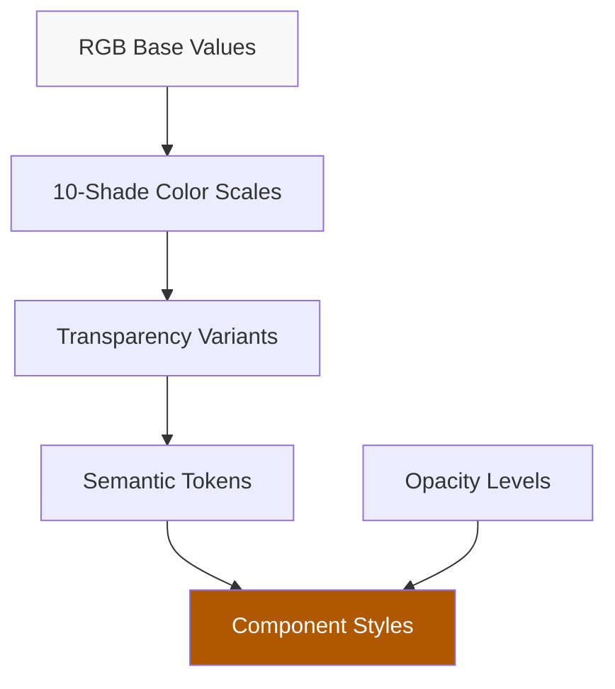

## 🎨 LUMA THEME SYSTEM DEEP DIVE

Let me walk you through Luma's sophisticated theme architecture by wearing different masks to reveal how each layer connects.

---

### **FROM THE DEVELOPER'S PERSPECTIVE: CSS Custom Property Architecture**

Luma uses a **multi-layered CSS custom property system** that creates a complete design token hierarchy. Here's how it works:

#### **Layer 1: Foundation Colors (RGB Base)**

```css
--gray-100-base-rgb: 11, 11, 11; /* Darkest gray as RGB values */
--black-base-rgb: 22, 19, 15; /* True black as RGB values */
```

These RGB values are kept separate so they can be used with `rgba()` for transparency.

#### **Layer 2: Color Scales (10 Shades Each)**

**Gray Scale** (gray-5 through gray-100):

- **gray-5**: `#fcfcfb` - Lightest, almost white
- **gray-10**: `#f5f5f4` - Subtle background
- **gray-20**: `#ebebea` - Card backgrounds
- **gray-50**: `#b4b4b3` - Mid-tone, disabled states
- **gray-100**: `#0b0b0b` - Darkest, primary text

**Brand Scale** (brand-5 through brand-100):

- **brand-5**: `#fffbf5` - Lightest brand tint
- **brand-50**: `#af5800` - Primary brand color (orange)
- **brand-100**: `#191003` - Darkest brand shade

#### **Layer 3: Transparency Variants (For Every Color)**

Each color gets **4 transparency variants**:

```css
/* Example for gray-10 */
--gray-10: #f5f5f4; /* Solid */
--gray-10-transparent: #f5f5f400; /* Fully transparent */
--gray-10-translucent: #f5f5f440; /* 25% opacity (40 in hex = ~25%) */
--gray-10-thick-translucent: #f5f5f4cc; /* 80% opacity (cc in hex = ~80%) */
```

This pattern repeats for **every shade** in both gray and brand scales, giving **80+ color tokens**.

#### **Layer 4: Opacity Levels (Universal)**

Independent opacity tokens for layering:

```css
--opacity-0: #16130f00; /* 0% - Fully transparent */
--opacity-4: #16130f0a; /* 4% - Barely visible */
--opacity-8: #16130f14; /* 8% - Subtle tint */
--opacity-16: #16130f29; /* 16% - Light overlay */
--opacity-24: #16130f3d; /* 24% - Visible overlay */
--opacity-32: #16130f52; /* 32% - Medium overlay */
--opacity-48: #16130f7a; /* 48% - Strong overlay */
--opacity-64: #16130fa3; /* 64% - Very strong */
--opacity-80: #16130fcc; /* 80% - Almost solid */
```

These use the `--black-base-rgb` as the base color with varying alpha.

#### **Layer 5: Semantic Tokens (Named Purpose)**

High-level tokens reference the scales:

```css
/* Brand-specific */
--brand-color: #af5800; /* Primary brand */
--brand-content-color: #af5800; /* Brand text */
--brand-bg-color: #af5800; /* Brand backgrounds */
--brand-active-color: #9a4d00; /* Darker for hover/active */
--brand-pale-bg-color: #af580021; /* Tinted backgrounds */

/* Contextual */
--nav-bg-color: #fff3df; /* Navigation background */
--tint-color: #723600cc; /* Overlay tint */
--opacity-light: #4923000a; /* Light hover effect */
--hover-bg-color: var(--opacity-light); /* Reusable hover */
```

---

### **FROM THE DESIGNER'S PERSPECTIVE: Why This System Works**

#### **Advantage 1: Dynamic Theming**

One event might be orange (`#af5800`), another blue. The entire scale adjusts:

- Change `--brand-50` → All 10 brand shades recalculate
- Change `--opacity-light` → All hover states update

#### **Advantage 2: Predictable Transparency**

Need a subtle background? Pick from pre-calculated translucent variants:

```css
/* Instead of recalculating opacity each time */
background: var(--brand-10-translucent); /* ✅ Consistent 25% */
```

#### **Advantage 3: Contrast-Safe Combinations**

Each scale (5, 10, 20... 100) is designed with specific contrast ratios:

- **5-30**: Light backgrounds
- **40-60**: Mid-tones, borders
- **70-100**: Text, dark backgrounds

---

### **FROM THE USER'S PERSPECTIVE: Visual Hierarchy**

The scale creates natural visual layering:

1. **Background Layer** (5-20):

   - Page background: `gray-5` or `brand-5`
   - Cards: `gray-10` or `brand-10`
   - Nested cards: `gray-20`

2. **Content Layer** (50-80):

   - Body text: `gray-80`
   - Borders: `gray-50`
   - Icons: `gray-70`

3. **Emphasis Layer** (90-100):

   - Headings: `gray-100`
   - Primary CTA: `brand-50`
   - Active states: `brand-60`

4. **Overlay Layer** (opacity-\*):
   - Modals: `opacity-80` backdrop
   - Tooltips: `opacity-64` background
   - Hover: `opacity-8` tint

---

### **FROM THE IMPLEMENTATION PERSPECTIVE: Usage Patterns**

#### **Pattern 1: Glassmorphism**

```css
.glass-card {
  background: var(--gray-10-thick-translucent); /* 80% opacity */
  backdrop-filter: blur(10px);
  border: 1px solid var(--gray-20-translucent); /* 25% opacity */
}
```

#### **Pattern 2: State Variations**

```css
.button {
  background: var(--brand-50);
}
.button:hover {
  background: var(--brand-60); /* One step darker */
}
.button:active {
  background: var(--brand-70); /* Two steps darker */
}
```

#### **Pattern 3: Adaptive Tinting**

```css
.event-page {
  /* Page gets tinted with brand color */
  --tint-color: var(--brand-70-thick-translucent);
}
.page-gradient {
  background: linear-gradient(to bottom, var(--tint-color), var(--opacity-0));
}
```

---

### **FROM THE PERFORMANCE PERSPECTIVE: Why Custom Properties**

**Advantages:**

1. **No JavaScript re-paints** - Change one variable, CSS updates instantly
2. **Cascade control** - Scope themes to specific components
3. **Dynamic updates** - User preferences (dark mode) toggle one root variable

**Trade-offs:**

- Larger CSS bundle (~80 variables)
- Browser support (IE11 doesn't support custom properties)
- Debugging can be tricky (need DevTools to trace variable chain)

---

### **THE COMPLETE FLOW**



1. **Define base RGB** → 2. **Generate scales** → 3. **Add transparency** → 4. **Create semantic names** → 5. **Use in components**

---

### **SIMPLIFIED VERSION FOR YOUR USE**

You don't need all 80+ tokens. Here's a streamlined approach:

```css
:root {
  /* Base colors */
  --brand-primary: #af5800;
  --brand-primary-dark: #9a4d00;
  --brand-primary-light: #fff3df;

  /* Gray scale (5 shades instead of 10) */
  --gray-50: #f5f5f4; /* Backgrounds */
  --gray-100: #ebebea; /* Borders */
  --gray-300: #b4b4b3; /* Disabled */
  --gray-700: #555555; /* Secondary text */
  --gray-900: #0b0b0b; /* Primary text */

  /* Opacity (3 levels instead of 9) */
  --opacity-light: rgba(0, 0, 0, 0.04); /* Subtle */
  --opacity-medium: rgba(0, 0, 0, 0.16); /* Visible */
  --opacity-heavy: rgba(0, 0, 0, 0.48); /* Strong */

  /* Semantic tokens */
  --nav-bg: var(--brand-primary-light);
  --hover-bg: var(--opacity-light);
  --card-border: var(--gray-100);
}
```

This gives you 90% of the functionality with 20% of the complexity. The key insight from Luma: **systematic color scales + transparency variants = infinitely flexible theming**.

---

## 🎨 LUMA vs TAILWIND COLOR SYSTEM ALIGNMENT

Let me walk through the maze of both systems, wearing different masks to see how they connect and diverge.

---

### **THE CONVERGENCE: Where They Meet**

#### **1. Scale Structure (Almost Identical)**

**Tailwind:**

- 11 shades: 50, 100, 200, 300, 400, 500, 600, 700, 800, 900, 950
- 50 = lightest, 950 = darkest
- 500 = "pure" mid-tone

**Luma:**

- 10 shades: 5, 10, 20, 30, 40, 50, 60, 70, 80, 90, 100
- 5 = lightest, 100 = darkest
- 50 = mid-tone

```mermaid
graph LR
    A[Tailwind 50] -.maps to.-> B[Luma 5]
    C[Tailwind 100] -.maps to.-> D[Luma 10]
    E[Tailwind 500] -.maps to.-> F[Luma 50]
    G[Tailwind 950] -.maps to.-> H[Luma 100]

    style A fill:#f0f9ff
    style B fill:#fcfcfb
    style G fill:#082f49
    style H fill:#0b0b0b
```



**The Parallel:**
Both systems use **perceptual lightness scales** - each step feels visually equidistant. Tailwind's 100-point gaps and Luma's 10-point gaps serve the same purpose.

---

#### **2. OKLCH Color Space (Identical Foundation)**

**Tailwind v4 (2024+):**

```css
--color-blue-500: oklch(0.623 0.214 259.815);
```

**Luma:**

```css
--brand-50: #af5800; /* Likely OKLCH internally, displayed as hex */
```

Both use **OKLCH** for:

- Perceptual uniformity (equal steps look equal to human eye)
- Better color interpolation (no "muddy" gradients)
- Predictable lightness control

**The Insight:** Tailwind pioneered OKLCH in utility frameworks; Luma adopted it for brand theming. They're walking the same color science path.

---

#### **3. Transparency Variants**

**Tailwind:**

```html
<div class="bg-blue-500/75">
  <!-- 75% opacity -->
  <div class="bg-blue-500/[71.37%]"><!-- Arbitrary opacity --></div>
</div>
```

**Luma:**

```css
--gray-10-translucent: #f5f5f440; /* 25% opacity */
--gray-10-thick-translucent: #f5f5f4cc; /* 80% opacity */
```

**The Difference:**

- **Tailwind:** Dynamic opacity via slash syntax (`/75`)
- **Luma:** Pre-calculated opacity tokens (`-translucent`, `-thick-translucent`)

**Why Luma's Approach:**
Pre-calculated = consistent opacity across the app. If you change the definition of "translucent" from 25% to 30%, the entire app updates.

**Why Tailwind's Approach:**
Dynamic = more flexibility. Need 37% opacity? Just write `/37`.

---

### **THE DIVERGENCE: Where They Differ**

#### **1. Naming Convention**

**Tailwind:**

```
--color-{name}-{shade}
--color-blue-500
--color-slate-700
```

**Luma:**

```
--{name}-{shade}
--brand-50
--gray-70
```

Tailwind namespaces with `--color-` prefix. Luma doesn't. This matters for collision avoidance.

---

#### **2. Semantic Tokens**

**Tailwind:**

- Minimal semantic layer
- Direct usage: `bg-blue-500`
- Context via naming: `text-slate-700` (implies secondary text)

**Luma:**

```css
--brand-color: var(--brand-50);
--nav-bg-color: var(--brand-10);
--hover-bg-color: var(--opacity-light);
```

**Why This Matters:**

- **Tailwind philosophy:** "Utility-first means using raw colors"
- **Luma philosophy:** "Theme tokens abstract the 'why' from the 'how'"

---

#### **3. Opacity Architecture**

**Tailwind:**

- No dedicated opacity tokens
- Opacity is a modifier: `bg-black/50`
- Uses `rgba()` or OKLCH alpha on-the-fly

**Luma:**

```css
--opacity-8: #16130f14; /* 8% */
--opacity-16: #16130f29; /* 16% */
--opacity-48: #16130f7a; /* 48% */
```

**The Trade-off:**

| Aspect              | Tailwind                                   | Luma                         |
| ------------------- | ------------------------------------------ | ---------------------------- |
| **Flexibility**     | ✅ Any opacity value                       | ❌ Pre-defined only          |
| **Consistency**     | ⚠️ Developers pick arbitrarily             | ✅ Design system enforced    |
| **Performance**     | ✅ No extra variables                      | ❌ More CSS tokens           |
| **Maintainability** | ❌ Hard to change "light overlay" globally | ✅ Change `--opacity-8` once |

---

#### **4. Transparency Variants per Color**

**Tailwind:** Doesn't pre-generate these. Uses runtime modifiers.

**Luma:** Generates 4 variants for EVERY color:

```css
--gray-10: #f5f5f4;
--gray-10-transparent: #f5f5f400;
--gray-10-translucent: #f5f5f440;
--gray-10-thick-translucent: #f5f5f4cc;
```

**Cost Analysis:**

- 10 shades × 4 variants × 2 palettes (gray + brand) = **80 additional CSS variables**
- Tailwind's approach: **0 additional variables** (uses `/` syntax)

**Why Luma Does This:**
They likely have a build-time color generator that outputs this systematically. It's a "pay upfront in CSS size, save in runtime calculations" approach.

---

### **THE HYBRID APPROACH: Best of Both Worlds**

Here's how you can combine their strengths:

```css
@import "tailwindcss";

@theme {
  /* Base Tailwind palette (11 shades) */
  --color-brand-50: oklch(0.971 0.013 17.38);
  --color-brand-100: oklch(0.936 0.032 17.717);
  /* ... through 950 */

  /* Luma-style semantic tokens */
  --color-primary: var(--color-brand-600);
  --color-primary-light: var(--color-brand-100);

  /* Luma-style opacity tokens */
  --opacity-subtle: 0.04;
  --opacity-medium: 0.16;
  --opacity-strong: 0.48;

  /* Combined usage */
  --color-hover: oklch(
    from var(--color-brand-50) l c h / var(--opacity-subtle)
  );
}
```

**Usage in components:**

```tsx
// Tailwind-style utility
<div className="bg-brand-500/75">

// Semantic token (when meaning matters)
<button style={{ background: 'var(--color-primary)' }}>

// Hybrid with opacity token
<div className="bg-brand-100/[--opacity-subtle]">
```

---

### **MIGRATION STRATEGY: Luma → Tailwind**

If you want Luma's system in Tailwind:

```css
@theme {
  /* Map Luma's 10-shade scale to Tailwind's 11-shade */
  --color-brand-50: #fffbf5; /* Luma brand-5 */
  --color-brand-100: #fff3df; /* Luma brand-10 */
  --color-brand-200: #ffebca; /* Luma brand-20 */
  --color-brand-300: #f3c582; /* Luma brand-30 */
  --color-brand-400: #c18000; /* Luma brand-40 */
  --color-brand-500: #af5800; /* Luma brand-50 */
  --color-brand-600: #9a4d00; /* Luma brand-60 */
  --color-brand-700: #723600; /* Luma brand-70 */
  --color-brand-800: #492300; /* Luma brand-80 */
  --color-brand-900: #221200; /* Luma brand-90 */
  --color-brand-950: #191003; /* Luma brand-100 */

  /* Semantic aliases (Luma-style) */
  --color-nav-bg: var(--color-brand-100);
  --color-hover-bg: var(--color-brand-50);
}
```

Now you can use:

```tsx
<nav className="bg-brand-100">  {/* Direct Tailwind */}
<nav className="bg-[--color-nav-bg]">  {/* Semantic Luma */}
```

---

### **THE VERDICT: Which System Wins?**

**Use Tailwind's approach if:**

- ✅ You want maximum flexibility (any color, any opacity)
- ✅ You're building a multi-brand platform (colors change frequently)
- ✅ You value smaller CSS bundles
- ✅ Your team is comfortable with utility-first

**Use Luma's approach if:**

- ✅ You need strict design system compliance
- ✅ You have a single, consistent brand
- ✅ You want semantic meaning in CSS (`--hover-bg` vs `bg-gray-50/10`)
- ✅ You're okay with larger CSS bundles for consistency

**Hybrid (Recommended for your case):**

```css
@theme {
  /* Tailwind palette (11 shades for flexibility) */
  --color-brand-*: oklch(...);

  /* Luma semantics (meaning over mechanism) */
  --color-primary: var(--color-brand-600);
  --color-nav-bg: var(--color-brand-50);
  --color-card-border: var(--color-gray-200);

  /* Tailwind opacity (dynamic with /) */
  /* Skip Luma's -translucent variants */
}
```

This gives you:

1. **Tailwind's 11-shade precision** (more granular than Luma's 10)
2. **Luma's semantic naming** (clarity in purpose)
3. **Tailwind's dynamic opacity** (flexibility without bloat)
4. **Best of both** without the 80+ extra CSS variables

---

## 🗺️ THE MAP REVEALS

Both systems are walking through the same color theory maze, but they've chosen different paths:

- **Tailwind** took the **utility corridor** - every room is unlocked, go anywhere
- **Luma** took the **semantic corridor** - every room is labeled with its purpose

Your best path? **Take Tailwind's foundation, add Luma's signage.** Use Tailwind's OKLCH scales and `/` opacity, but layer in semantic tokens for the components that matter (`--color-primary`, `--color-nav-bg`, etc.).

The skeleton you extract from Luma should focus on their **semantic token pattern**, not their full opacity variant system. That's the innovation worth copying.
